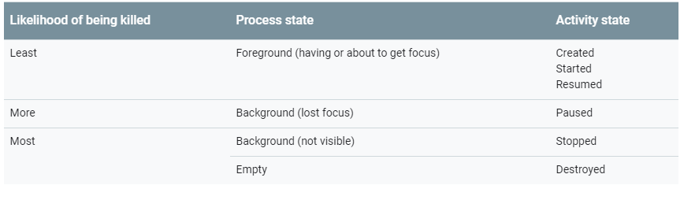
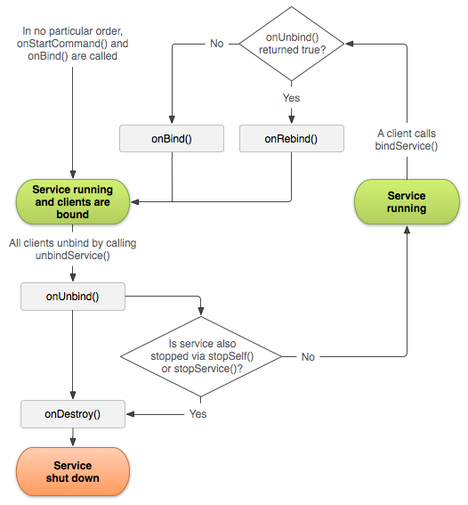

[toc]

# 官方文档
 - 官方文档: [Android](https://developer.android.google.cn/guide)
# ADB Shell
 - 官方文档：[ADB Shell](https://developer.android.google.cn/studio/command-line/adb?hl=zh_cn#shellcommands)

# Intent and Intent Filters
## Overview
Intent是

## 隐式调用

# Activity:
Activity 类提供了一系列的callback 方法可以让你知道 activity 的状态改变，比如 创建，停止 或者重新启用activity。
在lifecycle 的回调函数中，你可以声明一些activity的行为，比如当用户正在播放视频的时候，当用户切换到另外一个app 的时候停止视频的播放并且终止network的连接，当用户切回到当前app的时候，重新连接网络，并且当视频回到之前的位置开始播放。
在正确的回调方法里面做正确的事情可以使你的app更加高效和健壮。可以避免以下的问题：
- 当用户接到电话或者切换到另一个app的时候避免崩溃
- 当用户不再使用app的时候不会消耗宝贵的系统资源
- 当用户离开你的app的时候不会丢失用户状态
- 当用户进行横竖屏切换的时候不会崩溃或者丢失用户状态
以下的文档会解析activity的生命周期，首先会介绍下lifecycle的图解，然后回介绍每个回调方法：在执行的时候会发生什么，如何实现回调方法。
最后会介绍几个topic和 activity状态的转变。
lifecycle 最佳实践参考 [Handling Lifecycles with Lifecycle-Aware Components](https://developer.android.com/topic/libraries/architecture/lifecycle.html) 和 [Saving UI States](https://developer.android.com/topic/libraries/architecture/saving-states.html)
要学习如何使用activity 和一些其他的架构组件构建一个健壮的，可以在生产环境使用的app，请参考[Guide to App Architecture](https://developer.android.com/topic/libraries/architecture/guide.html)

## Activity-lifecycle concepts
Activity 类提供了六个核心的回调方法：onCreate(), onStart(), onResume(), onPause(), onStop(), and onDestroy(). 当系统进入一个新的状态的时候会回调这些回调方法。


上图是activity的lifecycle的展示。
当用户离开当前activity的时候，系统会调用方法去拆卸这个activity，在一些case中，这个这种拆卸只会是部分的，这个activity还会保存在内存中，并且还可以把这个activity调回到前台。当用户回到这个activity的时候，这个activity会回到用户离开前的状态。
在一些少数的case中， app在后台的活动是受到严格限制的。[restricted from starting activities when running in the background](https://developer.android.com/guide/components/activities/background-starts)

系统是否会杀死进程取决于activity 的状态[Activity state and ejection from memory](https://developer.android.com/guide/components/activities/activity-lifecycle#asem)

基于你的activity的复杂性，你可能不需要实现所有的回调方法。但是理解这些回调方法是很重要的，并且实现这些方法让app按照用户希望的那样运行。

## lifecycle callbacks
在一些状况下， 比如 setContentView()属于 activity lifecycle 他们自身，但是实现从属组件动作的代码应该放在组件本身。为了实现这个，你必须使组件具有生命周期意思。详情请看[Handling Lifecycles with Lifecycle-Aware Components](https://developer.android.com/topic/libraries/architecture/lifecycle.html)去学习如何让从属组件具有生命周期意识。
### onCreate()
你必须实现这个在系统第一次创建activity的时候会调用的回调方法。当activity 创建完成，activity进入Created 状态。在onCreate() 方法，你可以实现一些application 启动逻辑，这个方法只会实现一次。比如你可能会在onCreate() 方法去绑定数据列表， 将activity去关联 一个ViewMode， 和一些实例化的变量。这个方法接受Bundle 类型的参数savedInstanceState,这个参数包含了这个activity之前保存的状态，如果这个activity之前没有保存过，那么这个bundle 的对象的值是null。
如果你有一个有生命周期的从属组件，那么它会收到 ON_CREATE 事件。拥有@OnLifecycleEvent注解的方法会被调用，所以你的又生命周期的从属组件可以在执行一些在created 状态下启动的逻辑。
下面是onCreate() 方法的例子，声明了layout
并且从 参数里面读取之前保存的状态
```java
TextView textView;

// some transient state for the activity instance
String gameState;

@Override
public void onCreate(Bundle savedInstanceState) {
    // call the super class onCreate to complete the creation of activity like
    // the view hierarchy
    super.onCreate(savedInstanceState);

    // recovering the instance state
    if (savedInstanceState != null) {
        gameState = savedInstanceState.getString(GAME_STATE_KEY);
    }

    // set the user interface layout for this activity
    // the layout file is defined in the project res/layout/main_activity.xml file
    setContentView(R.layout.main_activity);

    // initialize member TextView so we can manipulate it later
    textView = (TextView) findViewById(R.id.text_view);
}

// This callback is called only when there is a saved instance that is previously saved by using
// onSaveInstanceState(). We restore some state in onCreate(), while we can optionally restore
// other state here, possibly usable after onStart() has completed.
// The savedInstanceState Bundle is same as the one used in onCreate().
@Override
public void onRestoreInstanceState(Bundle savedInstanceState) {
    textView.setText(savedInstanceState.getString(TEXT_VIEW_KEY));
}

// invoked when the activity may be temporarily destroyed, save the instance state here
@Override
public void onSaveInstanceState(Bundle outState) {
    outState.putString(GAME_STATE_KEY, gameState);
    outState.putString(TEXT_VIEW_KEY, textView.getText());

    // call superclass to save any view hierarchy
    super.onSaveInstanceState(outState);
}
```
作为定义在XML layout文件中，然后使用setContentView()来定义视图的一种替代方案，你可以创建一个新的View 对象，然后通过代码往ViewGroup 中插入View 来构建视图层次。更多的关于创建用户界面的信息，请参考[User Interface](https://developer.android.com/guide/topics/ui/index.html) 文档。
activity不会驻留在Created 状态，当onCreate() 方法调用完成之后，activity进入 Started 状态。系统会快速连续调用onStart()和onResume() 方法。

### onStart() 
当activity进入Started 状态时，系统调用onStart() 回调方法。这个方法使得用户可以看到activity，并且准备进入 前台(foreground) 和用户交互。这个方法是app初始化UI code 的方法。
当activity 进入Started 状态时，有生命周期的从属组件会收到ON_START 事件。
onStart() 方法会很快完成，并且和Created 状态一样，activity也不会驻留在Started 状态，当onStart() 回调完成时，activity会进入 Resumed 状态，并且调用 onResume() 方法。

### onResume()
当activity 进入Resumed 状态时，activity就到了前台(foreground)，然后系统会调用 onResume() 回调方法。
这是app与用户交互的状态。app会保持这个状态直到用户不再focus 这个app。比如有电话进来，用户跳转到另一个app，或者设备的屏幕关闭。
当activity进入resume 状态，它的有生命周期的从属组件会收到ON_RESUME事件，这里是从属组件可以开始它的功能当组件已经可见并且已经在前台(foreground)， 比如开始摄像头预览。
当中断事件发生的时候，activity 进入Paused 状态，系统会调用onPause() 回调方法。
当activity从Paused 状态回到 Resumed时，系统会调用onResume() 方法，所以你必须重新初始化那些在onPause() 方法中释放的组件，和执行其他必须在activity进入Paused状态时的初始化。
下面是lifecycle-aware组件：当收到ON_RESUME事件中访问摄像头
```java
public class CameraComponent implements LifecycleObserver {

    ...

    @OnLifecycleEvent(Lifecycle.Event.ON_RESUME)
    public void initializeCamera() {
        if (camera == null) {
            getCamera();
        }
    }

    ...
}
```
上面的code 是关于[LifecycleObserver](https://developer.android.com/reference/androidx/lifecycle/LifecycleObserver)接收到 ON_RESUME事件时初始化相机。在多窗口模式你的activity 可能处于完全可见但是是Paused 状态。比如用户处于多窗口模式，但是没有触及你的activity，你的activity会处于Paused 状态，如果你想让你的相机只有在app处于Resumed(可见并处于前台 visible and foreground) 状态时active，那就在ON_RESUME 事件中完成初始化。如果你想让你的相机在activity处于Paused 但是可见 (visible)的状态中仍然active，你应该在ON_START事件中初始化相机。然而，当你的activity 处于Paused状态时的相机访问 有可能因为有处于Resumed状态的activity也在使用相机的情况下被拒绝。
有时，你有可能需要在activity处于Paused的时候保持相机处于active状态，但是这个有可能降低用户的体验。在多窗口模式下，你需要更小心的控制生命周期和共享系统资源.学习更多的多窗口模式，请看[Multi-Window Support](https://developer.android.com/guide/topics/ui/multi-window.html)
不管你选择了哪一个事件去初始化组件，请确保选择合适的lifecycle 去释放资源。
如果你用ON_START 事件初始化，用ON_STOP事件释放，如果你用ON_RESUME事件初始化，用ON_PAUSE释放。这些代码可以写在lifecycle-aware 组件上，你也可以直接写在 activity的回调方法中，但是如果你使用了lifecycle-aware组件，那么这个组件可以在多个activity 中复用。详情请参考[Handling Lifecycles with Lifecycle-Aware Components](https://developer.android.com/topic/libraries/architecture/lifecycle.html) 如何创建一个lifecycle-aware组件。

### onPause()
当用户离开你的activity会调用这个方法(这个并不意味着这个activity会被destory)。 这表明activity不再在前台(尽管在多窗口模式下，该activity仍然是可见的)。使用onPause()方法去停止或者调整操作不应该花费太长的时间，当activity 在Paused状态时，你希望它能快速恢复。以下是activity可能进入Paused状态的一些例子：
  - 一些中断事件的执行，这种是最常见的情况。
  - 在android 7.0(API level 24) 或者更高，多个app在多个窗口运行，因为用户同一时间只会操作一个app，系统会暂停其他所有app。
  - 输入框打开的时候，activity仍可见，但是是Paused 状态。
当activity转成 Paused 状态， 所有绑定在该activity的lifecycle-aware组件都会收到 ON_PAUSE事件。lifecycle-aware组件可以停止所有function的运行 当组件已经不在前台， 比如相机预览。
你也可以在onPause() 方法中释放系统资源。处理传感器(比如GPS)或者其他用户在Paused状态下不需要的系统资源。像之前说的，处在Paused状态下的activity有可能还是可见的，所以应该考虑在onStop() 方法中释放所有的资源而不是在onPause() 中。
下面是lifecycle-aware组件：当收到ON_PAUSE事件中释放摄像头的例子
```java
public class JavaCameraComponent implements LifecycleObserver {

    ...

    @OnLifecycleEvent(Lifecycle.Event.ON_PAUSE)
    public void releaseCamera() {
        if (camera != null) {
            camera.release();
            camera = null;
        }
    }

    ...
}
```
onPause() 操作时非常简短的，不一定有足够的事件来执行保存操作。基于这个原因，你不应该使用onPause() 方法来保存用户数据，进行network 访问，或者执行数据库事务。这些工作可能不能在方法执行完之前完成。所以，你应该在onStop() 方法中执行那些繁琐的shutdown 操作。关于更多的保存数据操作，请看 [Saving and restoring activity state](https://developer.android.com/guide/components/activities/activity-lifecycle#saras)
执行完onPause() 方法并不意味着用户activity会离开Paused 状态，activity会保持Paused状态直到activity被重新唤醒的时候执行 onResume() 回调。当activity的状态从Paused 状态转变成Resumed状态的时候，系统会保存这个activity的实例在内存中，然后调用 onResume() 方法。在这种场景中，你不需要在任何回调方法来恢复之前的状态。当activity变得完全不可见的时候，系统会调用 onStop() 方法。

### onStop()
当用户对用户不可见的时候，activity会进入Stopped 状态。系统会调用onStop() 回调方法。举个例子，当有新的activity覆盖整个屏幕的时候。当activity运行结束之后，系统会调用onStop() 方法，这个是 to be terminated。
当activity转到Stopped 状态，所有绑定的lifecycle-aware 组件会收到 ON_STOP事件，这个是lifecycle 组件可以停止所有不需要再界面不可见时运行的function。
在onStop() 方法，app应该释放或者调整那些在app 不可见时不需要的资源。比如，你的app可能会停止动画，或者把位置更新从细粒度转到粗粒度。
你通常需要使用onStop() 方法来关闭那些CPU-intensive的操作。
例如，如果你找不到一个合适的时机来保存信息到数据库，你可以在onStop()方法中进行这个操作。以下时在onStop() 方法中保存数据库的例子。
```java
@Override
protected void onStop() {
    // call the superclass method first
    super.onStop();

    // save the note's current draft, because the activity is stopping
    // and we want to be sure the current note progress isn't lost.
    ContentValues values = new ContentValues();
    values.put(NotePad.Notes.COLUMN_NAME_NOTE, getCurrentNoteText());
    values.put(NotePad.Notes.COLUMN_NAME_TITLE, getCurrentNoteTitle());

    // do this update in background on an AsyncQueryHandler or equivalent
    asyncQueryHandler.startUpdate (
            mToken,  // int token to correlate calls
            null,    // cookie, not used here
            uri,    // The URI for the note to update.
            values,  // The map of column names and new values to apply to them.
            null,    // No SELECT criteria are used.
            null     // No WHERE columns are used.
    );
}
```
这个例子是直接使用 SQLite，你可能应该使用Room，一个基于SQLite 的抽象存储库。了解更多请看[Room Persistence Library](https://developer.android.com/topic/libraries/architecture/room.html)
当activity 进入Stopped 状态，activity 对象还会保留在内存中，它维护所有状态和成员信息，但并不是attach在窗口管理器。当 activity 恢复的时候，activity 重新调用这些信息，你不需要在任何初始化组件中创建任何回调方法来恢复之前的Resumed状态。系统也会跟踪在layout中所有view的当前状态。所以，当用户在EditText中输入信息的时候，信息会保留而不需要你手动保存。
<table><tr><td bgcolor=#e1f5fe>
<font color="#01579b" size=4>
Note:
当你的activity 处于Stopped 状态时，系统可能为了恢复内存而去销毁进程，就算系统销毁了处于Stopped 状态的进程，系统还是会保留这些View Object 中的状态 到 一个 Bundle 对象，然后在用户返回这个activity的时候还原。如果要看更多的还原activity的操作，请看[ Saving and restoring activity state](https://developer.android.com/guide/components/activities/activity-lifecycle#saras)
</font>
</td></tr></table>
从Stopped状态，activity要么回到跟用户交互，要么在activity完成之后消失。如果activity回到与用户交互，系统会调用 onRestart() 方法，如果activity 运行结束，系统会调用onDestory() 方法。

- onDestory()
 onDestory() 方法会在activity被destory之前调用。系统会调用这两个方法基于下面两种情况：
   - activity完成(基于用户解散这个activity或者finish() 方法被调用)
   - 系统由于 configuration change(例如设备旋转或者多窗口模式))临时销毁activity 
当activity 变成 Destoryed状态， 所有lifecycle-aware 组件会受到 ON_DESTROY 事件，lifecycle 组件会在activity 被销毁之前清除所有的东西。
应该使用ViewModel 对象去保存view data 而不是在里面写决定为什么销毁activity的逻辑。如果activity 由于configuration change 要重新创建activity，ViewModel 不需要做任何事，因为它将被保留下来给下一个activity实例。如果activity不准备重新创建，那么ViewModel 将会调用onCleared() 方法，会清除所有数据。
你可以根据isFinishing()区分下面两种场景。
如果activity finish，onDestory() 方法是生命周期最后一个回调函数。如果onDestory() 是configuration change的结果，系统会立即创建一个新的activity实例，然后用新的configuration调用onCreate() 方法。
onDestory() 回调应该释放所有的在onStop()中没有释放的资源。

## Activity state and ejection from memory
系统会kill进程当他需要释放内存的时候，系统kill进程的可能性有可能取决于进程当时的状态。反过来，进程的状态取决于进程中activity的运行状态。下图表示了进程状态，activity 状态和被系统kill的可能性

系统用户不会直接kill 一个 activity来释放内存。系统会kill 进程，包括activity和其他运行在其中的所有东西。学习如何保存和恢复activity UI 状态当系统kill 进程的时候。请看 [Saving and restoring activity state](https://developer.android.com/guide/components/activities/activity-lifecycle#saras)
用户也可以通过应用管理器去杀死进程。

想了解更多的进程相关的，请参考[Processes and Threads](https://developer.android.google.cn/guide/components/processes-and-threads.html)。想了解更多的进程的生命周期和activity绑定的信息，请参考[Process Lifecycle](https://developer.android.google.cn/guide/components/processes-and-threads.html#Lifecycle)。

## Saving and restoring transient UI state
一个用户希望当configuration change 像屏幕旋转或者进入多窗口模式的时候
activity的UI跟之前保持一致。然而，当这些configuration change 发生的时候，系统默认销毁activity， 包括存储在activity里面的UI状态。同样的，用户也希望当他切换到别的app再回来的时候，也希望activity的UI状态保持不变。然而，当你的activity处于Stopped 状态时，系统可能会kill了你的进程。
当你的activity因为系统需求约束销毁的时候，你应该使用ViewModel，onSaveInstanceState() 或者local storage 去保存UI状态。想学习更多关于用户期望和系统行为和如何在系统初始化activity和进程死亡之间最好的保存复杂的UI状态，请看[Saving UI State](https://developer.android.google.cn/topic/libraries/architecture/saving-states.html)。
这一小节简单介绍了什么是instance state和如何使用onSaveInstance()方法，如果你的UI 数据时简单和轻量级的，比如一些基础类型和简单对象比如String，你可以只使用onSaveInstanceState()去保存UI状态。在其他大部分情况，你都应该使用ViewModel和onSaveInstanceState()，当onSaveInstanceState()可能会导致序列化和反序列化的性能消耗时。

### Instance state
有几个场景activity被destory 时因为app的正常行为，比如用户按下返回按钮或者你的activity通过调用finfish() 方法。当因为用户按下返回按钮或者activity自己finish，无论是系统还是用户意识中，这个activity 实例已经永远销毁了。在这些场景中，用户希望的和系统行为一致，所以没有什么额外的工作要做。
然而，当系统因为系统约束，比如configuration change或者内存不足而destroy activity时，虽然实际上 activity实例已经销毁了，但是系统会记住它是存在的，如果用户试图导航回到activity，系统使用一组描述activity销毁状态前的数据创建一个新的activity 实例。
系统使用的恢复之前状态的保存的数据称为实例状态(Instance state),这是一个键值对存储在一个Bundle对象的集合。默认情况下，系统使用Bundle 实例去保存每个在activity布局中的View 对象(比如EditText widget 中的text value)的信息。所以，当你的activity实例被destroy和重新创建，这些layout的状态会还原到以前的状态，而不需要你手写代码。然而，你的activity可能有更多的状态信息要存储，比如一些用来追踪用户activity进展的成员变量。
- Note:
为了让Android系统恢复活动的View object的状态，每个视图都必须有一个唯一的id提供给 android:id 属性。
这个Bundle对象不适合用来保存很多琐碎的数据量，因为他要在主线程上进行序列化并且消耗进程的内存。为了在Bundle保存少量的数据，你应该该结合本地缓存和local storage来保存数据。即结合 onSavwInstanceState() 方法，ViewModel, 详情请看 [Saving UI States](https://developer.android.google.cn/topic/libraries/architecture/saving-states.html)。
### Saving simple ,ligheweight UI state using onSaveInstanceState()
当你的activity开始stop的时候，系统会调用 onSaveInstanceState() 方法，这样你的activity可以将状态信息保存到一个Bundle 对象。该方法的默认实现保存一些activity的视图层次，比如一些小部件EditText widget 的text信息或者ListView widget 的滚动的位置。
为了给activity保存额外的的实例状态(Instance state)的信息,你必须重写 onSaveInstanceState() 方法，然后加一些键值对到Bundle 对象上，当你的activity被意外销毁时。当你重写onSaveInstanceState()方法时，如果你想保存视图层级的状态，你必须调用父类的onSaveInstanceState() 方法。
```java
static final String STATE_SCORE = "playerScore";
static final String STATE_LEVEL = "playerLevel";
// ...


@Override
public void onSaveInstanceState(Bundle savedInstanceState) {
    // Save the user's current game state
    savedInstanceState.putInt(STATE_SCORE, currentScore);
    savedInstanceState.putInt(STATE_LEVEL, currentLevel);

    // Always call the superclass so it can save the view hierarchy state
    super.onSaveInstanceState(savedInstanceState);
}
```
- Note:
当用户显式地关闭activity时或者activity 的finfish() 方法被调用时onSaveInstanceState() 方法不会被调用。
为了保存一些持久化数据，比如user preferences 或者保存一些数据到数据库，你应该在activity在前台的时候找个合适的时机。如果你找不到合适时机，你应该在onStop() 方法中做这些事情。
### Restore activity UI state using saved instance state
当你的activity是在被destroy后重新创建，你可以通过系统传递过来的Bundle对象恢复之前的实例状态(Instance state)。onCreate() 和onRestoreInstanceState() 回调方法都会使用一样的Bundle 对象。
因为onCreate() 方法是在activity方法被创建的时候都会被调用的，(可能存在第一次创建的时候，Bundle 对象为null)，所以必须在使用前判断Bundle 对象是否为null。如果Bundle 对象是null,那么系统是在创建一个新的activity实例而不是恢复之前被销毁的实例。
下面是你可以在onCreate() 方法中恢复实例状态的例子：
```java
@Override
protected void onCreate(Bundle savedInstanceState) {
    super.onCreate(savedInstanceState); // Always call the superclass first

    // Check whether we're recreating a previously destroyed instance
    if (savedInstanceState != null) {
        // Restore value of members from saved state
        currentScore = savedInstanceState.getInt(STATE_SCORE);
        currentLevel = savedInstanceState.getInt(STATE_LEVEL);
    } else {
        // Probably initialize members with default values for a new instance
    }
    // ...
}
```
你也可以使用onRestoreInstancState() 方法，这个方法会在onStart() 方法被调用之后调用。系统只有在存在保存实例状态的时候(即 Bundle 对象不为null)调用，所以不需要检查Bundle 对象是否为null。
```java
public void onRestoreInstanceState(Bundle savedInstanceState) {
    // Always call the superclass so it can restore the view hierarchy
    super.onRestoreInstanceState(savedInstanceState);

    // Restore state members from saved instance
    currentScore = savedInstanceState.getInt(STATE_SCORE);
    currentLevel = savedInstanceState.getInt(STATE_LEVEL);
}
```
- Caution:
调用父类的onRestoreInstanceState() 方法默认实现可以恢复视图层面的状态。
## Navigating between activities
一个app在生命周期中可能进入和退出一个activity。比如用户可以使用设备的返回按键或者activity需要启动一个不同的activity。本节介绍activity之间的跳转。这些主题包括从一个activity启动另一个activity，保存activity的状态和恢复activity的状态。

### Starting one activity from another
一个activity通常需要启动另一个activity，如果当app需要从当前屏幕移动到一个新的activity。
取决于你的activity想不想新的activity有返回结果，你的启动activity的方法可以非为两个 startActivity()或者startActivityForResult()。在这两种情况下，你传递的都是Intent 对象。
Intent 对象描述了你想启动的activity或者描述了你想启动activity的类型(系统选择当前app或者甚至是不同app中的适当的应用)。Intent对象也可以传递一些少量的数据用来给activity启动使用，想了解更多的关于Intent 类，请参考[ Intents and Intent Filters](https://developer.android.google.cn/guide/components/intents-filters.html)。
 
 #### startActivity()
如果你启动一个新的activity不需要返回结果，你可以调用startActivity()方法。
当你在自己的app内，你经常需要简单地启动你知道的activity。例如下面代码显示了如何启动一个称为 SignActivity的activity。
```java
Intent intent = new Intent(this, SignInActivity.class);
startActivity(intent);
```
您的应用程序可能也要从您的活动执行一些操作,如发送电子邮件,短信,或状态更新,使用数据。在这种情况下,您的应用程序可能没有自己的活动来执行这样的行为,所以你可以利用活动提供的其他应用程序在设备上,它可以执行的操作。这是意图很有价值的地方:您可以创建一个意图描述你要执行的操作和系统启动适当的活动从另一个应用程序。如果有多个活动,可以处理的目的,然后,用户可以选择使用哪一个。例如,如果您想允许用户发送一封电子邮件,您可以创建以下Intent:
```java
Intent intent = new Intent(Intent.ACTION_SEND);
intent.putExtra(Intent.EXTRA_EMAIL, recipientArray);
startActivity(intent);
```
EXTRA_EMAIL额外添加到意图是一个字符串数组的电子邮件应该发送电子邮件地址。当一个电子邮件应用程序响应这个意图,它读取字符串数组中提供额外的和地方的”到“电子邮件领域组成形式。在这种情况下,电子邮件应用程序的活动开始,当用户完成时,resumes你的activity。
#### startActivityForResult()
有些时候，你需要从一个activity中得到返回结果。
例如,你可能会开始一个activity,让用户在一个联系人列表中选择一个人;当它结束时,它将返回被选中的人。要做到这一点,您调用startActivityForResult(Intent,int)方法,在整数参数标识返回结果的回调，用来区分一个activity中多个startActivityForResult(Intent, int)的响应逻辑。它不是全局标识符，不会与其他的app或者activity起冲突。返回来的结果的回调方法是onActivityResult(int,int,Intent)。
当一个子activity退出时，它可以调用setResult(int)去返回数据给父activity。子活动活动必须提供一个结果代码,可以是标准的返回结果RESULT_CANCELED,RESULT_OK，或者是从RESULT_FIRST_USER 开始的任何自定义值。此外，子activity可以包含任何数据的Intent 对象。父activity使用 onActivityResult(int,int,Intent)方法通过父活动提供的整数标识符来接收信息。
如果子activity因为任何原因失败了，比如说崩溃了，父activity会接收到代码 RESULT_CANCELED。
```java
public class MyActivity extends Activity {
     // ...

     static final int PICK_CONTACT_REQUEST = 0;

     public boolean onKeyDown(int keyCode, KeyEvent event) {
         if (keyCode == KeyEvent.KEYCODE_DPAD_CENTER) {
             // When the user center presses, let them pick a contact.
             startActivityForResult(
                 new Intent(Intent.ACTION_PICK,
                 new Uri("content://contacts")),
                 PICK_CONTACT_REQUEST);
            return true;
         }
         return false;
     }

     protected void onActivityResult(int requestCode, int resultCode,
             Intent data) {
         if (requestCode == PICK_CONTACT_REQUEST) {
             if (resultCode == RESULT_OK) {
                 // A contact was picked.  Here we will just display it
                 // to the user.
                 startActivity(new Intent(Intent.ACTION_VIEW, data));
             }
         }
     }
 }
```
#### Coordinating activities
当一个activity启动另一个activity的时候，他们都经历activity的转换。当另一个activity创建的时候，第一个activity进入Paused 或者 Stopped 状态。当这些activity保存共享数据到磁盘或者其他地方的时候，理解下面的很重要，并不是第一个activity完全stopped之后才创建第二个activity。相反，是在启动第二个activity的过程中停止第一个activity。
lifecycle 回调的顺序需要好好的定义，尤其是当两个activities在同一个app内，并且由由一个启动另外一个的时候。下面是activity A启动activity B 时的操作顺序：
  - 1.activity A 的onPause() 方法执行。
  - 2.activity B 的onCreate()，onStart() 和onResume() 方法执行，现在 activity B 是用户 focus的了。
  - 3. 然后 activity A 已经在屏幕上不可见了，它的onStop() 方法执行。
  这个预测的生命周期的顺序允许你管理从一个activity到另一个activity的信息转换。

## Activity state change
不同的事件，有可能是用户触发的，有可能是系统触发的，都会导致Activity的状态转换。本文档描述了一些常见的状态转换的情况以及处理这种状态转换的方法。想了解更多的关于activity的状态，请参考[Understand the Activity Lifecycle](https://developer.android.google.cn/guide/components/activities/activity-lifecycle.html)。想学习ViewModel类如何帮助你管理activity的生命周期，请参考[Understand the ViewModel Class](https://developer.android.google.cn/topic/libraries/architecture/viewmodel.html)。
### Configuration change occurs
有几个事件可以触发configuration change，最常见的例子可能是设备水平和竖直的变化。其他的包括语言的改变或者输入法的改变都会导致configuration change.
当configuration change发生的时候，activity会被销毁和重新创建。原来的activity实例可能会触发 onPause(),onStop(),和onDestroy()回调方法。一个新的activity实例会被创建，然后调用 onCreate(),onStart(),和onResume() 回调方法。
当configuration change时，混合使用ViewModel,onSaveInstanceState()和本地存储来保存activity的UI状态。如何结合这些方法取决于你的UI data的复杂程度，需要考虑检索速度和内存占用。想了解更多的保存activity的UI状态，请看 [Saving UI States](https://developer.android.google.cn/topic/libraries/architecture/saving-states.html)。
##### Handling multi-window cases
当一个app进入多窗口模式时，在Android 7.0(API level 24)或者更高版本可用，系统会通知当前正在运行的activity的configuration，activity的生命周期会发生变化。在处于多窗口模式下的app而言，resize窗口大小也会触发上述行为。你的activity可以自己处理这些configuration change，或者允许系统销毁你的activity然后用新的config去重新创建activity。
想了解更多关于多窗口的生命周期，请看[ Multi-Window Support ](https://developer.android.google.cn/guide/topics/ui/multi-window.html)的[ Multi-Window Lifecycle](https://developer.android.google.cn/guide/topics/ui/multi-window.html#lifecycle)小节。
在多窗口模式下，虽然有两个app对用户来说是可见的，但是只有一个app是在前台与用户交互的，这个app处于Resumed状态，而另一个app处于Paused状态。
当用户从app A 转到 app B,系统调用app A 的onPause() 方法，调用app B 的onResume() 方法。
想了解更多关于多窗口模式的细节，请看[Muti-Window Support](https://developer.android.google.cn/guide/topics/ui/multi-window.html)。
### Activity or dialog appears in foreground
当一个新的activity或者弹框出现在前台，taking focus 部分覆盖正在运行的activity，被覆盖的activity失去焦点进入Paused 状态，系统调用onPause() 方法。
当被覆盖的activity重新回到前台重新获得焦点，就会调用onResume() 方法。
当一个新的activity或者弹框出现在前台，并且完全覆盖正在运行的activity，这个activity失去焦点并且进入Stopped 状态，系统会快速调用onPause() 和 onStop() 方法。
当这个被覆盖的activity 实例重新回到前台的时候，系统调用onRestart() onStart() 和onResume() 方法，当一个新的实例覆盖activity的时候，系统不会调用onRestart() 方法，只会调用onStart()和onResume().
- note:
当用户按下home按钮时，当前activity的系统行为表现为完全覆盖。
## Test your activities
详见[Test your app's activities](https://developer.android.google.cn/guide/components/activities/testing)
## Task and Back Stack
当用户在执行一项确定的工作时，用户与之交互的activity的集合称为一个task。这些activity根据打开的顺序放在back stack里面。例如一个电子邮件app可能有一个activity来显示新消息的列表。当用户选择一个message时，会打开一个新的activity来查看这条message。这个新的activity会被加到back stack。当用户按下返回按钮，这个新的activity会finished然后从stack里面pop出来。
当app同时在多窗口模式(在android 7 API level 24 以上支持)下运行，系统会为每个窗口分别管理任务。每个窗口可能有多个任务。这个同样适用于[ Android apps running on Chromebooks](https://developer.android.google.cn/topic/arc/index.html)，系统在每个窗口上管理task，或者一组task。
设备主屏幕是大多数task的起点。当用户点击app的launcher icon时，app的task变成前台(foreground)。如果这个app没有task存在(最近没有使用),那么一个新的task就会被创建，app的main activity就会打开，作为栈的根。
当当前的activity启动另一个activity，这个新的activity会被push到stack的顶部，获得焦点，之前的activity会保留在stack里面，但是状态是Stopped的。当activity stop，修通会保留用户界面的状态。当用户点击返回按钮，当前的activity会从stack的顶部pop出来(这个activity会被destroy),之前的activity resumes.在stack中的activities永远不会rearranged，只有从stack中push进去或者pop出来，当从当前activity中启动时，push到stack中，当用户按下返回按钮时，从stack中pop出来。因此，back stack 是个后出先进的stack。下图显示了这一行为：

如果用户继续点击返回，那么在stack中的每个activity都会被pop出来，直到返回主界面(or to whichever activity was running when the task began)。当所有的activities都从stack移除的时候，这个task也就不存在了。
一个task是一个凝聚单元，当用户开始一个新的task或者通过Home 按钮跳转到主界面的时候，可以移动到 'background'。
当task处于background时，所有在这个task中的activities 都是stopped状态的，但是task是完好无损的，这个task只是简单地失去了焦点，如下图所示：

一个任务可以返回前台，用户可以从他之前离开的地方重新开始。举个例子，一个task A 有三个activities，用户按下home 按钮，然后启动一个新的app。当回到主界面的时候，这个task就在background了。当新的app B启动的时候，系统会为新的app B启动一个新的task。当用户返回主界面并且选择之前启动过的app A时， task A就到了foreground，它的三个activity都是没有任何改变的，然后处于stack顶部的activity会resumes。在这个时候，用户也可以通过主界面或者使用[Recents screen](https://developer.android.google.cn/guide/components/recents.html)切换回之前的task B，这个就是android的多任务的例子。
- note:
多任务可以在后台运行。但是当用户运行了太多的background task的时候，系统可能会destroy一些background activities来释放内存，可能会导致activity的状态丢失。
因为在back stack 中的activities永远不会rearranged，如果你的app允许用户通过不止一个activity启动一个activity，一个新的activity实例会被创建并且push到stack里面而不是把之前的activity实例置顶。因此，在你的应用程序中，一个activity可能会被实例化多次，如下图所示：

同样的，当用户通过返回按钮返回，每个在task中的activity都会顺序打开(每个都有它们自己的UI state)。然而如果你可以改变这种行为，比如让activity只实例化一次。这部分我们会在下面的小节[Managing Tasks](https://developer.android.google.cn/guide/components/activities/tasks-and-back-stack#ManagingTasks)中会介绍。
总结 activities和task的默认行为
- 当activity A 启动activity B,activity A 被stop，但是系统保留其状态比如滚动的位置和文本的输入。当用户按下返回键的时候，activity A resumes,它的状态会被还原。
- 当用户按下Home键离开这个task的时候，当前的activity是stopped的，它的task变成background的。系统保留这个task中的activities的每个状态。如果用户resume这个task通过选择启动图标启动task，这个task 变成foreground，然后resume这个task顶部的activity。
- 如果用户按下返回键，当前的activity从stack中pop出来然后destroy。stack中的前一个activity会resume。当activity被destroy，系统不会保留这个activity的状态。
- activities可以被实例化多次，即使是从不同的task中。
<table><tr><td bgcolor=#e1f5fe>
<font color="#01579b" size=4>
Navigation Design:
了解更多的app 的navigation的工作，请看android design's Navigation guide.
https://developer.android.google.cn/guide/navigation/navigation-design-graph
</font>
</td></tr></table>

### Managing tasks
Android 管理task 和back stack的方法如上所述，所有连续启动的activity在同一个task，保存在一个后入先出的stack里面- 在大多数的app里面工作良好，你不需要担心你的activities怎么跟task关联以及怎么他们是怎么存在于back stack里面的。然而，你可能想要中断这些正常的行为。也许你想要一个activity在一个新的task里面启动而不是放置在当前的task里面。或者 当你想要启动一个activity时，不是去创建一个新的实例而是把已有的实例置顶，或者，你想要用户离开当前task时把除了root activity以外的所有activity清空。
你可以做这些事情或者更多，使用 manifest 文件里面 <activity>的属性或者在你传递给startActivity()方法里面的intent设置flag。
在这个方面，下面一些主要的<activity>的属性你可以使用
- taskAffinity
- launchMode
- allowTaskReparenting
- clearTaskOnLaunch
- alwaysRetainTaskState
- finishOnTaskLaunch
下面时你可以使用的主要的intent 的flag：
- FLAG_ACTIVITY_CLEAR_TOP
- FLAG_ACTIVITY_SINGLE_TOP
- FLAG_ACTIVITY_NEW_TASK
在下面的小节中，你可以看到使用manifest 属性和intent 的flags 去定义activities 是如何关联task以及他们在back stack中的行为。
此外，将分别讨论如何在“最近”屏幕中表示和管理任务和活动的注意事项。查看 [Recents Screen](https://developer.android.google.cn/guide/components/recents.html) 获取更多信息。通常，你应该允许系统定义你的task和activities如何在Recents screen 中显示，你不应该修改这些行为。
- Caution：
大多数app不应该中断activities和task的默认行为，如果你决定修改你的activity的默认行为是必须的，请谨慎使用，并确保在启动过程中以及使用“后退”按钮从其他activity和任务导航回activity时测试activity的可用性。确保测试导航行为不与用户预期行为冲突。
#### Defining launch modes
Launch modes 允许你定义一个新的activity实例如果关联当前task。你可以通过以下两种方式定义不同的launch modes：
- 使用manifest 文件
当你在你的manifest file中定义activity，你可以指定当它启动的时候如果与task 关联。
- 使用 Intent 的flag
当你调用startActivity() 方法时，你可以在intent中添加一个flag，以声明新的activity应如何(或者是否)与当前task 关联。

这样，如果activity A启动activity B，则activity B可以在清单中定义它应如何与当前task关联（如果有的话），activity A也可以请求activity B应该如何与当前task关联。 如果两个activity 都定义了activity B应如何与task关联，则activity A的请求（如Intent 中所定义）优先于activity B的请求（如其manifest中所定义）。
- Note:
某些在manifest 文件中可用的launch modes在Intent的flag中不可用，一些在Intent flag中可用的launch mode不能定义在manifest文件中。
##### Using the manifest file
在manifest文件中声明activity时，可以使用<activity>元素的launchMode属性指定activity应如何与task关联。
launchMode属性指定有关如何将activity启动到task中的指令。 你可以将四种启动模式分配给launchMode属性：
- standard(the default mode)
默认。 系统在task中从中创建活动的新实例，并将intent路由到该活动。 该activity可以被实例化多次，每个实例可以属于不同的task，并且一个task可以具有多个实例。
- singleTop
如果activity的实例已经存在于当前task的顶部，则系统通过调用其onNewIntent()方法将Intent路由到该实例，而不是创建activity的新实例。 该activity可以被实例化多次，每个实例可以属于不同的task，一个task可以具有多个实例（但前提是位于后堆栈顶部的activity不是该activity的现有实例）。
例如，假设task的后stack由根activity A组成，根activity A在顶部，activity B，C和D（stack在A-B-C-D； D在顶部）。 Intent到达类型为D的activity。如果D具有默认的“标准”启动模式，则将启动该类的新实例，并且stack将变为A-B-C-D-D。 但是，如果D的启动模式为“ singleTop”，则D的现有实例通过onNewIntent（）接收Intent，因为它位于stack的顶部，即stack仍为A-B-C-D。 但是，如果到达类型B的activity的Intent，则将B的新实例添加到stack中，即使其启动模式为“singleTop”。Note: 注意：创建activity的新实例时，用户可以按“后退”按钮返回上一个activity。 但是，当activity的现有实例处理新Intent时，用户无法在新Intent到达onNewIntent（）之前按“后退”按钮以返回到activity状态。
- singleTask
系统创建一个新task，并在新task的根目录处实例化activity。 但是，如果activity的实例已经存在于单独的task中，则系统将通过对其onNewIntent（）方法的调用将Intent路由到现有实例，而不是创建新实例。 一次只能存在一个activity实例。注意：尽管activity在新task中开始，但是“后退”按钮仍使用户返回上一个activity
- singleInstance
与“ singleTask”相同，除了系统不会将任何其他activity启动到保存实例的task中。 activity始终在是其task的始终是单例的，只有一个成员。 所有用这种模式打开的activity都会在一个单独的task中。

再举一个例子，Android浏览器应用通过在<activity>元素中指定singleTask启动模式，声明Web浏览器activity应始终在其自己的task中打开。 这意味着，如果您的应用发出打开Android浏览器的意图，则其activity不会与您的应用放在同一task中。 取而代之的是，要么为浏览器启动一个新task，要么，如果浏览器已经在后台运行了一个task，则将该task带到新的位置以处理新的意图。
无论activity是在新task中启动还是在与启动该task的activity相同的task中启动，“后退”按钮始终会将用户带到上一个activity。 但是，如果启动指定singleTask启动模式的activity，则如果该activity的实例存在于后台task中，则整个task都将置于前台。 至此，back stack现在在stack的顶部包括来自提出的task的所有activity。 下图说明了这种情况。

具有“singleTask” launch model的activity如何添加到后stack的表示。 如果activity已经是具有自身后退stack的后台task的一部分，则整个back stack也将位于当前task之上。
有关在manifest文件中使用launch mode的更多信息，请参见<activity>元素文档，其中对launchMode属性和接受的值进行了更多讨论。
注意：您可以使用启动模式的Intent所包含的标志来覆盖您使用launchMode属性为activity指定的行为，如下一节所述。
##### Using Intent flags
启动活动时，可以通过在传递给startActivity（）的Intent中包含标志来修改活动与其task的默认关联。 可以用来修改默认行为的flag是：
- FLAG_ACTIVITY_NEW_TASK
在新task中启动activity。 如果您现在正在为该activity运行task，那么该task将被带到前台并恢复其状态，并且该activity将在onNewIntent（）中收到新的Intent。
这产生的行为与上一节中讨论的“ singleTask” launchMode值相同。
- FLAG_ACTIVITY_SINGLE_TOP
如果正在启动的activity是当前activity（在后stack的顶部），则现有实例将收到对onNewIntent（）的调用，而不是创建该activity的新实例。
这产生与上一节中讨论的“ singleTop” launchMode值相同的行为。
- FLAG_ACTIVITY_CLEAR_TOP
如果正在启动的activity已经在当前task中运行，那么与其启动该activity的新实例，不如破坏该activity之上的所有其他activity，并将此Intent传递给该activity的恢复实例（现在 顶部），通过onNewIntent（））。
产生此行为的launchMode属性没有相对应的值。
FLAG_ACTIVITY_CLEAR_TOP最常与FLAG_ACTIVITY_NEW_TASK结合使用。 当这些标志一起使用时，它们是一种在另一个task中定位现有activity并将其置于可以响应Intent的位置的方法。
Note：如果指定activity的启动模式为“标准”，则也会将其从stack中删除，并在其位置启动一个新实例以处理传入的Intent。 这是因为当启动模式为“标准”时，总是为新Intent创建新实例。
#### Handling affinities
affinity指示activity喜欢属于哪个task。 默认情况下，同一应用程序中的所有activity都具有相互关联性。 因此，默认情况下，同一应用程序中的所有activity都希望属于同一task。 但是，您可以修改activity的默认关联性。 在不同应用程序中定义的activity可以共享affinity，或者可以在同一应用程序中定义的activity分配不同的task affinity。
您可以使用<activity>元素的taskAffinity属性修改任何给定activity的 affinity 。
taskAffinity属性采用字符串值，该字符串值必须与<manifest>元素中声明的默认程序包名称唯一，因为系统使用该名称来标识应用程序的默认task关联。
affinity在下面两种情况下起作用：
- 当Intent 启动activity的时候包含了FLAG_ACTIVITY_NEW_TASK flag。
一个新的activity，默认是会启动到调用startActivity()启动它的activity所属的task中。它被push到相同的back stack中。然而当传递给startActivity()的Intent中包含了FLAG_ACTIVITY_NEW_TASK flag 时，系统将寻找不同的task来容纳新的activity，通常，这个是一个新的task。但是这也不是绝对的，如果已经存在一个task与新的task有相同的affinity，则会将改activity启动到该task中，如果没有，那么将开始一个新的task。
如果这个flag导致用户开始了一个新的task，而且用户按下home键离开这个activity，那么用户必须有某种方法可以navigate回到这个task。一些实体，比如通知管理器经常在外部task中启动activity，而不是将其作为自己的一部分，因此他们总是将FLAG_ACTIVITY_NEW_TASK 放入传递给startActivity() 的Intent中。如果你的可以被外部实体唤起的activity可能使用了这个flag唤起的，请注意用户有独立的方式来返回已经启动的任务，例如使用launch icon(task的root activity有 CATEGORY_LAUNCHER intent filter，详情请看[Starting a task](https://developer.android.google.cn/guide/components/activities/tasks-and-back-stack#Starting)).
- 当一个activity带有allowTaskReparenting 属性并且设置为true. 
在这种情况下，activity可以从它启动的task移动到具有关联性的task。
例如，假设将报告选定城市的天气状况的activity定义为旅行应用程序的一部分。 它与同一应用程序中的其他activity具有相同的关联性（默认应用程序关联性），并且允许使用此属性进行重新关联。 当您的一项activity开始天气报告者activity时，它最初与您的activity属于同一task。 但是，当旅行应用程序的task来到前台时，天气报告者activity将重新分配给该task并显示在其中。

tips:
提示：如果从用户的角度来看，一个APK文件包含多个app，则您可能希望使用taskAffinity属性为与每个app相关联的activity分配不同的affinity。
#### Clearing the back stack
如果用户长时间离开task，系统将清除除 root activity以外的所有activity的task。 当用户再次返回task时，仅还原root activity。 系统的行为方式是这样的，因为经过较长时间后，用户可能已经放弃了以前的工作，而返回到task以开始新的工作。
您可以使用一些activity属性来修改此行为：
- alwaysRetainTaskState
如果在任务的root activity 中将此属性设置为“ true”，则不会发生上述默认行为。 即使经过很长时间，该任务也会将所有activity保留在其堆栈中。
- clearTaskOnLaunch
如果在task的root activity中将此属性设置为“ true”，则每当用户离开task并返回到该task时，堆栈都会清除为root activity。 换句话说，它与alwaysRetainTaskState相反。 即使在离开task一小会后，用户也始终以其初始状态返回task。
- finishOnTaskLaunch
此属性类似于clearTaskOnLaunch，但它对单个activity而不是整个task进行操作。 它还可能导致任何activity消失，包括根activity。 设置为“ true”时，activity仅对于当前会话仍是task的一部分。 如果用户离开然后返回task，该task将不再存在。
#### Starting a task
你可以使用 intent filter 的"android.intent.action.MAIN"和category "android.intent.category.LAUNCHER"来设置一个entity的入口，如下所示
```xml
<activity ... >
    <intent-filter ... >
        <action android:name="android.intent.action.MAIN" />
        <category android:name="android.intent.category.LAUNCHER" />
    </intent-filter>
    ...
</activity>
```
这种intent filter 会在应用程序启动器中创建icon和标签，从而为用户提供启动activity的方法并且在activity 启动后随时返回创建的task的方法。
第二个功能很重要：用户必须能够离开task，然后稍后使用此activity launcher返回该task。因此，当activity 既有ACTION_MAIN和CATEGORY_LAUNCHER filter 时，才使用singleTask 和singleInstance,想象一下，如果缺少过滤器会发生什么：一个Intent启动一个singleTask的activity，启动一个新的task，并且用户花一些时间在该task上工作。然后用户按下home键，现在task已经到background，用户无法返回task，因为该task未在app launcher中显示。
在这些情况下，你不想要用户回到这些actvity，请把<activity>元素的finishOnTaskLaunch 属性设置成true,(详情请查看[Clearing the back stack](https://developer.android.google.cn/guide/components/activities/tasks-and-back-stack#Clearing))
想了解更多关于task和activities的表现和管理的信息，请看[Recents Screen](https://developer.android.google.cn/guide/components/activities/recents.html)。
### process and application lifecycle
- JobServiceW
#### Parcelable and Boundle


# Service
service是可以在后台执行长时间运行的操作的应用程序组件，并且不提供用户界面。 另一个应用程序组件可以启动service，并且即使用户切换到另一个应用程序，它也可以在后台继续运行。 此外，组件可以绑定到service以与其进行交互，甚至可以执行进程间通信（IPC）。 例如，一项service可以从后台处理网络事务，播放音乐，执行文件I / O或与内容提供者进行交互。
下面是三种不同的service:
- Foreground
必须显示一个通知， foreground service 会一直运行，即使用户没有跟这个 service 所属的app进行交互。
- Background
后台运行的service 不会直接通知用户.例如，如果某个应用使用服务来压缩其存储，则通常是后台服务。
Note:
 Android API level 26 以上当你的app 不在前台时 会增加 后台service的限制，详情请看 [restrictions on running background services](https://developer.android.google.cn/about/versions/oreo/background.html)
-Bound
bound service 提供一个client-server 接口用来作为组件和service之间的通信。当应用程序组件通过调用bindService（）绑定到service时，就绑定了service。 绑定的service提供了一个客户端-service器接口，该接口允许组件与该service进行交互，发送请求，接收结果，甚至通过进程间通信（IPC）跨进程进行交互。 只要绑定了另一个应用程序组件，绑定service就会运行。 多个组件可以一次绑定到service，但是当所有组件取消绑定时，该service将被销毁。

尽管本文档通常单独讨论启动的服务和绑定的服务，但是您的服务可以同时使用两种方式-它可以启动（无限期运行），还可以被绑定。 这仅是您是否实现几个回调方法的问题：onStartCommand（）允许组件启动它，onBind（）允许组件绑定它。
不管您的service是启动，绑定还是两者都使用，任何应用程序组件都可以以与任何组件都可以使用activity的方式相同的方式使用该service（即使来自单独的应用程序），也可以使用Intent启动它。 但是，您可以在清单文件中将service声明为私有service，并阻止对其他应用程序的访问。 关于这一点的在[Declaring the service in the manifest](https://developer.android.google.cn/guide/components/services#Declaring)中有更多讨论。
- note:
注意：service在其托管过程的主线程中运行； 除非另行指定，否则该service不会创建自己的线程，也不会在单独的进程中运行。 如果您的service要执行任何占用大量CPU的工作或blocking 操作（例如MP3播放或联网），则应在service中创建一个新线程以完成该工作。 通过使用单独的线程，可以降低应用程序无响应（ANR）错误的风险，并且应用程序的主线程可以保持专用于用户与activity的交互。
## Service and Thread
service只是一个可以在后台运行的组件，即使用户没有与您的应用程序进行交互，因此仅应在需要时才创建service。如果是尽在用户与app交互时执行一些主线程之外的工作，你应该创建一个新线程而不是service.例如你想仅在activity active的时候播放音乐，可以在onCreate() 中创建一个吸纳成，在onStart() 中开始运行它，然后再onStop() 中停止它。还可以考虑使用AnsyTask 或者HandlerThread 代替传统的Thread类，有关线程的更多信息，请参考
- [Processes and Threading](https://developer.android.google.cn/guide/components/processes-and-threads.html#Threads)
请记住，如果您确实使用了service，则默认情况下该service仍在应用程序的主线程中运行，因此，如果该service执行密集或阻塞操作，则仍应在该service中创建一个新线程。
## The basics
要创建service，必须创建Service的子类或使用其现有子类之一。 在实现中，您必须重写一些处理service生命周期关键方面的回调方法，并在适当的情况下提供一种允许组件绑定到service的机制。 这些是您应该重写的最重要的回调方法：
- onStartCommand()
当另一个组件（例如activity）请求启动service时，系统通过调用startService（）来调用此方法。 执行此方法时，service将启动并可以无限期在后台运行。 如果执行此操作，则有责任通过调用stopSelf（）或stopService（）在service完成后停止该service。 如果只想提供绑定，则不需要实现此方法。
- onBind()
当另一个组件想要与service绑定（例如执行RPC）时，系统通过调用bindService（）来调用此方法。 在此方法的实现中，必须提供一个接口，客户端可以通过返回IBinder使用该接口与service进行通信。 您必须始终实现此方法。 但是，如果不想允许绑定，则应返回null。
- onCreate() 
最初创建service时（在调用onStartCommand（）或onBind（）之前），系统将调用此方法以执行一次性设置过程。 如果service已经在运行，则不会调用此方法。
- onDestroy()
当不再使用该service并将其销毁时，系统将调用此方法。 您的service应实现此方法以清理所有资源，例如线程，注册的侦听器或接收器。 这是service收到的最后一个回调。


如果组件通过调用startService()来启动service（这导致对onStartCommand()的调用），则该service将继续运行，直到通过stopSelf()使其自身停止运行，或者另一个组件通过调用stopService()将其销毁。

如果组件调用 bindService() 方法去创建service 而没有调用onStartCommand 方法，service 只会在组件绑定的时间内运行，一旦所有组件都跟这个service 解绑，那么这个服务会被销毁。

Android系统仅在内存不足时停止service，并且必须为具有用户焦点的activity恢复系统资源。 如果service绑定到以用户为中心的activity，则它被杀死的可能性较小； 如果service被声明为在前台运行，则很少被杀死。 如果该service已启动并且正在长时间运行，则系统会随着时间的推移降低其在后台任务列表中的位置，并且该service极易被杀死-如果启动了service，则必须将其设计为通过以下方式妥善处理重启问题： 系统。 如果系统终止了您的service，它将在资源可用时立即重新启动它，但这也取决于您从onStartCommand() 返回的值。 有关系统何时销毁service的更多信息，请参阅[Processes and Threading](https://developer.android.google.cn/guide/components/processes-and-threads.html)文档。.
在以下各节中，您将看到如何创建startService（）和bindService（）service方法，以及如何从其他应用程序组件中使用它们。
### Declaring a service in the manifest
您必须在应用程序的manifest文件中声明所有service，就像对activity和其他组件一样。
在<application>节点下面添加<service>的子节点来声明你的service.下面是个例子：
```xml
<manifest ... >
  ...
  <application ... >
      <service android:name=".ExampleService" />
      ...
  </application>
</manifest>
```
查看[<service>](https://developer.android.google.cn/guide/topics/manifest/service-element.html)文档来查看更多关于定义service的信息。
您还可以在<service>元素中包含其他属性来定义属性，例如启动以及运行service所需的权限。 android：name属性是唯一必需的属性-它指定service的类名称。 在发布应用程序之后，请保留此名称不变，以避免由于依赖于启动或绑定service的显式Intent而导致代码被破坏的风险(请阅读博客文章[Things That Cannot change](http://android-developers.blogspot.com/2011/06/things-that-cannot-change.html))。
- Caution:
注意：为确保您的app安全，请在启动service时始终使用显式Intent，并且不要为service声明Intent filter。 使用隐式Intent启动service是一种安全隐患，因为您不能确定响应该Intent的service，并且用户无法看到哪个service会启动。 从Android 5.0（API级别21）开始，如果您以隐式Intent调用bindService（），系统将抛出异常。
您可以通过包含android：exported属性并将其设置为false来确保您的service仅对您的应用可用。 即使使用明确的Intent，这也可以有效地阻止其他应用启动service。
-Note:
用户可以查看其设备上正在运行的service，如果他们看到自己不认识或者不信任的service，则可以停止该service.为了避免用户意外停止你的service，你需要将android:description属性添加到应用清单中的<service>元素中。在描述中，请提供简短的句子，以解释该服务的功能以及带来的好处。

## Create a started service
一个started service时另一个组件通过调用startService()来启动的service,这将导致对该service的onStartCommand()方法的调用。

service启动时，其生命周期与启动它的组件无关。该service可以无限期地在后台运行，即使启动它的组件被销毁了。这样，service应在其工作完成时通过调用stopSelf()来停止自身，或者另一个组件可以通过调用stopService()来停止它。

诸如活动之类的应用程序组件可以通过调用startService()并传递一个Intent来启动service，该Intent指定service并包括要使用的service的任何数据。service通过onStartCommand()方法接收此Intent。

例如，假设一个活动需要将一些数据保存到在线数据库中。该活动可以启动伴随service，并通过将Intent传递给startService()来传递其数据以进行保存。该service在onStartCommand()中接收Intent，连接到Internet，并执行数据库事务。事务完成后，service将自行停止并被销毁。
- Caution:  
service在与声明它的应用程序相同的进程中运行，并且默认情况下在该应用程序的主线程中运行。 如果您的service在用户与同一应用程序中的活动进行交互时执行密集或阻塞操作，则该service会降低活动性能。 为避免影响应用程序性能，请在service内部启动一个新线程。

传统上，您可以扩展两个类来创建启动的服务：
- Service  
这是所有service的基类。 扩展此类时，创建一个新线程以使service可以完成其所有工作非常重要。 该service默认情况下使用应用程序的主线程，这可能会降低应用程序正在运行的任何活动的性能。
- IntentService  
这是Service的子类，它使用辅助线程来一次处理所有启动请求。 如果您不需要service同时处理多个请求，则这是最佳选择。 实现onHandleIntent（），它接收每个启动请求的Intent，以便您可以完成后台工作。


以下各节描述如何使用这些类中的任何一种来实现service。
### Extending the IntentService class
因为大多数启动的service不需要同时处理多个请求（这实际上可能是危险的多线程方案），所以最好使用IntentService类实现service。
IntentService类执行以下操作：
- 它创建一个默认的工作线程，该线程执行应用程序的主线程之外的所有传递给onStartCommand()的Intent。
- 创建一个工作队列，一次将一个Intent传递给你的onHandleIntent()实现，因此您不必担心多线程。
- 在处理所有启动请求之后停止服务，因此您不必调用stopSelf()。
- 提供onBind() 的默认实现，该实现返回null。
- 提供onStartCommand() 的默认实现，该实现将Intent发送到工作队列，然后发送到onHandleIntent()实现。

要完成客户端提供的工作，请实现onHandleIntent（）。 但是，您还需要为服务提供一个小的构造函数。
以下时IntentService 实现的一个例子：
```java
public class HelloIntentService extends IntentService {

  /**
   * A constructor is required, and must call the super <code><a href="/reference/android/app/IntentService.html#IntentService(java.lang.String)">IntentService(String)</a></code>
   * constructor with a name for the worker thread.
   */
  public HelloIntentService() {
      super("HelloIntentService");
  }

  /**
   * The IntentService calls this method from the default worker thread with
   * the intent that started the service. When this method returns, IntentService
   * stops the service, as appropriate.
   */
  @Override
  protected void onHandleIntent(Intent intent) {
      // Normally we would do some work here, like download a file.
      // For our sample, we just sleep for 5 seconds.
      try {
          Thread.sleep(5000);
      } catch (InterruptedException e) {
          // Restore interrupt status.
          Thread.currentThread().interrupt();
      }
  }
}
```
这就是您所需要的：onHandleIntent()的构造函数和实现。
如果您决定还重写其他回调方法，例如onCreate()，onStartCommand()或onDestroy()，请确保调用父类实现，以便IntentService可以正确处理工作线程。
例如，onStartCommand()必须返回默认实现，这是将Intent传递给onHandleIntent()的方式：
```java
@Override
public int onStartCommand(Intent intent, int flags, int startId) {
    Toast.makeText(this, "service starting", Toast.LENGTH_SHORT).show();
    return super.onStartCommand(intent,flags,startId);
}
```
除了onHandleIntent()之外，您不需要调用超类的唯一方法是onBind()。 仅当您的service允许绑定时才需要实现此功能。
在下一节中，您将看到扩展基本Service类时如何实现相同类型的service，该类使用更多代码，但如果需要同时处理启动请求，则可能是合适的。

### Extending the Service class
使用IntentService可以非常轻松地实现启动service。 但是，如果您需要service执行多线程（而不是通过工作队列处理启动请求），则可以扩展Service类以处理每个Intent。

为了进行比较，下面的示例代码显示了Service类的实现，该类使用IntentService执行与上一个示例相同的工作。 也就是说，对于每个启动请求，它使用工作线程执行作业，并且一次仅处理一个请求。
```java
public class HelloService extends Service {
  private Looper serviceLooper;
  private ServiceHandler serviceHandler;

  // Handler that receives messages from the thread
  private final class ServiceHandler extends Handler {
      public ServiceHandler(Looper looper) {
          super(looper);
      }
      @Override
      public void handleMessage(Message msg) {
          // Normally we would do some work here, like download a file.
          // For our sample, we just sleep for 5 seconds.
          try {
              Thread.sleep(5000);
          } catch (InterruptedException e) {
              // Restore interrupt status.
              Thread.currentThread().interrupt();
          }
          // Stop the service using the startId, so that we don't stop
          // the service in the middle of handling another job
          stopSelf(msg.arg1);
      }
  }

  @Override
  public void onCreate() {
    // Start up the thread running the service. Note that we create a
    // separate thread because the service normally runs in the process's
    // main thread, which we don't want to block. We also make it
    // background priority so CPU-intensive work doesn't disrupt our UI.
    HandlerThread thread = new HandlerThread("ServiceStartArguments",
            Process.THREAD_PRIORITY_BACKGROUND);
    thread.start();

    // Get the HandlerThread's Looper and use it for our Handler
    serviceLooper = thread.getLooper();
    serviceHandler = new ServiceHandler(serviceLooper);
  }

  @Override
  public int onStartCommand(Intent intent, int flags, int startId) {
      Toast.makeText(this, "service starting", Toast.LENGTH_SHORT).show();

      // For each start request, send a message to start a job and deliver the
      // start ID so we know which request we're stopping when we finish the job
      Message msg = serviceHandler.obtainMessage();
      msg.arg1 = startId;
      serviceHandler.sendMessage(msg);

      // If we get killed, after returning from here, restart
      return START_STICKY;
  }

  @Override
  public IBinder onBind(Intent intent) {
      // We don't provide binding, so return null
      return null;
  }

  @Override
  public void onDestroy() {
    Toast.makeText(this, "service done", Toast.LENGTH_SHORT).show();
  }
}
```
如您所见，与使用IntentService相比，要做的工作要多得多。
但是，由于您自己处理对onStartCommand()的每次调用，因此可以同时执行多个请求。 这不是本示例所要做的，但是如果您要这样做，则可以为每个请求创建一个新线程并立即运行它们，而不用等待上一个请求完成。

请注意，onStartCommand()方法必须返回一个整数。 整数是一个值，它描述在系统终止服务时系统应如何继续服务。 IntentService的默认实现会为您处理此问题，但是您可以对其进行修改。 onStartCommand()的返回值必须是以下常量之一：
- [*START_NOT_STICKY*](https://developer.android.google.cn/reference/android/app/Service.html#START_NOT_STICKY):   
    值为2，表示当没有pending的Intent 时系统不会重新create 服务。
- [*START_STICKY*](https://developer.android.google.cn/reference/android/app/Service.html#START_STICKY):  
值为1，系统重新创建service，并且调用 onStartCommand() 方法，但是不会重新传递上一次的intent。适用于音频播放场景
- [*START_REDELIVER_INTENT*](https://developer.android.google.cn/reference/android/app/Service.html#START_REDELIVER_INTENT):  
值为3，系统重新创建service，并且调用onStartCommand() 方法，并且重新传递上一次的intent.所有pending的intent 会轮流传过来。适用于下载场景。

有关这些返回值的更多详细信息，请参见每个常量的链接参考文档。 有关此类服务实现的扩展示例，请参阅[MessagingService sample on Github](https://github.com/googlesamples/android-MessagingService)示例中的MessagingService类。

### Start a service
您可以通过将Intent传递给startService（）或startForegroundService（）从活动或其他应用程序组件启动service。 Android系统调用service的onStartCommand（）方法，并将其传递给Intent，以指定要启动的service。
- Note:  
如果您的应用程序的目标是API级别26或更高级别，则除非应用程序本身位于前台，否则系统会限制使用或创建后台service。 如果应用程序需要创建前台service，则该应用程序应调用startForegroundService()。 该方法创建了后台service，但是该方法向系统发出信号，表明该service会将自己提升到前台。 创建service后，service必须在五秒钟内调用其startForeground()方法。
例如，activity可以使用带有startService（）的显式Intent来启动上一节（HelloService）中的示例service，如下所示：
```java
   Intent intent = new Intent(this, HelloService.class);
   startService(intent);
```
startService()方法立即返回，并且Android系统调用service的onStartCommand()方法。 如果该service尚未运行，则系统首先调用onCreate()，然后调用onStartCommand()。

如果service也不提供绑定，则startService()附带的Intent是应用程序组件与service之间唯一的通信方式。 但是，如果您希望service将结果发送回去，则启动该service的客户端可以为广播创建一个PendingIntent（使用getBroadcast()），然后在启动该service的Intent中将其传递给该service。 然后，该service可以使用广播来传递结果。

启动service的多个请求导致对该service的onStartCommand()的多个相应调用。 但是，仅需要一个停止service的请求（使用stopSelf()或stopService()）即可停止它。

- Stop Service
一个已经启动的service 必须管理自己的生命周期。这是因为系统并不会stop 或者destory service 除非系统内存不足，但是之后系统还是会根据 onStartCommand() 的返回值重启service。service 可以通过自身调用 stopSelf()方法或者其他的组件调用 stopService() 方法去停止service。
一旦调用了stopSelf() 或者 stopService() 方法，系统会尽可能快销毁service。
如果你的service 在onStartCommand处理多个request，那么你不应该在service 接受新的request中停止你的service，因为这有可能导致新的request中止执行。为了避免这个问题，应该使用 stopSelf(int) 方法去确保在stop service 时是基于最新的start request。当你调用stopSelf(int) 方法时，传递进来的是startId, 那么当有新的request 进来时， startId 会不匹配，那么service 将不会停止。
<font color="#bf360c" size=4>为了避免系统资源浪费，你应该在service做完工作之后就把它停止，或者在其他组件中调用stopService()将它停止。</font>

### Create a bound service
绑定service是一种允许应用程序组件通过调用bindService()来建立长期连接的方式与之绑定的service。它通常不允许组件通过调用startService()来启动它。

当您想通过应用程序中的activity和其他组件与service进行交互，或者想通过进程间通信（IPC）向其他应用程序公开某些应用程序的功能时，请创建绑定service。

要创建绑定service，请实现onBind()回调方法以返回IBinder，该IBinder定义了与service进行通信的接口。然后，其他应用程序组件可以调用bindService()来检索接口并开始在service上调用方法。该service仅用于service与其绑定的应用程序组件，因此，当没有任何组件绑定至该service时，系统将销毁它。您不需要以与通过onStartCommand()启动service时相同的方式停止绑定service。

要创建绑定service，必须定义一个接口，该接口指定客户端如何与service进行通信。service和客户端之间的此接口必须是IBinder的实现，并且是您的service必须从onBind()回调方法返回的接口。客户端收到IBinder后，它可以开始通过该接口与service进行交互。

多个客户端可以同时绑定到service。客户端与service交互完成后，它将调用unbindService()进行绑定。当没有客户端绑定到该service时，系统将销毁该service。

有多种方法来实现绑定服务，并且实现比启动的服务更为复杂。 由于这些原因，绑定服务的讨论出现在有关绑定服务的单独文档中。
bound service 比start service 要复杂得多，详细要看[bound services](https://developer.android.google.cn/guide/components/bound-services.html)

### Send notification to the user
service运行时，可以使用[Toast Notifications](https://developer.android.google.cn/guide/topics/ui/notifiers/toasts.html)或[Status Bar Notifications](https://developer.android.google.cn/guide/topics/ui/notifiers/notifications.html)向用户通知事件。

toast通知是一条消息，在消失之前仅出现在当前窗口的表面上。 状态栏通知会在状态栏中提供带有消息的图标，用户可以选择该消息以执行某项操作（例如开始一个activity）。

通常，状态栏通知是在完成诸如文件下载之类的后台工作且用户现在可以对其执行操作时使用的最佳技术。 当用户从展开的视图中选择通知时，通知可以启动activity（例如显示下载的文件）。

有关更多信息，请参见[Toast Notifications](https://developer.android.google.cn/guide/topics/ui/notifiers/toasts.html)或[Status Bar Notifications](https://developer.android.google.cn/guide/topics/ui/notifiers/notifications.html)开发人员指南。


### Running a service in the foreground
前台service是用户主动意识到的service，不是内存不足时系统要杀死的候选对象。 前台service必须为状态栏提供一个通知，该通知位于“正在进行”标题下。 这意味着除非service停止或从前台删除，否则无法取消该通知。
- Caution: 限制app 使用foreground service  
仅当您的应用程序需要执行用户注意到的任务时才应使用前台service，即使他们没有直接与应用程序进行交互。 因此，前台service必须显示优先级为PRIORITY_LOW或更高的状态栏通知，这有助于确保用户了解您的应用程序在做什么。 如果该操作的重要性不够低，以至于您想使用最低优先级通知，则可能不应该使用service。 相反，请考虑使用计划的作业。   
每个运行service的应用程序都会给系统带来额外的负担，从而消耗系统资源。 如果应用程序尝试通过使用低优先级通知来隐藏其service，则可能会削弱用户正在与之交互的应用程序的性能。 因此，如果应用程序尝试使用最低优先级通知运行service，则系统会在通知抽屉的底部调出该应用程序的行为。

例如，应该将播放来自service的音乐的音乐播放器设置为在前台运行，因为用户明确知道其操作。 状态栏中的通知可能会指示当前歌曲，并允许用户启动与音乐播放器进行交互的活动。 同样，让用户跟踪其运行的应用程序将需要前台service来跟踪用户的位置。
- Note:  
Android 9 (API level 28) 或者以上版本如果要使用foreground service 必须申请FOREGROUND_SERVICE 权限，如果没有申请该权限，会抛出 SecurityException 异常。

要将service 启动为 foreground service， 调用startForeground 方法，传入两个参数， 一个不为0 的唯一标识nitification身份的 Integer ，一个notification。

```java
Intent notificationIntent = new Intent(this, ExampleActivity.class);
PendingIntent pendingIntent =
        PendingIntent.getActivity(this, 0, notificationIntent, 0);

Notification notification =
          new Notification.Builder(this, CHANNEL_DEFAULT_IMPORTANCE)
    .setContentTitle(getText(R.string.notification_title))
    .setContentText(getText(R.string.notification_message))
    .setSmallIcon(R.drawable.icon)
    .setContentIntent(pendingIntent)
    .setTicker(getText(R.string.ticker_text))
    .build();

startForeground(ONGOING_NOTIFICATION_ID, notification);
```
- Caution: The integer ID that you give to startForeground() must not be 0.

要从前台删除service，请调用stopForeground()。 此方法采用一个布尔值，该布尔值指示是否也要删除状态栏通知。 此方法不会停止service。 但是，如果在service仍在前台运行时停止该service，该通知也会被删除。
想了解更多关于 notification 的信息，请参考 [Create Status Bar Notification](https://developer.android.google.cn/guide/topics/ui/notifiers/notifications.html)

## Managing the life cycle of a service
service的生命周期比活动的生命周期简单得多。但是，更重要的是，您必须密切注意service的创建和销毁方式，因为service可以在用户不知情的情况下在后台运行。

service生命周期（从创建之时到销毁之时）可以遵循以下两个路径之一：

- 启动service  
当另一个组件调用startService()时创建service。然后，该service将无限期运行，并且必须通过调用stopSelf()来停止自身。另一个组件也可以通过调用stopService()来停止service。service停止后，系统将销毁它。

- 绑定service  
当另一个组件（客户端）调用bindService()时创建service。然后，客户端通过IBinder接口与service进行通信。客户端可以通过调用unbindService()来关闭连接。多个客户端可以绑定到同一service，并且当所有客户端取消绑定时，系统将销毁该service。该service不需要自行停止。

这两条路径并不完全分开。您可以绑定到已经由startService()启动的service。例如，您可以通过调用带有标识要播放音乐的Intent的startService()来启动背景音乐service。之后，可能在用户想要对播放器进行某种控制或获取有关当前歌曲的信息时，可以通过调用bindService()将活动绑定到service。在这种情况下，直到所有客户端解除绑定后，stopService()或stopSelf()才真正停止service。

### Implementing the lifecycle callbacks
跟activity 一样， service 也有它的lifecycle 回调方法。
```java
public class ExampleService extends Service {
    int startMode;       // indicates how to behave if the service is killed
    IBinder binder;      // interface for clients that bind
    boolean allowRebind; // indicates whether onRebind should be used

    @Override
    public void onCreate() {
        // The service is being created
    }
    @Override
    public int onStartCommand(Intent intent, int flags, int startId) {
        // The service is starting, due to a call to startService()
        return mStartMode;
    }
    @Override
    public IBinder onBind(Intent intent) {
        // A client is binding to the service with bindService()
        return mBinder;
    }
    @Override
    public boolean onUnbind(Intent intent) {
        // All clients have unbound with unbindService()
        return mAllowRebind;
    }
    @Override
    public void onRebind(Intent intent) {
        // A client is binding to the service with bindService(),
        // after onUnbind() has already been called
    }
    @Override
    public void onDestroy() {
        // The service is no longer used and is being destroyed
    }
}
```
<table><tr><td bgcolor=#e1f5fe>
<font color="#01579b" size=4>
Note:
跟Activity lifecycle回调方法不同， service lifecycle 回调方法不需要调用 父类的实现方法。
</font>
</td></tr></table>


上图显示了service的典型回调方法，尽管该图将startService()创建的service 与bindService() 创建的service区分开，但是请记住，无论service如何启动，任何service都可能允许客户端绑定到该service。最初以onStartCommand()启动(由客户端调用startService()的service)仍可以接收对onBind()的调用(当客户端调用bindService()时)。
通过实现这些方法，你可以monitor 这两个service的生命周期。
- entire lifetime 在 onCreate() 方法被调用和onDestory() 返回之间。与activity类似，service在onCreate()方法中进行初始化设置，并且在onDestroy() 方法中释放所有剩余资源。例如，音乐播放service可以在onCreate()方法中传播创建在其中播放音乐的线程，然后可以在onDestroy() 中停止该线程。
  - note:  
onCreate() 和 onDestroy() 会被所有的service调用，不管他们是用startService() 还是bindService() 创建的。
- active lifetime 在onStartCommand()或者onBind()方法。不管是startService()还是bindService() 都会处理Intent.
如果service已经启动，则active lifetime 将在entire lifetime 结束的时候结束(即使在onStartCommand()返回之后，该service仍然处于active状态),如果service是绑定的。则active lifetime在onUnbind()返回之后结束。
Note:
尽管通过调用stopSelf() 或者stopService() 来停止已经启动的service，但是service没有相应的onStop()回调方法，除非service是绑定到client的，否则，系统将在service stopeed的时候销毁它，onDestroy() 回调是唯一收到的回调。
有关创建绑定service的信息，请参考[Bound Service](https://developer.android.google.cn/guide/components/bound-services.html)，这个文档在[Managing  the lifecycle of a bound service](https://developer.android.google.cn/guide/components/bound-services.html#Lifecycle)包含了onRebind() 回调方法的更多信息。
## Create a background service
IntentService类提供了用于在单个后台线程上运行操作的简单结构。 这使其可以处理长时间运行的操作，而不会影响用户界面的响应能力。 此外，IntentService不受大多数用户界面生命周期事件的影响，因此它会在可能会关闭AsyncTask的情况下继续运行.
IntentService有一些限制：
- 它不能直接与您的用户界面进行交互。 要将其结果放入用户界面，您必须将其发送到activity中。
- 工作请求按顺序运行。 如果某个操作正在IntentService中运行，并且您向它发送了另一个请求，则该请求将等待直到第一个操作完成。
- 在IntentService上运行的操作不能被中断。

但是，在大多数情况下，IntentService是执行简单后台操作的首选方法。
本指南向您展示如何执行以下操作：
- 创建自己的IntentService子类。
- 创建所需的回调方法onHandleIntent（）。
- 在清单文件中定义IntentService。
### Handle incoming intents
要为您的应用创建IntentService组件，请定义一个扩展IntentService的类，并在其中定义一个覆盖onHandleIntent（）的方法。 例如：
```java
public class RSSPullService extends IntentService {
    @Override
    protected void onHandleIntent(Intent workIntent) {
        // Gets data from the incoming Intent
        String dataString = workIntent.getDataString();
        ...
        // Do work here, based on the contents of dataString
        ...
    }
}
```
请注意，常规Service组件的其他回调(例如onStartCommand())由IntentService自动调用。 在IntentService中，应避免重写这些回调。
要学习更多的关于IntentService,请看[Extending the IntentService class](https://developer.android.google.cn/guide/components/services.html#ExtendingIntentService)。
### Define the intent service in the manifest
IntentService还需要在应用程序清单中有一个entity。 将此entity作为<service>元素提供，该元素是<application>元素的子元素：
```xml
    <application
        android:icon="@drawable/icon"
        android:label="@string/app_name">
        ...
        <!--
            Because android:exported is set to "false",
            the service is only available to this app.
        -->
        <service
            android:name=".RSSPullService"
            android:exported="false"/>
        ...
    </application>
```
android：name属性指定IntentService的类名称。  
请注意，<service>元素不包含Intent filter。 将工作请求发送到service的activity使用显式的Intent，因此不需要filter。 这也意味着只有同一应用程序或具有相同用户ID的其他应用程序中的组件才能访问该服务。

有了基本的IntentService类之后，您就可以使用Intent对象向其发送工作请求了。 [Send work requests to the background service](https://developer.android.google.cn/training/run-background-service/send-request)描述了构造这些对象并将其发送到IntentService的过程。

## Send work requests to the background service
上一课向您展示了如何创建JobIntentService类。 本课向您展示如何通过使Intent与工作排队来触发JobIntentService运行操作。 该Intent可以选择包含JobIntentService要处理的数据。
### Create and send a work request to a JobIntentService
要创建工作请求并将其发送到JobIntentService，请创建一个Intent并将其排队，以通过调用enqueueWork()使其执行。 (可选)您可以将数据添加到Intent中（以Intent 的extras）以供JobIntentService处理。 有关创建意图的更多信息，请阅读[Intents and Intent Filters](https://developer.android.google.cn/guide/components/intents-filters.html)。
以下代码片段演示了此过程： 
- 1. 为一个名为RSSPullService 的JobIntentService创建一个新的Intent。
```java
/*
 * Creates a new Intent to start the RSSPullService
 * JobIntentService. Passes a URI in the
 * Intent's "data" field.
 */
serviceIntent = new Intent();
serviceIntent.putExtra("download_url", dataUrl));
```
- Call enqueueWork()
```java
// Starts the JobIntentService
private static final int RSS_JOB_ID = 1000;
RSSPullService.enqueueWork(getContext(), RSSPullService.class, RSS_JOB_ID, serviceIntent);
```
注意，您可以从activity或Fragment 中的任何位置发送工作请求。 例如，如果您需要首先获取用户输入，则可以从响应按钮单击或类似手势的回调中发送请求。

调用enqueueWork（）后，JobIntentService将执行其onHandleWork（）方法中定义的工作，然后自行停止。
下一步是将工作请求的结果发送回原来的Activity或Fragment。下一课将向您展示如何使用[BroadcastReceiver](https://developer.android.google.cn/reference/android/content/BroadcastReceiver.html)进行此操作。
## Report work status(需要先看BroadcastReceiver)

## Bound services
绑定service是client-server 接口中的server端。 它允许组件（例如activity）绑定到service，发送请求，接收响应以及执行进程间通信（IPC）。 绑定service通常仅在服务(绑定)另一个应用程序组件时才存在，并且不会无限期地在后台运行。

本文档介绍了如何创建绑定service，包括如何从其他应用程序组件绑定到该service。 有关一般service的其他信息，例如如何从service传递通知以及如何将service设置为在前台运行，请参阅[service](https://developer.android.google.cn/guide/components/services.html)文档。
### The basics
绑定service是Service类的一种实现，它允许其他应用程序与其绑定并与其交互。 要提供service绑定，必须实现onBind()回调方法。 此方法返回一个IBinder对象，该对象定义客户端可以用来与service交互的编程接口。
#### Binding to started service
如[service](https://developer.android.google.cn/guide/components/services.html)文档中所述，您可以创建已启动和绑定的service。 也就是说，您可以通过调用startService()来启动service，这将允许该service无限期运行，并且还可以通过调用bindService()来允许客户端绑定到该service。  
如果您确实允许启动和绑定service，则在启动service后，当所有客户端都解除绑定时，系统不会销毁该service。 相反，您必须通过调用stopSelf（）或stopService（）显式停止该service。

尽管通常实现onBind()或onStartCommand()其中一个方法，但有时都需要实现两者。 例如，音乐播放器可能会发现允许其service无限期运行并提供绑定是很有用的。 这样，activity可以启动service以播放一些音乐，并且即使用户离开了应用程序，音乐也继续播放。 然后，当用户返回到应用程序时，activity可以绑定到service以重新获得对播放的控制。

想了解更多关于向一个start service添加绑定的生命周期，请看[Managing the lifecycle of a bound Service](https://developer.android.google.cn/guide/components/bound-services#Lifecycle)

客户端通过调用bindService()绑定到service。 当这样做时，它必须提供ServiceConnection的实现，该实现监视与service的连接。 bindService()的返回值指示所请求的service是否存在以及是否允许客户端访问它。 当Android系统在客户端和service之间创建连接时，它将在ServiceConnection上调用onServiceConnected()。 onServiceConnected()方法包含一个IBinder参数，客户端随后可以使用该参数与绑定的service进行通信。

您可以同时将多个客户端连接到service。 但是，系统缓存IBinderservice通信通道。 换句话说，仅当第一个客户端绑定时，系统才调用service的onBind()方法来生成IBinder。 然后，系统将同一IBinder提供给绑定到该service的所有其他客户端，而无需再次调用onBind()。

当最后一个客户端与service解除绑定时，系统将销毁该service，除非该service也由startService()启动。

绑定service实现中最重要的部分是定义onBind()回调方法返回的接口。 下一节讨论了定义service的IBinder接口的几种不同方法。
### Creating a bound service
创建提供绑定的service时，必须提供IBinder，该IBinder提供客户端可以用来与service进行交互的编程接口。 您可以通过三种方式定义接口：
- Extending the Binder class  
如果您的service是您自己的应用程序专用的，并且在与客户端在同一时期内运行（这是常见的），则应通过扩展Binder类并从onBind()返回它的实例来创建接口。 客户端收到Binder，并可以使用它直接访问Binder实现或service中可用的公共方法。  
当您的service只是您自己的应用程序的后台工作程序时，这是首选技术。 您不会以这种方式创建接口的唯一原因是，您的service被其他应用程序使用或跨进程使用。
- Using a Messenger
如果需要您的接口跨不同的进程工作，则可以使用Messenger来为service创建一个接口。 以这种方式，service定义了一个响应不同类型的Message对象的Handler。 该处理程序是Messenger的基础，后者可以与客户端共享IBinder，从而允许客户端使用Message对象将命令发送到service。 此外，客户端可以定义自己的Messenger，因此service可以将消息发送回去。  
这是执行进程间通信(IPC)的最简单方法，因为Messenger将所有请求排队到一个线程中，因此您不必将service设计为线程安全的。
- Using AIDL  
Android接口定义语言（AIDL）将对象分解为原语，操作系统可以理解这些原语，并跨进程将其编组以执行IPC。 先前使用Messenger的技术实际上是基于AIDL作为其基础结构。 如上所述，Messenger在单个线程中创建所有客户端请求的队列，因此service一次接收一个请求。 但是，如果您希望service同时处理多个请求，则可以直接使用AIDL。 在这种情况下，您的service必须是线程安全的并且具有多线程功能。  
要直接使用AIDL，必须创建一个定义编程接口的.aidl文件。 Android SDK工具使用此文件生成一个抽象类，该抽象类实现了接口并处理IPC，然后可以在服务中进行扩展。
  - Note:  
大多数应用程序不应使用AIDL创建绑定服务，因为它可能需要多线程功能，并且可能导致更复杂的实现。 因此，AIDL不适合大多数应用程序，并且本文档未讨论如何将其用于您的服务。 如果确定需要直接使用AIDL，请参阅AIDL文档。

#### Extending the Binder class
如果您的service仅由本地应用程序使用，并且不需要跨进程工作，则可以实现自己的Binder类，该类可为客户端提供对service中公共方法的直接访问。
- Note:  
仅当客户端和service位于同一应用程序和进程中（这是最常见的）时，此方法才有效。 例如，这对于需要将活动绑定到其自己的在后台播放音乐的service的音乐应用程序来说效果很好。 

设置方法如下：
1. 在您的service中，创建执行以下操作之一的Binder实例
  - 包含客户端可以调用的公共方法。
  - 返回当前Service实例，该实例具有客户端可以调用的公共方法。
  - 返回服务托管的另一个类的实例，该类具有客户端可以调用的公共方法。
2. 从onBind()回调方法返回此Binder实例。
3. 在客户端中，从onServiceConnected()回调方法接收Binder并使用提供的方法对绑定的service进行调用。
- Note:  
服务和客户端必须在同一应用程序中，以便客户端可以转换返回的对象并正确调用其API。 服务和客户端也必须处于同一进程中，因为此技术不会跨进程执行任何处理。  
例如，这是一项serice，可通过Binder实现为客户提供对service中方法的访问：
```java
public class LocalService extends Service {
    // Binder given to clients
    private final IBinder binder = new LocalBinder();
    // Random number generator
    private final Random mGenerator = new Random();

    /**
     * Class used for the client Binder.  Because we know this service always
     * runs in the same process as its clients, we don't need to deal with IPC.
     */
    public class LocalBinder extends Binder {
        LocalService getService() {
            // Return this instance of LocalService so clients can call public methods
            return LocalService.this;
        }
    }

    @Override
    public IBinder onBind(Intent intent) {
        return binder;
    }

    /** method for clients */
    public int getRandomNumber() {
      return mGenerator.nextInt(100);
    }
}
```
LocalBinder为客户端提供getService()方法以检索LocalService的当前实例。 这允许客户端调用service中的公共方法。 例如，客户端可以从service中调用getRandomNumber()。  
这是一个绑定到LocalService并在单击按钮时调用getRandomNumber（）的activity：
```java
public class BindingActivity extends Activity {
    LocalService mService;
    boolean mBound = false;

    @Override
    protected void onCreate(Bundle savedInstanceState) {
        super.onCreate(savedInstanceState);
        setContentView(R.layout.main);
    }

    @Override
    protected void onStart() {
        super.onStart();
        // Bind to LocalService
        Intent intent = new Intent(this, LocalService.class);
        bindService(intent, connection, Context.BIND_AUTO_CREATE);
    }

    @Override
    protected void onStop() {
        super.onStop();
        unbindService(connection);
        mBound = false;
    }

    /** Called when a button is clicked (the button in the layout file attaches to
      * this method with the android:onClick attribute) */
    public void onButtonClick(View v) {
        if (mBound) {
            // Call a method from the LocalService.
            // However, if this call were something that might hang, then this request should
            // occur in a separate thread to avoid slowing down the activity performance.
            int num = mService.getRandomNumber();
            Toast.makeText(this, "number: " + num, Toast.LENGTH_SHORT).show();
        }
    }

    /** Defines callbacks for service binding, passed to bindService() */
    private ServiceConnection connection = new ServiceConnection() {

        @Override
        public void onServiceConnected(ComponentName className,
                IBinder service) {
            // We've bound to LocalService, cast the IBinder and get LocalService instance
            LocalBinder binder = (LocalBinder) service;
            mService = binder.getService();
            mBound = true;
        }

        @Override
        public void onServiceDisconnected(ComponentName arg0) {
            mBound = false;
        }
    };
}
```
上面的示例显示了客户端如何使用ServiceConnection和onServiceConnected（）回调的实现绑定到service。 下一节将提供有关此service绑定过程的更多信息。
- Note:  
在上面的示例中，onStop()方法将客户端与service解除绑定。 如[Additional notes](https://developer.android.google.cn/guide/components/bound-services#Additional_Notes)中所述，客户应在适当的时候取消与service的绑定。

有关更多示例代码，请参见[ApiDemos](https://android.googlesource.com/platform/development/+/master/samples/ApiDemos)中的LocalService.java类和LocalServiceActivities.java类。
#### Using a Messenger
如果您需要service与远程进程进行通信，则可以使用Messenger来提供service的接口。 此技术使您无需使用AIDL即可执行进程间通信（IPC）。

与 AIDL 相比，使用Messenger接口更简单，因为Messenger会将对service的所有调用排队。 纯AIDL接口将同时请求发送到service，然后该service必须处理多线程。

对于大多数应用程序，该service不需要执行多线程，因此使用Messenger可使该service一次处理一个请求。 如果您的service是多线程很重要，请使用AIDL定义您的接口。  

这是有关如何使用Messenger的摘要：
1. 该service实现了一个处理程序，该处理程序接收来自客户端的每个调用的回调。
2. 该service使用Handler创建一个Messenger对象(对Handler的引用)。
3. Messenger会创建一个IBinder，该service将从onBind()返回给客户端。
4. 客户端使用IBinder实例化Messenger(引用service的Handler)，客户端使用Messenger将Message对象发送到service。
5. 该service在其处理程序中(特别是在handleMessage()方法中)接收每个消息。

这样，客户端就没有方法调用service。 而是，客户端传递service在其处理程序中接收的消息（消息对象）。

这是一个使用Messenger接口的简单示例服务：
```java
public class MessengerService extends Service {
    /**
     * Command to the service to display a message
     */
    static final int MSG_SAY_HELLO = 1;

    /**
     * Handler of incoming messages from clients.
     */
    static class IncomingHandler extends Handler {
        private Context applicationContext;

        IncomingHandler(Context context) {
            applicationContext = context.getApplicationContext();
        }

        @Override
        public void handleMessage(Message msg) {
            switch (msg.what) {
                case MSG_SAY_HELLO:
                    Toast.makeText(applicationContext, "hello!", Toast.LENGTH_SHORT).show();
                    break;
                default:
                    super.handleMessage(msg);
            }
        }
    }

    /**
     * Target we publish for clients to send messages to IncomingHandler.
     */
    Messenger mMessenger;

    /**
     * When binding to the service, we return an interface to our messenger
     * for sending messages to the service.
     */
    @Override
    public IBinder onBind(Intent intent) {
        Toast.makeText(getApplicationContext(), "binding", Toast.LENGTH_SHORT).show();
        mMessenger = new Messenger(new IncomingHandler(this));
        return mMessenger.getBinder();
    }
}
```
请注意，处理程序中的handleMessage()方法是service接收传入的Message并根据what成员决定做什么的地方。

客户端所需要做的就是根据service返回的IBinder创建Messenger，并使用send()发送消息。 例如，这是一个绑定到service并将MSG_SAY_HELLO消息传递给service的简单activity：
```java
public class ActivityMessenger extends Activity {
    /** Messenger for communicating with the service. */
    Messenger mService = null;

    /** Flag indicating whether we have called bind on the service. */
    boolean bound;

    /**
     * Class for interacting with the main interface of the service.
     */
    private ServiceConnection mConnection = new ServiceConnection() {
        public void onServiceConnected(ComponentName className, IBinder service) {
            // This is called when the connection with the service has been
            // established, giving us the object we can use to
            // interact with the service.  We are communicating with the
            // service using a Messenger, so here we get a client-side
            // representation of that from the raw IBinder object.
            mService = new Messenger(service);
            bound = true;
        }

        public void onServiceDisconnected(ComponentName className) {
            // This is called when the connection with the service has been
            // unexpectedly disconnected -- that is, its process crashed.
            mService = null;
            bound = false;
        }
    };

    public void sayHello(View v) {
        if (!bound) return;
        // Create and send a message to the service, using a supported 'what' value
        Message msg = Message.obtain(null, MessengerService.MSG_SAY_HELLO, 0, 0);
        try {
            mService.send(msg);
        } catch (RemoteException e) {
            e.printStackTrace();
        }
    }

    @Override
    protected void onCreate(Bundle savedInstanceState) {
        super.onCreate(savedInstanceState);
        setContentView(R.layout.main);
    }

    @Override
    protected void onStart() {
        super.onStart();
        // Bind to the service
        bindService(new Intent(this, MessengerService.class), mConnection,
            Context.BIND_AUTO_CREATE);
    }

    @Override
    protected void onStop() {
        super.onStop();
        // Unbind from the service
        if (bound) {
            unbindService(mConnection);
            bound = false;
        }
    }
}
```
请注意，此示例未显示service如何响应客户端。 如果您希望service做出响应，则还需要在客户端中创建Messenger。 当客户端收到onServiceConnected()回调时，它将向Message发送一条消息到service，该消息在send()方法的replyTo参数中包括客户端的Messenger。  
您可以在[MessengerService.java](https://android.googlesource.com/platform/development/+/master/samples/ApiDemos/src/com/example/android/apis/app/MessengerService.java)（service）和[MessengerServiceActivities.java](https://android.googlesource.com/platform/development/+/master/samples/ApiDemos/src/com/example/android/apis/app/MessengerServiceActivities.java)（客户端）示例中看到有关如何提供双向消息传递的示例。
### Binding to a service
应用程序组件（客户端）可以通过调用bindService()绑定到service。 然后，Android系统调用service的onBind()方法，该方法返回用于与service交互的IBinder。

绑定是异步的，bindService()立即返回而无需将IBinder返回给客户端。 要接收IBinder，客户端必须创建ServiceConnection的实例并将其传递给bindService()。 ServiceConnection包括系统调用以传递IBinder的回调方法。
- Note:  
只有activity，service和content provider可以绑定到service，而不能从广播接收器绑定到service。  
要绑定到客户端的service，请按照下列步骤操作：
1. 实现 ServiceConnection.  
你的实现必须重写两个回调方法：
   - onServiceConnected()
   系统调用这个传递service onBind() 方法返回的IBinder对象。
   - onServiceDisconnected()
   当与service的连接意外丢失（例如，service崩溃或被杀死）时，Android系统会调用此方法。 客户端解除绑定时不调用此方法。
2. 调用 bindService() 方法，传递 ServiceConnection 实现。
   - Note:  
   如果该方法返回false，则您的客户端没有与该service的有效连接。 但是，您的客户端仍应调用unbindService(),否则，您的客户端将在service空闲时阻止其关闭。
3. 当系统调用onServiceConnected()回调方法时，您可以使用接口定义的方法开始对service进行调用
4. 要断开service，请调用unbindService()  
如果在应用程序销毁客户端时您的客户端仍绑定到service，则销毁会导致客户端解除绑定。 更好的做法是在客户端与service交互完成后立即解除绑定。 这样可以关闭空闲service。 有关绑定和取消绑定的适当时间的更多信息，请参阅[Additional notes](https://developer.android.google.cn/guide/components/bound-services#Additional_Notes)。

以下示例通过扩展Binder类将客户端连接到上面创建的service，因此它所要做的就是将返回的IBinder强制转换为LocalService类并请求LocalService实例：
```java
LocalService mService;
private ServiceConnection mConnection = new ServiceConnection() {
    // Called when the connection with the service is established
    public void onServiceConnected(ComponentName className, IBinder service) {
        // Because we have bound to an explicit
        // service that is running in our own process, we can
        // cast its IBinder to a concrete class and directly access it.
        LocalBinder binder = (LocalBinder) service;
        mService = binder.getService();
        mBound = true;
    }

    // Called when the connection with the service disconnects unexpectedly
    public void onServiceDisconnected(ComponentName className) {
        Log.e(TAG, "onServiceDisconnected");
        mBound = false;
    }
};
```
使用此ServiceConnection，客户端可以通过将service传递给bindService()来绑定到service，如以下示例所示：
```java
Intent intent = new Intent(this, LocalService.class);
bindService(intent, connection, Context.BIND_AUTO_CREATE);
```
- bindService()的第一个参数是一个Intent，用于显式命名要绑定的service  
  - caution:  
如果您使用Intent绑定到service，请使用显式Intent确保您的应用程序安全。 使用隐式Intent启动service会带来安全隐患，因为您无法确定哪个service将对Intent做出响应，并且用户无法看到哪个service会启动。 从Android 5.0（API级别21）开始，如果您以隐式Intent调用bindService（），系统将引发异常。

- 第二个参数是ServiceConnection对象。
- 第三个参数是指示绑定选项的标志。 如果该service尚未启用，通常应为BIND_AUTO_CREATE才能创建该service。 其他可能的值是BIND_DEBUG_UNBIND和BIND_NOT_FOREGROUND，如果没有则为0。

#### Additional notes
以下是有关绑定到service的一些重要说明：
- 您应该始终捕获DeadObjectException异常，该异常在连接断开时引发。 这是远程方法抛出的唯一异常。
- 对象是跨进程的引用计数。
- 通常，在匹配客户端生命周期的绑定和解绑时刻时，将绑定和解除绑定配对，如以下示例中所述：
  - 如果仅在activity可见时需要与service交互，则应在onStart()期间绑定，而在onStop()期间取消绑定。
  - 如果您希望activity即使在后台停止也能收到响应，则可以在onCreate()期间绑定，而在onDestroy()期间取消绑定。 请注意，这意味着您的activity需要在整个运行过程中都使用该service（即使在后台），因此，如果该service处于另一个进程中，则您将增加该进程的权重，因为系统更有可能会kill它。
    - Note:  
    通常，在activity的onResume()和onPause()期间，您通常不绑定和解除绑定，因为这些回调在每个生命周期转换时都会发生，因此应将在这些转换时发生的处理保持在最低限度。 此外，如果应用程序中的多个activity绑定到同一service，并且其中两个activity之间存在过渡，则该service可能会被破坏并重新创建，因为当前activity在下一个绑定之前（暂停期间）取消绑定（在暂停期间）（在恢复期间）。 activity文档中介绍了有关activity如何协调其生命周期的activity转换。

有关显示如何绑定到service的更多示例代码，请参见[ApiDemos](https://android.googlesource.com/platform/development/+/master/samples/ApiDemos)中的[RemoteService.java](https://android.googlesource.com/platform/development/+/master/samples/ApiDemos/src/com/example/android/apis/app/RemoteService.java)类。


### Managing the lifecycle of a bound service
当service与所有客户端解除绑定时，Android系统会销毁该service（除非该service也是通过onStartCommand()启动的）。因此，如果service是纯粹的绑定service，则不必管理service的生命周期-Android系统会根据是否绑定到任何客户端来为您管理service。

但是，如果选择实现onStartCommand()回调方法，则必须显式停止该service，因为现在认为该service已启动。在这种情况下，service将一直运行，直到该service通过stopSelf()停止自身运行或其他组件调用stopService()为止，无论该service是否绑定到任何客户端。

此外，如果您的service已启动并接受绑定，则当系统调用您的onUnbind()方法时，如果您希望在下一次客户端绑定到该service时收到对onRebind()的调用，则可以选择返回true。 onRebind()返回void，但是客户端仍在其onServiceConnected()回调中接收IBinder。下图说明了这种生命周期的逻辑。


有关已启动service的生命周期的更多信息，请参阅[Service](https://developer.android.google.cn/guide/components/services.html#Lifecycle)文档。

# Broadcast


