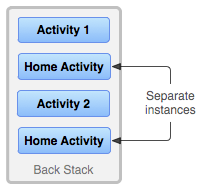
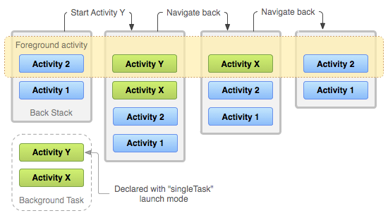
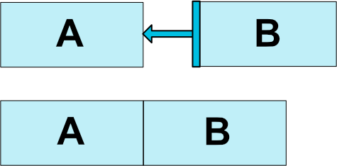

<!-- TOC -->

- [官方文档](#官方文档)
- [ADB Shell](#adb-shell)
- [Intent and Intent Filters](#intent-and-intent-filters)
    - [Overview](#overview)
    - [隐式调用](#隐式调用)
- [Activity:](#activity)
    - [Activity-lifecycle concepts](#activity-lifecycle-concepts)
    - [lifecycle callbacks](#lifecycle-callbacks)
        - [onCreate()](#oncreate)
        - [onStart()](#onstart)
        - [onResume()](#onresume)
        - [onPause()](#onpause)
        - [onStop()](#onstop)
    - [Activity state and ejection from memory](#activity-state-and-ejection-from-memory)
    - [Saving and restoring transient UI state](#saving-and-restoring-transient-ui-state)
        - [Instance state](#instance-state)
        - [Saving simple ,ligheweight UI state using onSaveInstanceState()](#saving-simple-ligheweight-ui-state-using-onsaveinstancestate)
        - [Restore activity UI state using saved instance state](#restore-activity-ui-state-using-saved-instance-state)
    - [Navigating between activities](#navigating-between-activities)
        - [Starting one activity from another](#starting-one-activity-from-another)
            - [startActivityForResult()](#startactivityforresult)
            - [Coordinating activities](#coordinating-activities)
    - [Activity state change](#activity-state-change)
        - [Configuration change occurs](#configuration-change-occurs)
                - [Handling multi-window cases](#handling-multi-window-cases)
        - [Activity or dialog appears in foreground](#activity-or-dialog-appears-in-foreground)
    - [Test your activities](#test-your-activities)
    - [Task and Back Stack](#task-and-back-stack)
        - [Managing tasks](#managing-tasks)
            - [Defining launch modes](#defining-launch-modes)
                - [Using the manifest file](#using-the-manifest-file)
                - [Using Intent flags](#using-intent-flags)
            - [Handling affinities](#handling-affinities)
            - [Clearing the back stack](#clearing-the-back-stack)
            - [Starting a task](#starting-a-task)
        - [process and application lifecycle](#process-and-application-lifecycle)
            - [Parcelable and Boundle](#parcelable-and-boundle)
- [Service](#service)
    - [Service and Thread](#service-and-thread)
    - [The basics](#the-basics)
        - [Declaring a service in the manifest](#declaring-a-service-in-the-manifest)
    - [Create a started service](#create-a-started-service)
        - [Extending the IntentService class](#extending-the-intentservice-class)
        - [Extending the Service class](#extending-the-service-class)
        - [Start a service](#start-a-service)
        - [Create a bound service](#create-a-bound-service)
        - [Send notification to the user](#send-notification-to-the-user)
        - [Running a service in the foreground](#running-a-service-in-the-foreground)
    - [Managing the life cycle of a service](#managing-the-life-cycle-of-a-service)
        - [Implementing the lifecycle callbacks](#implementing-the-lifecycle-callbacks)
    - [Create a background service](#create-a-background-service)
        - [Handle incoming intents](#handle-incoming-intents)
        - [Define the intent service in the manifest](#define-the-intent-service-in-the-manifest)
    - [Send work requests to the background service](#send-work-requests-to-the-background-service)
        - [Create and send a work request to a JobIntentService](#create-and-send-a-work-request-to-a-jobintentservice)
    - [Report work status(需要先看BroadcastReceiver)](#report-work-status需要先看broadcastreceiver)
        - [Report status from a JobIntentService](#report-status-from-a-jobintentservice)
        - [Receive status broadcasts from a JobIntentService](#receive-status-broadcasts-from-a-jobintentservice)
    - [Bound services](#bound-services)
        - [The basics](#the-basics-1)
            - [Binding to started service](#binding-to-started-service)
        - [Creating a bound service](#creating-a-bound-service)
            - [Extending the Binder class](#extending-the-binder-class)
            - [Using a Messenger](#using-a-messenger)
        - [Binding to a service](#binding-to-a-service)
            - [Additional notes](#additional-notes)
        - [Managing the lifecycle of a bound service](#managing-the-lifecycle-of-a-bound-service)
- [Broadcast](#broadcast)
    - [About system broadcasts](#about-system-broadcasts)
        - [Changes to system broadcasts](#changes-to-system-broadcasts)
    - [Receiving broadcasts](#receiving-broadcasts)
        - [Manifest-declared receivers](#manifest-declared-receivers)
        - [Context-registered receivers](#context-registered-receivers)
        - [Effects on process state](#effects-on-process-state)
    - [Sending broadcasts](#sending-broadcasts)
    - [Restricting broadcasts with permissions](#restricting-broadcasts-with-permissions)
        - [Sending with permissions](#sending-with-permissions)
        - [Receiving with permissions](#receiving-with-permissions)
    - [Security considerations and best practices](#security-considerations-and-best-practices)

<!-- /TOC -->


# 官方文档
 - 官方文档: [Android](https://developer.android.google.cn/guide)
# ADB Shell
 - 官方文档：[ADB Shell](https://developer.android.google.cn/studio/command-line/adb?hl=zh_cn#shellcommands)

# Intent and Intent Filters
## Overview
Intent是

## 隐式调用

# Activity:
Activity 类提供了一系列的callback 方法可以让你知道 activity 的状态改变，比如 创建，停止 或者重新启用activity。
在lifecycle 的回调函数中，你可以声明一些activity的行为，比如当用户正在播放视频的时候，当用户切换到另外一个app 的时候停止视频的播放并且终止network的连接，当用户切回到当前app的时候，重新连接网络，并且当视频回到之前的位置开始播放。
在正确的回调方法里面做正确的事情可以使你的app更加高效和健壮。可以避免以下的问题：
- 当用户接到电话或者切换到另一个app的时候避免崩溃
- 当用户不再使用app的时候不会消耗宝贵的系统资源
- 当用户离开你的app的时候不会丢失用户状态
- 当用户进行横竖屏切换的时候不会崩溃或者丢失用户状态
以下的文档会解析activity的生命周期，首先会介绍下lifecycle的图解，然后回介绍每个回调方法：在执行的时候会发生什么，如何实现回调方法。
最后会介绍几个topic和 activity状态的转变。
lifecycle 最佳实践参考 [Handling Lifecycles with Lifecycle-Aware Components](https://developer.android.com/topic/libraries/architecture/lifecycle.html) 和 [Saving UI States](https://developer.android.com/topic/libraries/architecture/saving-states.html)
要学习如何使用activity 和一些其他的架构组件构建一个健壮的，可以在生产环境使用的app，请参考[Guide to App Architecture](https://developer.android.com/topic/libraries/architecture/guide.html)

## Activity-lifecycle concepts
Activity 类提供了六个核心的回调方法：onCreate(), onStart(), onResume(), onPause(), onStop(), and onDestroy(). 当系统进入一个新的状态的时候会回调这些回调方法。


上图是activity的lifecycle的展示。
当用户离开当前activity的时候，系统会调用方法去拆卸这个activity，在一些case中，这个这种拆卸只会是部分的，这个activity还会保存在内存中，并且还可以把这个activity调回到前台。当用户回到这个activity的时候，这个activity会回到用户离开前的状态。
在一些少数的case中， app在后台的活动是受到严格限制的。[restricted from starting activities when running in the background](https://developer.android.com/guide/components/activities/background-starts)

系统是否会杀死进程取决于activity 的状态[Activity state and ejection from memory](https://developer.android.com/guide/components/activities/activity-lifecycle#asem)

基于你的activity的复杂性，你可能不需要实现所有的回调方法。但是理解这些回调方法是很重要的，并且实现这些方法让app按照用户希望的那样运行。

## lifecycle callbacks
在一些状况下， 比如 setContentView()属于 activity lifecycle 他们自身，但是实现从属组件动作的代码应该放在组件本身。为了实现这个，你必须使组件具有生命周期意思。详情请看[Handling Lifecycles with Lifecycle-Aware Components](https://developer.android.com/topic/libraries/architecture/lifecycle.html)去学习如何让从属组件具有生命周期意识。
### onCreate()
你必须实现这个在系统第一次创建activity的时候会调用的回调方法。当activity 创建完成，activity进入Created 状态。在onCreate() 方法，你可以实现一些application 启动逻辑，这个方法只会实现一次。比如你可能会在onCreate() 方法去绑定数据列表， 将activity去关联 一个ViewMode， 和一些实例化的变量。这个方法接受Bundle 类型的参数savedInstanceState,这个参数包含了这个activity之前保存的状态，如果这个activity之前没有保存过，那么这个bundle 的对象的值是null。
如果你有一个有生命周期的从属组件，那么它会收到 ON_CREATE 事件。拥有@OnLifecycleEvent注解的方法会被调用，所以你的又生命周期的从属组件可以在执行一些在created 状态下启动的逻辑。
下面是onCreate() 方法的例子，声明了layout
并且从 参数里面读取之前保存的状态
```java
TextView textView;

// some transient state for the activity instance
String gameState;

@Override
public void onCreate(Bundle savedInstanceState) {
    // call the super class onCreate to complete the creation of activity like
    // the view hierarchy
    super.onCreate(savedInstanceState);

    // recovering the instance state
    if (savedInstanceState != null) {
        gameState = savedInstanceState.getString(GAME_STATE_KEY);
    }

    // set the user interface layout for this activity
    // the layout file is defined in the project res/layout/main_activity.xml file
    setContentView(R.layout.main_activity);

    // initialize member TextView so we can manipulate it later
    textView = (TextView) findViewById(R.id.text_view);
}

// This callback is called only when there is a saved instance that is previously saved by using
// onSaveInstanceState(). We restore some state in onCreate(), while we can optionally restore
// other state here, possibly usable after onStart() has completed.
// The savedInstanceState Bundle is same as the one used in onCreate().
@Override
public void onRestoreInstanceState(Bundle savedInstanceState) {
    textView.setText(savedInstanceState.getString(TEXT_VIEW_KEY));
}

// invoked when the activity may be temporarily destroyed, save the instance state here
@Override
public void onSaveInstanceState(Bundle outState) {
    outState.putString(GAME_STATE_KEY, gameState);
    outState.putString(TEXT_VIEW_KEY, textView.getText());

    // call superclass to save any view hierarchy
    super.onSaveInstanceState(outState);
}
```
作为定义在XML layout文件中，然后使用setContentView()来定义视图的一种替代方案，你可以创建一个新的View 对象，然后通过代码往ViewGroup 中插入View 来构建视图层次。更多的关于创建用户界面的信息，请参考[User Interface](https://developer.android.com/guide/topics/ui/index.html) 文档。
activity不会驻留在Created 状态，当onCreate() 方法调用完成之后，activity进入 Started 状态。系统会快速连续调用onStart()和onResume() 方法。

### onStart() 
当activity进入Started 状态时，系统调用onStart() 回调方法。这个方法使得用户可以看到activity，并且准备进入 前台(foreground) 和用户交互。这个方法是app初始化UI code 的方法。
当activity 进入Started 状态时，有生命周期的从属组件会收到ON_START 事件。
onStart() 方法会很快完成，并且和Created 状态一样，activity也不会驻留在Started 状态，当onStart() 回调完成时，activity会进入 Resumed 状态，并且调用 onResume() 方法。

### onResume()
当activity 进入Resumed 状态时，activity就到了前台(foreground)，然后系统会调用 onResume() 回调方法。
这是app与用户交互的状态。app会保持这个状态直到用户不再focus 这个app。比如有电话进来，用户跳转到另一个app，或者设备的屏幕关闭。
当activity进入resume 状态，它的有生命周期的从属组件会收到ON_RESUME事件，这里是从属组件可以开始它的功能当组件已经可见并且已经在前台(foreground)， 比如开始摄像头预览。
当中断事件发生的时候，activity 进入Paused 状态，系统会调用onPause() 回调方法。
当activity从Paused 状态回到 Resumed时，系统会调用onResume() 方法，所以你必须重新初始化那些在onPause() 方法中释放的组件，和执行其他必须在activity进入Paused状态时的初始化。
下面是lifecycle-aware组件：当收到ON_RESUME事件中访问摄像头
```java
public class CameraComponent implements LifecycleObserver {

    ...

    @OnLifecycleEvent(Lifecycle.Event.ON_RESUME)
    public void initializeCamera() {
        if (camera == null) {
            getCamera();
        }
    }

    ...
}
```
上面的code 是关于[LifecycleObserver](https://developer.android.com/reference/androidx/lifecycle/LifecycleObserver)接收到 ON_RESUME事件时初始化相机。在多窗口模式你的activity 可能处于完全可见但是是Paused 状态。比如用户处于多窗口模式，但是没有触及你的activity，你的activity会处于Paused 状态，如果你想让你的相机只有在app处于Resumed(可见并处于前台 visible and foreground) 状态时active，那就在ON_RESUME 事件中完成初始化。如果你想让你的相机在activity处于Paused 但是可见 (visible)的状态中仍然active，你应该在ON_START事件中初始化相机。然而，当你的activity 处于Paused状态时的相机访问 有可能因为有处于Resumed状态的activity也在使用相机的情况下被拒绝。
有时，你有可能需要在activity处于Paused的时候保持相机处于active状态，但是这个有可能降低用户的体验。在多窗口模式下，你需要更小心的控制生命周期和共享系统资源.学习更多的多窗口模式，请看[Multi-Window Support](https://developer.android.com/guide/topics/ui/multi-window.html)
不管你选择了哪一个事件去初始化组件，请确保选择合适的lifecycle 去释放资源。
如果你用ON_START 事件初始化，用ON_STOP事件释放，如果你用ON_RESUME事件初始化，用ON_PAUSE释放。这些代码可以写在lifecycle-aware 组件上，你也可以直接写在 activity的回调方法中，但是如果你使用了lifecycle-aware组件，那么这个组件可以在多个activity 中复用。详情请参考[Handling Lifecycles with Lifecycle-Aware Components](https://developer.android.com/topic/libraries/architecture/lifecycle.html) 如何创建一个lifecycle-aware组件。

### onPause()
当用户离开你的activity会调用这个方法(这个并不意味着这个activity会被destory)。 这表明activity不再在前台(尽管在多窗口模式下，该activity仍然是可见的)。使用onPause()方法去停止或者调整操作不应该花费太长的时间，当activity 在Paused状态时，你希望它能快速恢复。以下是activity可能进入Paused状态的一些例子：
  - 一些中断事件的执行，这种是最常见的情况。
  - 在android 7.0(API level 24) 或者更高，多个app在多个窗口运行，因为用户同一时间只会操作一个app，系统会暂停其他所有app。
  - 输入框打开的时候，activity仍可见，但是是Paused 状态。
当activity转成 Paused 状态， 所有绑定在该activity的lifecycle-aware组件都会收到 ON_PAUSE事件。lifecycle-aware组件可以停止所有function的运行 当组件已经不在前台， 比如相机预览。
你也可以在onPause() 方法中释放系统资源。处理传感器(比如GPS)或者其他用户在Paused状态下不需要的系统资源。像之前说的，处在Paused状态下的activity有可能还是可见的，所以应该考虑在onStop() 方法中释放所有的资源而不是在onPause() 中。
下面是lifecycle-aware组件：当收到ON_PAUSE事件中释放摄像头的例子
```java
public class JavaCameraComponent implements LifecycleObserver {

    ...

    @OnLifecycleEvent(Lifecycle.Event.ON_PAUSE)
    public void releaseCamera() {
        if (camera != null) {
            camera.release();
            camera = null;
        }
    }

    ...
}
```
onPause() 操作时非常简短的，不一定有足够的事件来执行保存操作。基于这个原因，你不应该使用onPause() 方法来保存用户数据，进行network 访问，或者执行数据库事务。这些工作可能不能在方法执行完之前完成。所以，你应该在onStop() 方法中执行那些繁琐的shutdown 操作。关于更多的保存数据操作，请看 [Saving and restoring activity state](https://developer.android.com/guide/components/activities/activity-lifecycle#saras)
执行完onPause() 方法并不意味着用户activity会离开Paused 状态，activity会保持Paused状态直到activity被重新唤醒的时候执行 onResume() 回调。当activity的状态从Paused 状态转变成Resumed状态的时候，系统会保存这个activity的实例在内存中，然后调用 onResume() 方法。在这种场景中，你不需要在任何回调方法来恢复之前的状态。当activity变得完全不可见的时候，系统会调用 onStop() 方法。

### onStop()
当用户对用户不可见的时候，activity会进入Stopped 状态。系统会调用onStop() 回调方法。举个例子，当有新的activity覆盖整个屏幕的时候。当activity运行结束之后，系统会调用onStop() 方法，这个是 to be terminated。
当activity转到Stopped 状态，所有绑定的lifecycle-aware 组件会收到 ON_STOP事件，这个是lifecycle 组件可以停止所有不需要再界面不可见时运行的function。
在onStop() 方法，app应该释放或者调整那些在app 不可见时不需要的资源。比如，你的app可能会停止动画，或者把位置更新从细粒度转到粗粒度。
你通常需要使用onStop() 方法来关闭那些CPU-intensive的操作。
例如，如果你找不到一个合适的时机来保存信息到数据库，你可以在onStop()方法中进行这个操作。以下时在onStop() 方法中保存数据库的例子。
```java
@Override
protected void onStop() {
    // call the superclass method first
    super.onStop();

    // save the note's current draft, because the activity is stopping
    // and we want to be sure the current note progress isn't lost.
    ContentValues values = new ContentValues();
    values.put(NotePad.Notes.COLUMN_NAME_NOTE, getCurrentNoteText());
    values.put(NotePad.Notes.COLUMN_NAME_TITLE, getCurrentNoteTitle());

    // do this update in background on an AsyncQueryHandler or equivalent
    asyncQueryHandler.startUpdate (
            mToken,  // int token to correlate calls
            null,    // cookie, not used here
            uri,    // The URI for the note to update.
            values,  // The map of column names and new values to apply to them.
            null,    // No SELECT criteria are used.
            null     // No WHERE columns are used.
    );
}
```
这个例子是直接使用 SQLite，你可能应该使用Room，一个基于SQLite 的抽象存储库。了解更多请看[Room Persistence Library](https://developer.android.com/topic/libraries/architecture/room.html)
当activity 进入Stopped 状态，activity 对象还会保留在内存中，它维护所有状态和成员信息，但并不是attach在窗口管理器。当 activity 恢复的时候，activity 重新调用这些信息，你不需要在任何初始化组件中创建任何回调方法来恢复之前的Resumed状态。系统也会跟踪在layout中所有view的当前状态。所以，当用户在EditText中输入信息的时候，信息会保留而不需要你手动保存。
<table><tr><td bgcolor=#e1f5fe>
<font color="#01579b" size=4>
Note:
当你的activity 处于Stopped 状态时，系统可能为了恢复内存而去销毁进程，就算系统销毁了处于Stopped 状态的进程，系统还是会保留这些View Object 中的状态 到 一个 Bundle 对象，然后在用户返回这个activity的时候还原。如果要看更多的还原activity的操作，请看[ Saving and restoring activity state](https://developer.android.com/guide/components/activities/activity-lifecycle#saras)
</font>
</td></tr></table>
从Stopped状态，activity要么回到跟用户交互，要么在activity完成之后消失。如果activity回到与用户交互，系统会调用 onRestart() 方法，如果activity 运行结束，系统会调用onDestory() 方法。

- onDestory()
 onDestory() 方法会在activity被destory之前调用。系统会调用这两个方法基于下面两种情况：
   - activity完成(基于用户解散这个activity或者finish() 方法被调用)
   - 系统由于 configuration change(例如设备旋转或者多窗口模式))临时销毁activity 
当activity 变成 Destoryed状态， 所有lifecycle-aware 组件会受到 ON_DESTROY 事件，lifecycle 组件会在activity 被销毁之前清除所有的东西。
应该使用ViewModel 对象去保存view data 而不是在里面写决定为什么销毁activity的逻辑。如果activity 由于configuration change 要重新创建activity，ViewModel 不需要做任何事，因为它将被保留下来给下一个activity实例。如果activity不准备重新创建，那么ViewModel 将会调用onCleared() 方法，会清除所有数据。
你可以根据isFinishing()区分下面两种场景。
如果activity finish，onDestory() 方法是生命周期最后一个回调函数。如果onDestory() 是configuration change的结果，系统会立即创建一个新的activity实例，然后用新的configuration调用onCreate() 方法。
onDestory() 回调应该释放所有的在onStop()中没有释放的资源。

## Activity state and ejection from memory
系统会kill进程当他需要释放内存的时候，系统kill进程的可能性有可能取决于进程当时的状态。反过来，进程的状态取决于进程中activity的运行状态。下图表示了进程状态，activity 状态和被系统kill的可能性

系统用户不会直接kill 一个 activity来释放内存。系统会kill 进程，包括activity和其他运行在其中的所有东西。学习如何保存和恢复activity UI 状态当系统kill 进程的时候。请看 [Saving and restoring activity state](https://developer.android.com/guide/components/activities/activity-lifecycle#saras)
用户也可以通过应用管理器去杀死进程。

想了解更多的进程相关的，请参考[Processes and Threads](https://developer.android.google.cn/guide/components/processes-and-threads.html)。想了解更多的进程的生命周期和activity绑定的信息，请参考[Process Lifecycle](https://developer.android.google.cn/guide/components/processes-and-threads.html#Lifecycle)。

## Saving and restoring transient UI state
一个用户希望当configuration change 像屏幕旋转或者进入多窗口模式的时候
activity的UI跟之前保持一致。然而，当这些configuration change 发生的时候，系统默认销毁activity， 包括存储在activity里面的UI状态。同样的，用户也希望当他切换到别的app再回来的时候，也希望activity的UI状态保持不变。然而，当你的activity处于Stopped 状态时，系统可能会kill了你的进程。
当你的activity因为系统需求约束销毁的时候，你应该使用ViewModel，onSaveInstanceState() 或者local storage 去保存UI状态。想学习更多关于用户期望和系统行为和如何在系统初始化activity和进程死亡之间最好的保存复杂的UI状态，请看[Saving UI State](https://developer.android.google.cn/topic/libraries/architecture/saving-states.html)。
这一小节简单介绍了什么是instance state和如何使用onSaveInstance()方法，如果你的UI 数据时简单和轻量级的，比如一些基础类型和简单对象比如String，你可以只使用onSaveInstanceState()去保存UI状态。在其他大部分情况，你都应该使用ViewModel和onSaveInstanceState()，当onSaveInstanceState()可能会导致序列化和反序列化的性能消耗时。

### Instance state
有几个场景activity被destory 时因为app的正常行为，比如用户按下返回按钮或者你的activity通过调用finfish() 方法。当因为用户按下返回按钮或者activity自己finish，无论是系统还是用户意识中，这个activity 实例已经永远销毁了。在这些场景中，用户希望的和系统行为一致，所以没有什么额外的工作要做。
然而，当系统因为系统约束，比如configuration change或者内存不足而destroy activity时，虽然实际上 activity实例已经销毁了，但是系统会记住它是存在的，如果用户试图导航回到activity，系统使用一组描述activity销毁状态前的数据创建一个新的activity 实例。
系统使用的恢复之前状态的保存的数据称为实例状态(Instance state),这是一个键值对存储在一个Bundle对象的集合。默认情况下，系统使用Bundle 实例去保存每个在activity布局中的View 对象(比如EditText widget 中的text value)的信息。所以，当你的activity实例被destroy和重新创建，这些layout的状态会还原到以前的状态，而不需要你手写代码。然而，你的activity可能有更多的状态信息要存储，比如一些用来追踪用户activity进展的成员变量。
- Note:
为了让Android系统恢复活动的View object的状态，每个视图都必须有一个唯一的id提供给 android:id 属性。
这个Bundle对象不适合用来保存很多琐碎的数据量，因为他要在主线程上进行序列化并且消耗进程的内存。为了在Bundle保存少量的数据，你应该该结合本地缓存和local storage来保存数据。即结合 onSavwInstanceState() 方法，ViewModel, 详情请看 [Saving UI States](https://developer.android.google.cn/topic/libraries/architecture/saving-states.html)。
### Saving simple ,ligheweight UI state using onSaveInstanceState()
当你的activity开始stop的时候，系统会调用 onSaveInstanceState() 方法，这样你的activity可以将状态信息保存到一个Bundle 对象。该方法的默认实现保存一些activity的视图层次，比如一些小部件EditText widget 的text信息或者ListView widget 的滚动的位置。
为了给activity保存额外的的实例状态(Instance state)的信息,你必须重写 onSaveInstanceState() 方法，然后加一些键值对到Bundle 对象上，当你的activity被意外销毁时。当你重写onSaveInstanceState()方法时，如果你想保存视图层级的状态，你必须调用父类的onSaveInstanceState() 方法。
```java
static final String STATE_SCORE = "playerScore";
static final String STATE_LEVEL = "playerLevel";
// ...


@Override
public void onSaveInstanceState(Bundle savedInstanceState) {
    // Save the user's current game state
    savedInstanceState.putInt(STATE_SCORE, currentScore);
    savedInstanceState.putInt(STATE_LEVEL, currentLevel);

    // Always call the superclass so it can save the view hierarchy state
    super.onSaveInstanceState(savedInstanceState);
}
```
- Note:
当用户显式地关闭activity时或者activity 的finfish() 方法被调用时onSaveInstanceState() 方法不会被调用。
为了保存一些持久化数据，比如user preferences 或者保存一些数据到数据库，你应该在activity在前台的时候找个合适的时机。如果你找不到合适时机，你应该在onStop() 方法中做这些事情。
### Restore activity UI state using saved instance state
当你的activity是在被destroy后重新创建，你可以通过系统传递过来的Bundle对象恢复之前的实例状态(Instance state)。onCreate() 和onRestoreInstanceState() 回调方法都会使用一样的Bundle 对象。
因为onCreate() 方法是在activity方法被创建的时候都会被调用的，(可能存在第一次创建的时候，Bundle 对象为null)，所以必须在使用前判断Bundle 对象是否为null。如果Bundle 对象是null,那么系统是在创建一个新的activity实例而不是恢复之前被销毁的实例。
下面是你可以在onCreate() 方法中恢复实例状态的例子：
```java
@Override
protected void onCreate(Bundle savedInstanceState) {
    super.onCreate(savedInstanceState); // Always call the superclass first

    // Check whether we're recreating a previously destroyed instance
    if (savedInstanceState != null) {
        // Restore value of members from saved state
        currentScore = savedInstanceState.getInt(STATE_SCORE);
        currentLevel = savedInstanceState.getInt(STATE_LEVEL);
    } else {
        // Probably initialize members with default values for a new instance
    }
    // ...
}
```
你也可以使用onRestoreInstancState() 方法，这个方法会在onStart() 方法被调用之后调用。系统只有在存在保存实例状态的时候(即 Bundle 对象不为null)调用，所以不需要检查Bundle 对象是否为null。
```java
public void onRestoreInstanceState(Bundle savedInstanceState) {
    // Always call the superclass so it can restore the view hierarchy
    super.onRestoreInstanceState(savedInstanceState);

    // Restore state members from saved instance
    currentScore = savedInstanceState.getInt(STATE_SCORE);
    currentLevel = savedInstanceState.getInt(STATE_LEVEL);
}
```
- Caution:
调用父类的onRestoreInstanceState() 方法默认实现可以恢复视图层面的状态。
## Navigating between activities
一个app在生命周期中可能进入和退出一个activity。比如用户可以使用设备的返回按键或者activity需要启动一个不同的activity。本节介绍activity之间的跳转。这些主题包括从一个activity启动另一个activity，保存activity的状态和恢复activity的状态。

### Starting one activity from another
一个activity通常需要启动另一个activity，如果当app需要从当前屏幕移动到一个新的activity。
取决于你的activity想不想新的activity有返回结果，你的启动activity的方法可以非为两个 startActivity()或者startActivityForResult()。在这两种情况下，你传递的都是Intent 对象。
Intent 对象描述了你想启动的activity或者描述了你想启动activity的类型(系统选择当前app或者甚至是不同app中的适当的应用)。Intent对象也可以传递一些少量的数据用来给activity启动使用，想了解更多的关于Intent 类，请参考[ Intents and Intent Filters](https://developer.android.google.cn/guide/components/intents-filters.html)。
 
 #### startActivity()
如果你启动一个新的activity不需要返回结果，你可以调用startActivity()方法。
当你在自己的app内，你经常需要简单地启动你知道的activity。例如下面代码显示了如何启动一个称为 SignActivity的activity。
```java
Intent intent = new Intent(this, SignInActivity.class);
startActivity(intent);
```
你的应用程序可能也要从你的活动执行一些操作,如发送电子邮件,短信,或状态更新,使用数据。在这种情况下,你的应用程序可能没有自己的活动来执行这样的行为,所以你可以利用活动提供的其他应用程序在设备上,它可以执行的操作。这是意图很有价值的地方:你可以创建一个意图描述你要执行的操作和系统启动适当的活动从另一个应用程序。如果有多个活动,可以处理的目的,然后,用户可以选择使用哪一个。例如,如果你想允许用户发送一封电子邮件,你可以创建以下Intent:
```java
Intent intent = new Intent(Intent.ACTION_SEND);
intent.putExtra(Intent.EXTRA_EMAIL, recipientArray);
startActivity(intent);
```
EXTRA_EMAIL额外添加到意图是一个字符串数组的电子邮件应该发送电子邮件地址。当一个电子邮件应用程序响应这个意图,它读取字符串数组中提供额外的和地方的”到“电子邮件领域组成形式。在这种情况下,电子邮件应用程序的活动开始,当用户完成时,resumes你的activity。
#### startActivityForResult()
有些时候，你需要从一个activity中得到返回结果。
例如,你可能会开始一个activity,让用户在一个联系人列表中选择一个人;当它结束时,它将返回被选中的人。要做到这一点,你调用startActivityForResult(Intent,int)方法,在整数参数标识返回结果的回调，用来区分一个activity中多个startActivityForResult(Intent, int)的响应逻辑。它不是全局标识符，不会与其他的app或者activity起冲突。返回来的结果的回调方法是onActivityResult(int,int,Intent)。
当一个子activity退出时，它可以调用setResult(int)去返回数据给父activity。子活动活动必须提供一个结果代码,可以是标准的返回结果RESULT_CANCELED,RESULT_OK，或者是从RESULT_FIRST_USER 开始的任何自定义值。此外，子activity可以包含任何数据的Intent 对象。父activity使用 onActivityResult(int,int,Intent)方法通过父活动提供的整数标识符来接收信息。
如果子activity因为任何原因失败了，比如说崩溃了，父activity会接收到代码 RESULT_CANCELED。
```java
public class MyActivity extends Activity {
     // ...

     static final int PICK_CONTACT_REQUEST = 0;

     public boolean onKeyDown(int keyCode, KeyEvent event) {
         if (keyCode == KeyEvent.KEYCODE_DPAD_CENTER) {
             // When the user center presses, let them pick a contact.
             startActivityForResult(
                 new Intent(Intent.ACTION_PICK,
                 new Uri("content://contacts")),
                 PICK_CONTACT_REQUEST);
            return true;
         }
         return false;
     }

     protected void onActivityResult(int requestCode, int resultCode,
             Intent data) {
         if (requestCode == PICK_CONTACT_REQUEST) {
             if (resultCode == RESULT_OK) {
                 // A contact was picked.  Here we will just display it
                 // to the user.
                 startActivity(new Intent(Intent.ACTION_VIEW, data));
             }
         }
     }
 }
```
#### Coordinating activities
当一个activity启动另一个activity的时候，他们都经历activity的转换。当另一个activity创建的时候，第一个activity进入Paused 或者 Stopped 状态。当这些activity保存共享数据到磁盘或者其他地方的时候，理解下面的很重要，并不是第一个activity完全stopped之后才创建第二个activity。相反，是在启动第二个activity的过程中停止第一个activity。
lifecycle 回调的顺序需要好好的定义，尤其是当两个activities在同一个app内，并且由由一个启动另外一个的时候。下面是activity A启动activity B 时的操作顺序：
  - 1.activity A 的onPause() 方法执行。
  - 2.activity B 的onCreate()，onStart() 和onResume() 方法执行，现在 activity B 是用户 focus的了。
  - 3. 然后 activity A 已经在屏幕上不可见了，它的onStop() 方法执行。
  这个预测的生命周期的顺序允许你管理从一个activity到另一个activity的信息转换。

## Activity state change
不同的事件，有可能是用户触发的，有可能是系统触发的，都会导致Activity的状态转换。本文档描述了一些常见的状态转换的情况以及处理这种状态转换的方法。想了解更多的关于activity的状态，请参考[Understand the Activity Lifecycle](https://developer.android.google.cn/guide/components/activities/activity-lifecycle.html)。想学习ViewModel类如何帮助你管理activity的生命周期，请参考[Understand the ViewModel Class](https://developer.android.google.cn/topic/libraries/architecture/viewmodel.html)。
### Configuration change occurs
有几个事件可以触发configuration change，最常见的例子可能是设备水平和竖直的变化。其他的包括语言的改变或者输入法的改变都会导致configuration change.
当configuration change发生的时候，activity会被销毁和重新创建。原来的activity实例可能会触发 onPause(),onStop(),和onDestroy()回调方法。一个新的activity实例会被创建，然后调用 onCreate(),onStart(),和onResume() 回调方法。
当configuration change时，混合使用ViewModel,onSaveInstanceState()和本地存储来保存activity的UI状态。如何结合这些方法取决于你的UI data的复杂程度，需要考虑检索速度和内存占用。想了解更多的保存activity的UI状态，请看 [Saving UI States](https://developer.android.google.cn/topic/libraries/architecture/saving-states.html)。
##### Handling multi-window cases
当一个app进入多窗口模式时，在Android 7.0(API level 24)或者更高版本可用，系统会通知当前正在运行的activity的configuration，activity的生命周期会发生变化。在处于多窗口模式下的app而言，resize窗口大小也会触发上述行为。你的activity可以自己处理这些configuration change，或者允许系统销毁你的activity然后用新的config去重新创建activity。
想了解更多关于多窗口的生命周期，请看[ Multi-Window Support ](https://developer.android.google.cn/guide/topics/ui/multi-window.html)的[ Multi-Window Lifecycle](https://developer.android.google.cn/guide/topics/ui/multi-window.html#lifecycle)小节。
在多窗口模式下，虽然有两个app对用户来说是可见的，但是只有一个app是在前台与用户交互的，这个app处于Resumed状态，而另一个app处于Paused状态。
当用户从app A 转到 app B,系统调用app A 的onPause() 方法，调用app B 的onResume() 方法。
想了解更多关于多窗口模式的细节，请看[Muti-Window Support](https://developer.android.google.cn/guide/topics/ui/multi-window.html)。
### Activity or dialog appears in foreground
当一个新的activity或者弹框出现在前台，taking focus 部分覆盖正在运行的activity，被覆盖的activity失去焦点进入Paused 状态，系统调用onPause() 方法。
当被覆盖的activity重新回到前台重新获得焦点，就会调用onResume() 方法。
当一个新的activity或者弹框出现在前台，并且完全覆盖正在运行的activity，这个activity失去焦点并且进入Stopped 状态，系统会快速调用onPause() 和 onStop() 方法。
当这个被覆盖的activity 实例重新回到前台的时候，系统调用onRestart() onStart() 和onResume() 方法，当一个新的实例覆盖activity的时候，系统不会调用onRestart() 方法，只会调用onStart()和onResume().
- note:
当用户按下home按钮时，当前activity的系统行为表现为完全覆盖。
## Test your activities
详见[Test your app's activities](https://developer.android.google.cn/guide/components/activities/testing)
## Task and Back Stack
当用户在执行一项确定的工作时，用户与之交互的activity的集合称为一个task。这些activity根据打开的顺序放在back stack里面。例如一个电子邮件app可能有一个activity来显示新消息的列表。当用户选择一个message时，会打开一个新的activity来查看这条message。这个新的activity会被加到back stack。当用户按下返回按钮，这个新的activity会finished然后从stack里面pop出来。
当app同时在多窗口模式(在android 7 API level 24 以上支持)下运行，系统会为每个窗口分别管理任务。每个窗口可能有多个任务。这个同样适用于[ Android apps running on Chromebooks](https://developer.android.google.cn/topic/arc/index.html)，系统在每个窗口上管理task，或者一组task。
设备主屏幕是大多数task的起点。当用户点击app的launcher icon时，app的task变成前台(foreground)。如果这个app没有task存在(最近没有使用),那么一个新的task就会被创建，app的main activity就会打开，作为栈的根。
当当前的activity启动另一个activity，这个新的activity会被push到stack的顶部，获得焦点，之前的activity会保留在stack里面，但是状态是Stopped的。当activity stop，修通会保留用户界面的状态。当用户点击返回按钮，当前的activity会从stack的顶部pop出来(这个activity会被destroy),之前的activity resumes.在stack中的activities永远不会rearranged，只有从stack中push进去或者pop出来，当从当前activity中启动时，push到stack中，当用户按下返回按钮时，从stack中pop出来。因此，back stack 是个后出先进的stack。下图显示了这一行为：

如果用户继续点击返回，那么在stack中的每个activity都会被pop出来，直到返回主界面(or to whichever activity was running when the task began)。当所有的activities都从stack移除的时候，这个task也就不存在了。
一个task是一个凝聚单元，当用户开始一个新的task或者通过Home 按钮跳转到主界面的时候，可以移动到 'background'。
当task处于background时，所有在这个task中的activities 都是stopped状态的，但是task是完好无损的，这个task只是简单地失去了焦点，如下图所示：

一个任务可以返回前台，用户可以从他之前离开的地方重新开始。举个例子，一个task A 有三个activities，用户按下home 按钮，然后启动一个新的app。当回到主界面的时候，这个task就在background了。当新的app B启动的时候，系统会为新的app B启动一个新的task。当用户返回主界面并且选择之前启动过的app A时， task A就到了foreground，它的三个activity都是没有任何改变的，然后处于stack顶部的activity会resumes。在这个时候，用户也可以通过主界面或者使用[Recents screen](https://developer.android.google.cn/guide/components/recents.html)切换回之前的task B，这个就是android的多任务的例子。
- note:
多任务可以在后台运行。但是当用户运行了太多的background task的时候，系统可能会destroy一些background activities来释放内存，可能会导致activity的状态丢失。
因为在back stack 中的activities永远不会rearranged，如果你的app允许用户通过不止一个activity启动一个activity，一个新的activity实例会被创建并且push到stack里面而不是把之前的activity实例置顶。因此，在你的应用程序中，一个activity可能会被实例化多次，如下图所示：

同样的，当用户通过返回按钮返回，每个在task中的activity都会顺序打开(每个都有它们自己的UI state)。然而如果你可以改变这种行为，比如让activity只实例化一次。这部分我们会在下面的小节[Managing Tasks](https://developer.android.google.cn/guide/components/activities/tasks-and-back-stack#ManagingTasks)中会介绍。
总结 activities和task的默认行为
- 当activity A 启动activity B,activity A 被stop，但是系统保留其状态比如滚动的位置和文本的输入。当用户按下返回键的时候，activity A resumes,它的状态会被还原。
- 当用户按下Home键离开这个task的时候，当前的activity是stopped的，它的task变成background的。系统保留这个task中的activities的每个状态。如果用户resume这个task通过选择启动图标启动task，这个task 变成foreground，然后resume这个task顶部的activity。
- 如果用户按下返回键，当前的activity从stack中pop出来然后destroy。stack中的前一个activity会resume。当activity被destroy，系统不会保留这个activity的状态。
- activities可以被实例化多次，即使是从不同的task中。
<table><tr><td bgcolor=#e1f5fe>
<font color="#01579b" size=4>
Navigation Design:
了解更多的app 的navigation的工作，请看android design's Navigation guide.
https://developer.android.google.cn/guide/navigation/navigation-design-graph
</font>
</td></tr></table>

### Managing tasks
Android 管理task 和back stack的方法如上所述，所有连续启动的activity在同一个task，保存在一个后入先出的stack里面- 在大多数的app里面工作良好，你不需要担心你的activities怎么跟task关联以及怎么他们是怎么存在于back stack里面的。然而，你可能想要中断这些正常的行为。也许你想要一个activity在一个新的task里面启动而不是放置在当前的task里面。或者 当你想要启动一个activity时，不是去创建一个新的实例而是把已有的实例置顶，或者，你想要用户离开当前task时把除了root activity以外的所有activity清空。
你可以做这些事情或者更多，使用 manifest 文件里面 <activity>的属性或者在你传递给startActivity()方法里面的intent设置flag。
在这个方面，下面一些主要的<activity>的属性你可以使用
- taskAffinity
- launchMode
- allowTaskReparenting
- clearTaskOnLaunch
- alwaysRetainTaskState
- finishOnTaskLaunch
下面时你可以使用的主要的intent 的flag：
- FLAG_ACTIVITY_CLEAR_TOP
- FLAG_ACTIVITY_SINGLE_TOP
- FLAG_ACTIVITY_NEW_TASK
在下面的小节中，你可以看到使用manifest 属性和intent 的flags 去定义activities 是如何关联task以及他们在back stack中的行为。
此外，将分别讨论如何在“最近”屏幕中表示和管理任务和活动的注意事项。查看 [Recents Screen](https://developer.android.google.cn/guide/components/recents.html) 获取更多信息。通常，你应该允许系统定义你的task和activities如何在Recents screen 中显示，你不应该修改这些行为。
- Caution：
大多数app不应该中断activities和task的默认行为，如果你决定修改你的activity的默认行为是必须的，请谨慎使用，并确保在启动过程中以及使用“后退”按钮从其他activity和任务导航回activity时测试activity的可用性。确保测试导航行为不与用户预期行为冲突。
#### Defining launch modes
Launch modes 允许你定义一个新的activity实例如果关联当前task。你可以通过以下两种方式定义不同的launch modes：
- 使用manifest 文件
当你在你的manifest file中定义activity，你可以指定当它启动的时候如果与task 关联。
- 使用 Intent 的flag
当你调用startActivity() 方法时，你可以在intent中添加一个flag，以声明新的activity应如何(或者是否)与当前task 关联。

这样，如果activity A启动activity B，则activity B可以在清单中定义它应如何与当前task关联（如果有的话），activity A也可以请求activity B应该如何与当前task关联。 如果两个activity 都定义了activity B应如何与task关联，则activity A的请求（如Intent 中所定义）优先于activity B的请求（如其manifest中所定义）。
- Note:
某些在manifest 文件中可用的launch modes在Intent的flag中不可用，一些在Intent flag中可用的launch mode不能定义在manifest文件中。
##### Using the manifest file
在manifest文件中声明activity时，可以使用<activity>元素的launchMode属性指定activity应如何与task关联。
launchMode属性指定有关如何将activity启动到task中的指令。 你可以将四种启动模式分配给launchMode属性：
- standard(the default mode)
默认。 系统在task中从中创建活动的新实例，并将intent路由到该活动。 该activity可以被实例化多次，每个实例可以属于不同的task，并且一个task可以具有多个实例。
- singleTop
如果activity的实例已经存在于当前task的顶部，则系统通过调用其onNewIntent()方法将Intent路由到该实例，而不是创建activity的新实例。 该activity可以被实例化多次，每个实例可以属于不同的task，一个task可以具有多个实例（但前提是位于后堆栈顶部的activity不是该activity的现有实例）。
例如，假设task的后stack由根activity A组成，根activity A在顶部，activity B，C和D（stack在A-B-C-D； D在顶部）。 Intent到达类型为D的activity。如果D具有默认的“标准”启动模式，则将启动该类的新实例，并且stack将变为A-B-C-D-D。 但是，如果D的启动模式为“ singleTop”，则D的现有实例通过onNewIntent（）接收Intent，因为它位于stack的顶部，即stack仍为A-B-C-D。 但是，如果到达类型B的activity的Intent，则将B的新实例添加到stack中，即使其启动模式为“singleTop”。Note: 注意：创建activity的新实例时，用户可以按“后退”按钮返回上一个activity。 但是，当activity的现有实例处理新Intent时，用户无法在新Intent到达onNewIntent（）之前按“后退”按钮以返回到activity状态。
- singleTask
系统创建一个新task，并在新task的根目录处实例化activity。 但是，如果activity的实例已经存在于单独的task中，则系统将通过对其onNewIntent（）方法的调用将Intent路由到现有实例，而不是创建新实例。 一次只能存在一个activity实例。注意：尽管activity在新task中开始，但是“后退”按钮仍使用户返回上一个activity
- singleInstance
与“ singleTask”相同，除了系统不会将任何其他activity启动到保存实例的task中。 activity始终在是其task的始终是单例的，只有一个成员。 所有用这种模式打开的activity都会在一个单独的task中。

再举一个例子，Android浏览器应用通过在<activity>元素中指定singleTask启动模式，声明Web浏览器activity应始终在其自己的task中打开。 这意味着，如果你的应用发出打开Android浏览器的意图，则其activity不会与你的应用放在同一task中。 取而代之的是，要么为浏览器启动一个新task，要么，如果浏览器已经在后台运行了一个task，则将该task带到新的位置以处理新的意图。
无论activity是在新task中启动还是在与启动该task的activity相同的task中启动，“后退”按钮始终会将用户带到上一个activity。 但是，如果启动指定singleTask启动模式的activity，则如果该activity的实例存在于后台task中，则整个task都将置于前台。 至此，back stack现在在stack的顶部包括来自提出的task的所有activity。 下图说明了这种情况。

具有“singleTask” launch model的activity如何添加到后stack的表示。 如果activity已经是具有自身后退stack的后台task的一部分，则整个back stack也将位于当前task之上。
有关在manifest文件中使用launch mode的更多信息，请参见<activity>元素文档，其中对launchMode属性和接受的值进行了更多讨论。
注意：你可以使用启动模式的Intent所包含的标志来覆盖你使用launchMode属性为activity指定的行为，如下一节所述。
##### Using Intent flags
启动活动时，可以通过在传递给startActivity（）的Intent中包含标志来修改活动与其task的默认关联。 可以用来修改默认行为的flag是：
- FLAG_ACTIVITY_NEW_TASK
在新task中启动activity。 如果你现在正在为该activity运行task，那么该task将被带到前台并恢复其状态，并且该activity将在onNewIntent（）中收到新的Intent。
这产生的行为与上一节中讨论的“ singleTask” launchMode值相同。
- FLAG_ACTIVITY_SINGLE_TOP
如果正在启动的activity是当前activity（在后stack的顶部），则现有实例将收到对onNewIntent（）的调用，而不是创建该activity的新实例。
这产生与上一节中讨论的“ singleTop” launchMode值相同的行为。
- FLAG_ACTIVITY_CLEAR_TOP
如果正在启动的activity已经在当前task中运行，那么与其启动该activity的新实例，不如破坏该activity之上的所有其他activity，并将此Intent传递给该activity的恢复实例（现在 顶部），通过onNewIntent（））。
产生此行为的launchMode属性没有相对应的值。
FLAG_ACTIVITY_CLEAR_TOP最常与FLAG_ACTIVITY_NEW_TASK结合使用。 当这些标志一起使用时，它们是一种在另一个task中定位现有activity并将其置于可以响应Intent的位置的方法。
Note：如果指定activity的启动模式为“标准”，则也会将其从stack中删除，并在其位置启动一个新实例以处理传入的Intent。 这是因为当启动模式为“标准”时，总是为新Intent创建新实例。
#### Handling affinities
affinity指示activity喜欢属于哪个task。 默认情况下，同一应用程序中的所有activity都具有相互关联性。 因此，默认情况下，同一应用程序中的所有activity都希望属于同一task。 但是，你可以修改activity的默认关联性。 在不同应用程序中定义的activity可以共享affinity，或者可以在同一应用程序中定义的activity分配不同的task affinity。
你可以使用<activity>元素的taskAffinity属性修改任何给定activity的 affinity 。
taskAffinity属性采用字符串值，该字符串值必须与<manifest>元素中声明的默认程序包名称唯一，因为系统使用该名称来标识应用程序的默认task关联。
affinity在下面两种情况下起作用：
- 当Intent 启动activity的时候包含了FLAG_ACTIVITY_NEW_TASK flag。
一个新的activity，默认是会启动到调用startActivity()启动它的activity所属的task中。它被push到相同的back stack中。然而当传递给startActivity()的Intent中包含了FLAG_ACTIVITY_NEW_TASK flag 时，系统将寻找不同的task来容纳新的activity，通常，这个是一个新的task。但是这也不是绝对的，如果已经存在一个task与新的task有相同的affinity，则会将改activity启动到该task中，如果没有，那么将开始一个新的task。
如果这个flag导致用户开始了一个新的task，而且用户按下home键离开这个activity，那么用户必须有某种方法可以navigate回到这个task。一些实体，比如通知管理器经常在外部task中启动activity，而不是将其作为自己的一部分，因此他们总是将FLAG_ACTIVITY_NEW_TASK 放入传递给startActivity() 的Intent中。如果你的可以被外部实体唤起的activity可能使用了这个flag唤起的，请注意用户有独立的方式来返回已经启动的任务，例如使用launch icon(task的root activity有 CATEGORY_LAUNCHER intent filter，详情请看[Starting a task](https://developer.android.google.cn/guide/components/activities/tasks-and-back-stack#Starting)).
- 当一个activity带有allowTaskReparenting 属性并且设置为true. 
在这种情况下，activity可以从它启动的task移动到具有关联性的task。
例如，假设将报告选定城市的天气状况的activity定义为旅行应用程序的一部分。 它与同一应用程序中的其他activity具有相同的关联性（默认应用程序关联性），并且允许使用此属性进行重新关联。 当你的一项activity开始天气报告者activity时，它最初与你的activity属于同一task。 但是，当旅行应用程序的task来到前台时，天气报告者activity将重新分配给该task并显示在其中。

tips:
提示：如果从用户的角度来看，一个APK文件包含多个app，则你可能希望使用taskAffinity属性为与每个app相关联的activity分配不同的affinity。
#### Clearing the back stack
如果用户长时间离开task，系统将清除除 root activity以外的所有activity的task。 当用户再次返回task时，仅还原root activity。 系统的行为方式是这样的，因为经过较长时间后，用户可能已经放弃了以前的工作，而返回到task以开始新的工作。
你可以使用一些activity属性来修改此行为：
- alwaysRetainTaskState
如果在任务的root activity 中将此属性设置为“ true”，则不会发生上述默认行为。 即使经过很长时间，该任务也会将所有activity保留在其堆栈中。
- clearTaskOnLaunch
如果在task的root activity中将此属性设置为“ true”，则每当用户离开task并返回到该task时，堆栈都会清除为root activity。 换句话说，它与alwaysRetainTaskState相反。 即使在离开task一小会后，用户也始终以其初始状态返回task。
- finishOnTaskLaunch
此属性类似于clearTaskOnLaunch，但它对单个activity而不是整个task进行操作。 它还可能导致任何activity消失，包括根activity。 设置为“ true”时，activity仅对于当前会话仍是task的一部分。 如果用户离开然后返回task，该task将不再存在。
#### Starting a task
你可以使用 intent filter 的"android.intent.action.MAIN"和category "android.intent.category.LAUNCHER"来设置一个entity的入口，如下所示
```xml
<activity ... >
    <intent-filter ... >
        <action android:name="android.intent.action.MAIN" />
        <category android:name="android.intent.category.LAUNCHER" />
    </intent-filter>
    ...
</activity>
```
这种intent filter 会在应用程序启动器中创建icon和标签，从而为用户提供启动activity的方法并且在activity 启动后随时返回创建的task的方法。
第二个功能很重要：用户必须能够离开task，然后稍后使用此activity launcher返回该task。因此，当activity 既有ACTION_MAIN和CATEGORY_LAUNCHER filter 时，才使用singleTask 和singleInstance,想象一下，如果缺少过滤器会发生什么：一个Intent启动一个singleTask的activity，启动一个新的task，并且用户花一些时间在该task上工作。然后用户按下home键，现在task已经到background，用户无法返回task，因为该task未在app launcher中显示。
在这些情况下，你不想要用户回到这些actvity，请把<activity>元素的finishOnTaskLaunch 属性设置成true,(详情请查看[Clearing the back stack](https://developer.android.google.cn/guide/components/activities/tasks-and-back-stack#Clearing))
想了解更多关于task和activities的表现和管理的信息，请看[Recents Screen](https://developer.android.google.cn/guide/components/activities/recents.html)。
### process and application lifecycle
- JobServiceW
#### Parcelable and Boundle


# Service
service是可以在后台执行长时间运行的操作的应用程序组件，并且不提供用户界面。 另一个应用程序组件可以启动service，并且即使用户切换到另一个应用程序，它也可以在后台继续运行。 此外，组件可以绑定到service以与其进行交互，甚至可以执行进程间通信（IPC）。 例如，一项service可以从后台处理网络事务，播放音乐，执行文件I / O或与内容提供者进行交互。
下面是三种不同的service:
- Foreground
必须显示一个通知， foreground service 会一直运行，即使用户没有跟这个 service 所属的app进行交互。
- Background
后台运行的service 不会直接通知用户.例如，如果某个应用使用服务来压缩其存储，则通常是后台服务。
Note:
 Android API level 26 以上当你的app 不在前台时 会增加 后台service的限制，详情请看 [restrictions on running background services](https://developer.android.google.cn/about/versions/oreo/background.html)
-Bound
bound service 提供一个client-server 接口用来作为组件和service之间的通信。当应用程序组件通过调用bindService（）绑定到service时，就绑定了service。 绑定的service提供了一个客户端-service器接口，该接口允许组件与该service进行交互，发送请求，接收结果，甚至通过进程间通信（IPC）跨进程进行交互。 只要绑定了另一个应用程序组件，绑定service就会运行。 多个组件可以一次绑定到service，但是当所有组件取消绑定时，该service将被销毁。

尽管本文档通常单独讨论启动的服务和绑定的服务，但是你的服务可以同时使用两种方式-它可以启动（无限期运行），还可以被绑定。 这仅是你是否实现几个回调方法的问题：onStartCommand（）允许组件启动它，onBind（）允许组件绑定它。
不管你的service是启动，绑定还是两者都使用，任何应用程序组件都可以以与任何组件都可以使用activity的方式相同的方式使用该service（即使来自单独的应用程序），也可以使用Intent启动它。 但是，你可以在清单文件中将service声明为私有service，并阻止对其他应用程序的访问。 关于这一点的在[Declaring the service in the manifest](https://developer.android.google.cn/guide/components/services#Declaring)中有更多讨论。
- note:
注意：service在其托管过程的主线程中运行； 除非另行指定，否则该service不会创建自己的线程，也不会在单独的进程中运行。 如果你的service要执行任何占用大量CPU的工作或blocking 操作（例如MP3播放或联网），则应在service中创建一个新线程以完成该工作。 通过使用单独的线程，可以降低应用程序无响应（ANR）错误的风险，并且应用程序的主线程可以保持专用于用户与activity的交互。
## Service and Thread
service只是一个可以在后台运行的组件，即使用户没有与你的应用程序进行交互，因此仅应在需要时才创建service。如果是尽在用户与app交互时执行一些主线程之外的工作，你应该创建一个新线程而不是service.例如你想仅在activity active的时候播放音乐，可以在onCreate() 中创建一个吸纳成，在onStart() 中开始运行它，然后再onStop() 中停止它。还可以考虑使用AnsyTask 或者HandlerThread 代替传统的Thread类，有关线程的更多信息，请参考
- [Processes and Threading](https://developer.android.google.cn/guide/components/processes-and-threads.html#Threads)
请记住，如果你确实使用了service，则默认情况下该service仍在应用程序的主线程中运行，因此，如果该service执行密集或阻塞操作，则仍应在该service中创建一个新线程。
## The basics
要创建service，必须创建Service的子类或使用其现有子类之一。 在实现中，你必须重写一些处理service生命周期关键方面的回调方法，并在适当的情况下提供一种允许组件绑定到service的机制。 这些是你应该重写的最重要的回调方法：
- onStartCommand()
当另一个组件（例如activity）请求启动service时，系统通过调用startService（）来调用此方法。 执行此方法时，service将启动并可以无限期在后台运行。 如果执行此操作，则有责任通过调用stopSelf（）或stopService（）在service完成后停止该service。 如果只想提供绑定，则不需要实现此方法。
- onBind()
当另一个组件想要与service绑定（例如执行RPC）时，系统通过调用bindService（）来调用此方法。 在此方法的实现中，必须提供一个接口，客户端可以通过返回IBinder使用该接口与service进行通信。 你必须始终实现此方法。 但是，如果不想允许绑定，则应返回null。
- onCreate() 
最初创建service时（在调用onStartCommand（）或onBind（）之前），系统将调用此方法以执行一次性设置过程。 如果service已经在运行，则不会调用此方法。
- onDestroy()
当不再使用该service并将其销毁时，系统将调用此方法。 你的service应实现此方法以清理所有资源，例如线程，注册的侦听器或接收器。 这是service收到的最后一个回调。


如果组件通过调用startService()来启动service（这导致对onStartCommand()的调用），则该service将继续运行，直到通过stopSelf()使其自身停止运行，或者另一个组件通过调用stopService()将其销毁。

如果组件调用 bindService() 方法去创建service 而没有调用onStartCommand 方法，service 只会在组件绑定的时间内运行，一旦所有组件都跟这个service 解绑，那么这个服务会被销毁。

Android系统仅在内存不足时停止service，并且必须为具有用户焦点的activity恢复系统资源。 如果service绑定到以用户为中心的activity，则它被杀死的可能性较小； 如果service被声明为在前台运行，则很少被杀死。 如果该service已启动并且正在长时间运行，则系统会随着时间的推移降低其在后台任务列表中的位置，并且该service极易被杀死-如果启动了service，则必须将其设计为通过以下方式妥善处理重启问题： 系统。 如果系统终止了你的service，它将在资源可用时立即重新启动它，但这也取决于你从onStartCommand() 返回的值。 有关系统何时销毁service的更多信息，请参阅[Processes and Threading](https://developer.android.google.cn/guide/components/processes-and-threads.html)文档。.
在以下各节中，你将看到如何创建startService（）和bindService（）service方法，以及如何从其他应用程序组件中使用它们。
### Declaring a service in the manifest
你必须在应用程序的manifest文件中声明所有service，就像对activity和其他组件一样。
在<application>节点下面添加<service>的子节点来声明你的service.下面是个例子：
```xml
<manifest ... >
  ...
  <application ... >
      <service android:name=".ExampleService" />
      ...
  </application>
</manifest>
```
查看[<service>](https://developer.android.google.cn/guide/topics/manifest/service-element.html)文档来查看更多关于定义service的信息。
你还可以在<service>元素中包含其他属性来定义属性，例如启动以及运行service所需的权限。 android：name属性是唯一必需的属性-它指定service的类名称。 在发布应用程序之后，请保留此名称不变，以避免由于依赖于启动或绑定service的显式Intent而导致代码被破坏的风险(请阅读博客文章[Things That Cannot change](http://android-developers.blogspot.com/2011/06/things-that-cannot-change.html))。
- Caution:
注意：为确保你的app安全，请在启动service时始终使用显式Intent，并且不要为service声明Intent filter。 使用隐式Intent启动service是一种安全隐患，因为你不能确定响应该Intent的service，并且用户无法看到哪个service会启动。 从Android 5.0（API级别21）开始，如果你以隐式Intent调用bindService（），系统将抛出异常。
你可以通过包含android：exported属性并将其设置为false来确保你的service仅对你的应用可用。 即使使用明确的Intent，这也可以有效地阻止其他应用启动service。
-Note:
用户可以查看其设备上正在运行的service，如果他们看到自己不认识或者不信任的service，则可以停止该service.为了避免用户意外停止你的service，你需要将android:description属性添加到应用清单中的<service>元素中。在描述中，请提供简短的句子，以解释该服务的功能以及带来的好处。

## Create a started service
一个started service时另一个组件通过调用startService()来启动的service,这将导致对该service的onStartCommand()方法的调用。

service启动时，其生命周期与启动它的组件无关。该service可以无限期地在后台运行，即使启动它的组件被销毁了。这样，service应在其工作完成时通过调用stopSelf()来停止自身，或者另一个组件可以通过调用stopService()来停止它。

诸如活动之类的应用程序组件可以通过调用startService()并传递一个Intent来启动service，该Intent指定service并包括要使用的service的任何数据。service通过onStartCommand()方法接收此Intent。

例如，假设一个活动需要将一些数据保存到在线数据库中。该活动可以启动伴随service，并通过将Intent传递给startService()来传递其数据以进行保存。该service在onStartCommand()中接收Intent，连接到Internet，并执行数据库事务。事务完成后，service将自行停止并被销毁。
- Caution:  
service在与声明它的应用程序相同的进程中运行，并且默认情况下在该应用程序的主线程中运行。 如果你的service在用户与同一应用程序中的活动进行交互时执行密集或阻塞操作，则该service会降低活动性能。 为避免影响应用程序性能，请在service内部启动一个新线程。

传统上，你可以扩展两个类来创建启动的服务：
- Service  
这是所有service的基类。 扩展此类时，创建一个新线程以使service可以完成其所有工作非常重要。 该service默认情况下使用应用程序的主线程，这可能会降低应用程序正在运行的任何活动的性能。
- IntentService  
这是Service的子类，它使用辅助线程来一次处理所有启动请求。 如果你不需要service同时处理多个请求，则这是最佳选择。 实现onHandleIntent（），它接收每个启动请求的Intent，以便你可以完成后台工作。


以下各节描述如何使用这些类中的任何一种来实现service。
### Extending the IntentService class
因为大多数启动的service不需要同时处理多个请求（这实际上可能是危险的多线程方案），所以最好使用IntentService类实现service。
IntentService类执行以下操作：
- 它创建一个默认的工作线程，该线程执行应用程序的主线程之外的所有传递给onStartCommand()的Intent。
- 创建一个工作队列，一次将一个Intent传递给你的onHandleIntent()实现，因此你不必担心多线程。
- 在处理所有启动请求之后停止服务，因此你不必调用stopSelf()。
- 提供onBind() 的默认实现，该实现返回null。
- 提供onStartCommand() 的默认实现，该实现将Intent发送到工作队列，然后发送到onHandleIntent()实现。

要完成客户端提供的工作，请实现onHandleIntent（）。 但是，你还需要为服务提供一个小的构造函数。
以下时IntentService 实现的一个例子：
```java
public class HelloIntentService extends IntentService {

  /**
   * A constructor is required, and must call the super <code><a href="/reference/android/app/IntentService.html#IntentService(java.lang.String)">IntentService(String)</a></code>
   * constructor with a name for the worker thread.
   */
  public HelloIntentService() {
      super("HelloIntentService");
  }

  /**
   * The IntentService calls this method from the default worker thread with
   * the intent that started the service. When this method returns, IntentService
   * stops the service, as appropriate.
   */
  @Override
  protected void onHandleIntent(Intent intent) {
      // Normally we would do some work here, like download a file.
      // For our sample, we just sleep for 5 seconds.
      try {
          Thread.sleep(5000);
      } catch (InterruptedException e) {
          // Restore interrupt status.
          Thread.currentThread().interrupt();
      }
  }
}
```
这就是你所需要的：onHandleIntent()的构造函数和实现。
如果你决定还重写其他回调方法，例如onCreate()，onStartCommand()或onDestroy()，请确保调用父类实现，以便IntentService可以正确处理工作线程。
例如，onStartCommand()必须返回默认实现，这是将Intent传递给onHandleIntent()的方式：
```java
@Override
public int onStartCommand(Intent intent, int flags, int startId) {
    Toast.makeText(this, "service starting", Toast.LENGTH_SHORT).show();
    return super.onStartCommand(intent,flags,startId);
}
```
除了onHandleIntent()之外，你不需要调用超类的唯一方法是onBind()。 仅当你的service允许绑定时才需要实现此功能。
在下一节中，你将看到扩展基本Service类时如何实现相同类型的service，该类使用更多代码，但如果需要同时处理启动请求，则可能是合适的。

### Extending the Service class
使用IntentService可以非常轻松地实现启动service。 但是，如果你需要service执行多线程（而不是通过工作队列处理启动请求），则可以扩展Service类以处理每个Intent。

为了进行比较，下面的示例代码显示了Service类的实现，该类使用IntentService执行与上一个示例相同的工作。 也就是说，对于每个启动请求，它使用工作线程执行作业，并且一次仅处理一个请求。
```java
public class HelloService extends Service {
  private Looper serviceLooper;
  private ServiceHandler serviceHandler;

  // Handler that receives messages from the thread
  private final class ServiceHandler extends Handler {
      public ServiceHandler(Looper looper) {
          super(looper);
      }
      @Override
      public void handleMessage(Message msg) {
          // Normally we would do some work here, like download a file.
          // For our sample, we just sleep for 5 seconds.
          try {
              Thread.sleep(5000);
          } catch (InterruptedException e) {
              // Restore interrupt status.
              Thread.currentThread().interrupt();
          }
          // Stop the service using the startId, so that we don't stop
          // the service in the middle of handling another job
          stopSelf(msg.arg1);
      }
  }

  @Override
  public void onCreate() {
    // Start up the thread running the service. Note that we create a
    // separate thread because the service normally runs in the process's
    // main thread, which we don't want to block. We also make it
    // background priority so CPU-intensive work doesn't disrupt our UI.
    HandlerThread thread = new HandlerThread("ServiceStartArguments",
            Process.THREAD_PRIORITY_BACKGROUND);
    thread.start();

    // Get the HandlerThread's Looper and use it for our Handler
    serviceLooper = thread.getLooper();
    serviceHandler = new ServiceHandler(serviceLooper);
  }

  @Override
  public int onStartCommand(Intent intent, int flags, int startId) {
      Toast.makeText(this, "service starting", Toast.LENGTH_SHORT).show();

      // For each start request, send a message to start a job and deliver the
      // start ID so we know which request we're stopping when we finish the job
      Message msg = serviceHandler.obtainMessage();
      msg.arg1 = startId;
      serviceHandler.sendMessage(msg);

      // If we get killed, after returning from here, restart
      return START_STICKY;
  }

  @Override
  public IBinder onBind(Intent intent) {
      // We don't provide binding, so return null
      return null;
  }

  @Override
  public void onDestroy() {
    Toast.makeText(this, "service done", Toast.LENGTH_SHORT).show();
  }
}
```
如你所见，与使用IntentService相比，要做的工作要多得多。
但是，由于你自己处理对onStartCommand()的每次调用，因此可以同时执行多个请求。 这不是本示例所要做的，但是如果你要这样做，则可以为每个请求创建一个新线程并立即运行它们，而不用等待上一个请求完成。

请注意，onStartCommand()方法必须返回一个整数。 整数是一个值，它描述在系统终止服务时系统应如何继续服务。 IntentService的默认实现会为你处理此问题，但是你可以对其进行修改。 onStartCommand()的返回值必须是以下常量之一：
- [*START_NOT_STICKY*](https://developer.android.google.cn/reference/android/app/Service.html#START_NOT_STICKY):   
    值为2，表示当没有pending的Intent 时系统不会重新create 服务。
- [*START_STICKY*](https://developer.android.google.cn/reference/android/app/Service.html#START_STICKY):  
值为1，系统重新创建service，并且调用 onStartCommand() 方法，但是不会重新传递上一次的intent。适用于音频播放场景
- [*START_REDELIVER_INTENT*](https://developer.android.google.cn/reference/android/app/Service.html#START_REDELIVER_INTENT):  
值为3，系统重新创建service，并且调用onStartCommand() 方法，并且重新传递上一次的intent.所有pending的intent 会轮流传过来。适用于下载场景。

有关这些返回值的更多详细信息，请参见每个常量的链接参考文档。 有关此类服务实现的扩展示例，请参阅[MessagingService sample on Github](https://github.com/googlesamples/android-MessagingService)示例中的MessagingService类。

### Start a service
你可以通过将Intent传递给startService（）或startForegroundService（）从活动或其他应用程序组件启动service。 Android系统调用service的onStartCommand（）方法，并将其传递给Intent，以指定要启动的service。
- Note:  
如果你的应用程序的目标是API级别26或更高级别，则除非应用程序本身位于前台，否则系统会限制使用或创建后台service。 如果应用程序需要创建前台service，则该应用程序应调用startForegroundService()。 该方法创建了后台service，但是该方法向系统发出信号，表明该service会将自己提升到前台。 创建service后，service必须在五秒钟内调用其startForeground()方法。
例如，activity可以使用带有startService（）的显式Intent来启动上一节（HelloService）中的示例service，如下所示：
```java
   Intent intent = new Intent(this, HelloService.class);
   startService(intent);
```
startService()方法立即返回，并且Android系统调用service的onStartCommand()方法。 如果该service尚未运行，则系统首先调用onCreate()，然后调用onStartCommand()。

如果service也不提供绑定，则startService()附带的Intent是应用程序组件与service之间唯一的通信方式。 但是，如果你希望service将结果发送回去，则启动该service的客户端可以为广播创建一个PendingIntent（使用getBroadcast()），然后在启动该service的Intent中将其传递给该service。 然后，该service可以使用广播来传递结果。

启动service的多个请求导致对该service的onStartCommand()的多个相应调用。 但是，仅需要一个停止service的请求（使用stopSelf()或stopService()）即可停止它。

- Stop Service
一个已经启动的service 必须管理自己的生命周期。这是因为系统并不会stop 或者destory service 除非系统内存不足，但是之后系统还是会根据 onStartCommand() 的返回值重启service。service 可以通过自身调用 stopSelf()方法或者其他的组件调用 stopService() 方法去停止service。
一旦调用了stopSelf() 或者 stopService() 方法，系统会尽可能快销毁service。
如果你的service 在onStartCommand处理多个request，那么你不应该在service 接受新的request中停止你的service，因为这有可能导致新的request中止执行。为了避免这个问题，应该使用 stopSelf(int) 方法去确保在stop service 时是基于最新的start request。当你调用stopSelf(int) 方法时，传递进来的是startId, 那么当有新的request 进来时， startId 会不匹配，那么service 将不会停止。
<font color="#bf360c" size=4>为了避免系统资源浪费，你应该在service做完工作之后就把它停止，或者在其他组件中调用stopService()将它停止。</font>

### Create a bound service
绑定service是一种允许应用程序组件通过调用bindService()来建立长期连接的方式与之绑定的service。它通常不允许组件通过调用startService()来启动它。

当你想通过应用程序中的activity和其他组件与service进行交互，或者想通过进程间通信（IPC）向其他应用程序公开某些应用程序的功能时，请创建绑定service。

要创建绑定service，请实现onBind()回调方法以返回IBinder，该IBinder定义了与service进行通信的接口。然后，其他应用程序组件可以调用bindService()来检索接口并开始在service上调用方法。该service仅用于service与其绑定的应用程序组件，因此，当没有任何组件绑定至该service时，系统将销毁它。你不需要以与通过onStartCommand()启动service时相同的方式停止绑定service。

要创建绑定service，必须定义一个接口，该接口指定客户端如何与service进行通信。service和客户端之间的此接口必须是IBinder的实现，并且是你的service必须从onBind()回调方法返回的接口。客户端收到IBinder后，它可以开始通过该接口与service进行交互。

多个客户端可以同时绑定到service。客户端与service交互完成后，它将调用unbindService()进行绑定。当没有客户端绑定到该service时，系统将销毁该service。

有多种方法来实现绑定服务，并且实现比启动的服务更为复杂。 由于这些原因，绑定服务的讨论出现在有关绑定服务的单独文档中。
bound service 比start service 要复杂得多，详细要看[bound services](https://developer.android.google.cn/guide/components/bound-services.html)

### Send notification to the user
service运行时，可以使用[Toast Notifications](https://developer.android.google.cn/guide/topics/ui/notifiers/toasts.html)或[Status Bar Notifications](https://developer.android.google.cn/guide/topics/ui/notifiers/notifications.html)向用户通知事件。

toast通知是一条消息，在消失之前仅出现在当前窗口的表面上。 状态栏通知会在状态栏中提供带有消息的图标，用户可以选择该消息以执行某项操作（例如开始一个activity）。

通常，状态栏通知是在完成诸如文件下载之类的后台工作且用户现在可以对其执行操作时使用的最佳技术。 当用户从展开的视图中选择通知时，通知可以启动activity（例如显示下载的文件）。

有关更多信息，请参见[Toast Notifications](https://developer.android.google.cn/guide/topics/ui/notifiers/toasts.html)或[Status Bar Notifications](https://developer.android.google.cn/guide/topics/ui/notifiers/notifications.html)开发人员指南。


### Running a service in the foreground
前台service是用户主动意识到的service，不是内存不足时系统要杀死的候选对象。 前台service必须为状态栏提供一个通知，该通知位于“正在进行”标题下。 这意味着除非service停止或从前台删除，否则无法取消该通知。
- Caution: 限制app 使用foreground service  
仅当你的应用程序需要执行用户注意到的任务时才应使用前台service，即使他们没有直接与应用程序进行交互。 因此，前台service必须显示优先级为PRIORITY_LOW或更高的状态栏通知，这有助于确保用户了解你的应用程序在做什么。 如果该操作的重要性不够低，以至于你想使用最低优先级通知，则可能不应该使用service。 相反，请考虑使用计划的作业。   
每个运行service的应用程序都会给系统带来额外的负担，从而消耗系统资源。 如果应用程序尝试通过使用低优先级通知来隐藏其service，则可能会削弱用户正在与之交互的应用程序的性能。 因此，如果应用程序尝试使用最低优先级通知运行service，则系统会在通知抽屉的底部调出该应用程序的行为。

例如，应该将播放来自service的音乐的音乐播放器设置为在前台运行，因为用户明确知道其操作。 状态栏中的通知可能会指示当前歌曲，并允许用户启动与音乐播放器进行交互的活动。 同样，让用户跟踪其运行的应用程序将需要前台service来跟踪用户的位置。
- Note:  
Android 9 (API level 28) 或者以上版本如果要使用foreground service 必须申请FOREGROUND_SERVICE 权限，如果没有申请该权限，会抛出 SecurityException 异常。

要将service 启动为 foreground service， 调用startForeground 方法，传入两个参数， 一个不为0 的唯一标识nitification身份的 Integer ，一个notification。

```java
Intent notificationIntent = new Intent(this, ExampleActivity.class);
PendingIntent pendingIntent =
        PendingIntent.getActivity(this, 0, notificationIntent, 0);

Notification notification =
          new Notification.Builder(this, CHANNEL_DEFAULT_IMPORTANCE)
    .setContentTitle(getText(R.string.notification_title))
    .setContentText(getText(R.string.notification_message))
    .setSmallIcon(R.drawable.icon)
    .setContentIntent(pendingIntent)
    .setTicker(getText(R.string.ticker_text))
    .build();

startForeground(ONGOING_NOTIFICATION_ID, notification);
```
- Caution: The integer ID that you give to startForeground() must not be 0.

要从前台删除service，请调用stopForeground()。 此方法采用一个布尔值，该布尔值指示是否也要删除状态栏通知。 此方法不会停止service。 但是，如果在service仍在前台运行时停止该service，该通知也会被删除。
想了解更多关于 notification 的信息，请参考 [Create Status Bar Notification](https://developer.android.google.cn/guide/topics/ui/notifiers/notifications.html)

## Managing the life cycle of a service
service的生命周期比活动的生命周期简单得多。但是，更重要的是，你必须密切注意service的创建和销毁方式，因为service可以在用户不知情的情况下在后台运行。

service生命周期（从创建之时到销毁之时）可以遵循以下两个路径之一：

- 启动service  
当另一个组件调用startService()时创建service。然后，该service将无限期运行，并且必须通过调用stopSelf()来停止自身。另一个组件也可以通过调用stopService()来停止service。service停止后，系统将销毁它。

- 绑定service  
当另一个组件（客户端）调用bindService()时创建service。然后，客户端通过IBinder接口与service进行通信。客户端可以通过调用unbindService()来关闭连接。多个客户端可以绑定到同一service，并且当所有客户端取消绑定时，系统将销毁该service。该service不需要自行停止。

这两条路径并不完全分开。你可以绑定到已经由startService()启动的service。例如，你可以通过调用带有标识要播放音乐的Intent的startService()来启动背景音乐service。之后，可能在用户想要对播放器进行某种控制或获取有关当前歌曲的信息时，可以通过调用bindService()将活动绑定到service。在这种情况下，直到所有客户端解除绑定后，stopService()或stopSelf()才真正停止service。

### Implementing the lifecycle callbacks
跟activity 一样， service 也有它的lifecycle 回调方法。
```java
public class ExampleService extends Service {
    int startMode;       // indicates how to behave if the service is killed
    IBinder binder;      // interface for clients that bind
    boolean allowRebind; // indicates whether onRebind should be used

    @Override
    public void onCreate() {
        // The service is being created
    }
    @Override
    public int onStartCommand(Intent intent, int flags, int startId) {
        // The service is starting, due to a call to startService()
        return mStartMode;
    }
    @Override
    public IBinder onBind(Intent intent) {
        // A client is binding to the service with bindService()
        return mBinder;
    }
    @Override
    public boolean onUnbind(Intent intent) {
        // All clients have unbound with unbindService()
        return mAllowRebind;
    }
    @Override
    public void onRebind(Intent intent) {
        // A client is binding to the service with bindService(),
        // after onUnbind() has already been called
    }
    @Override
    public void onDestroy() {
        // The service is no longer used and is being destroyed
    }
}
```
<table><tr><td bgcolor=#e1f5fe>
<font color="#01579b" size=4>
Note:
跟Activity lifecycle回调方法不同， service lifecycle 回调方法不需要调用 父类的实现方法。
</font>
</td></tr></table>


上图显示了service的典型回调方法，尽管该图将startService()创建的service 与bindService() 创建的service区分开，但是请记住，无论service如何启动，任何service都可能允许客户端绑定到该service。最初以onStartCommand()启动(由客户端调用startService()的service)仍可以接收对onBind()的调用(当客户端调用bindService()时)。
通过实现这些方法，你可以monitor 这两个service的生命周期。
- entire lifetime 在 onCreate() 方法被调用和onDestory() 返回之间。与activity类似，service在onCreate()方法中进行初始化设置，并且在onDestroy() 方法中释放所有剩余资源。例如，音乐播放service可以在onCreate()方法中传播创建在其中播放音乐的线程，然后可以在onDestroy() 中停止该线程。
  - note:  
onCreate() 和 onDestroy() 会被所有的service调用，不管他们是用startService() 还是bindService() 创建的。
- active lifetime 在onStartCommand()或者onBind()方法。不管是startService()还是bindService() 都会处理Intent.
如果service已经启动，则active lifetime 将在entire lifetime 结束的时候结束(即使在onStartCommand()返回之后，该service仍然处于active状态),如果service是绑定的。则active lifetime在onUnbind()返回之后结束。
Note:
尽管通过调用stopSelf() 或者stopService() 来停止已经启动的service，但是service没有相应的onStop()回调方法，除非service是绑定到client的，否则，系统将在service stopeed的时候销毁它，onDestroy() 回调是唯一收到的回调。
有关创建绑定service的信息，请参考[Bound Service](https://developer.android.google.cn/guide/components/bound-services.html)，这个文档在[Managing  the lifecycle of a bound service](https://developer.android.google.cn/guide/components/bound-services.html#Lifecycle)包含了onRebind() 回调方法的更多信息。
## Create a background service
IntentService类提供了用于在单个后台线程上运行操作的简单结构。 这使其可以处理长时间运行的操作，而不会影响用户界面的响应能力。 此外，IntentService不受大多数用户界面生命周期事件的影响，因此它会在可能会关闭AsyncTask的情况下继续运行.
IntentService有一些限制：
- 它不能直接与你的用户界面进行交互。 要将其结果放入用户界面，你必须将其发送到activity中。
- 工作请求按顺序运行。 如果某个操作正在IntentService中运行，并且你向它发送了另一个请求，则该请求将等待直到第一个操作完成。
- 在IntentService上运行的操作不能被中断。

但是，在大多数情况下，IntentService是执行简单后台操作的首选方法。
本指南向你展示如何执行以下操作：
- 创建自己的IntentService子类。
- 创建所需的回调方法onHandleIntent（）。
- 在清单文件中定义IntentService。
### Handle incoming intents
要为你的应用创建IntentService组件，请定义一个扩展IntentService的类，并在其中定义一个覆盖onHandleIntent（）的方法。 例如：
```java
public class RSSPullService extends IntentService {
    @Override
    protected void onHandleIntent(Intent workIntent) {
        // Gets data from the incoming Intent
        String dataString = workIntent.getDataString();
        ...
        // Do work here, based on the contents of dataString
        ...
    }
}
```
请注意，常规Service组件的其他回调(例如onStartCommand())由IntentService自动调用。 在IntentService中，应避免重写这些回调。
要学习更多的关于IntentService,请看[Extending the IntentService class](https://developer.android.google.cn/guide/components/services.html#ExtendingIntentService)。
### Define the intent service in the manifest
IntentService还需要在应用程序清单中有一个entity。 将此entity作为<service>元素提供，该元素是<application>元素的子元素：
```xml
    <application
        android:icon="@drawable/icon"
        android:label="@string/app_name">
        ...
        <!--
            Because android:exported is set to "false",
            the service is only available to this app.
        -->
        <service
            android:name=".RSSPullService"
            android:exported="false"/>
        ...
    </application>
```
android：name属性指定IntentService的类名称。  
请注意，<service>元素不包含Intent filter。 将工作请求发送到service的activity使用显式的Intent，因此不需要filter。 这也意味着只有同一应用程序或具有相同用户ID的其他应用程序中的组件才能访问该服务。

有了基本的IntentService类之后，你就可以使用Intent对象向其发送工作请求了。 [Send work requests to the background service](https://developer.android.google.cn/training/run-background-service/send-request)描述了构造这些对象并将其发送到IntentService的过程。

## Send work requests to the background service
上一课向你展示了如何创建JobIntentService类。 本课向你展示如何通过使Intent与工作排队来触发JobIntentService运行操作。 该Intent可以选择包含JobIntentService要处理的数据。
### Create and send a work request to a JobIntentService
要创建工作请求并将其发送到JobIntentService，请创建一个Intent并将其排队，以通过调用enqueueWork()使其执行。 (可选)你可以将数据添加到Intent中（以Intent 的extras）以供JobIntentService处理。 有关创建意图的更多信息，请阅读[Intents and Intent Filters](https://developer.android.google.cn/guide/components/intents-filters.html)。
以下代码片段演示了此过程： 
- 1. 为一个名为RSSPullService 的JobIntentService创建一个新的Intent。
```java
/*
 * Creates a new Intent to start the RSSPullService
 * JobIntentService. Passes a URI in the
 * Intent's "data" field.
 */
serviceIntent = new Intent();
serviceIntent.putExtra("download_url", dataUrl));
```
- Call enqueueWork()
```java
// Starts the JobIntentService
private static final int RSS_JOB_ID = 1000;
RSSPullService.enqueueWork(getContext(), RSSPullService.class, RSS_JOB_ID, serviceIntent);
```
注意，你可以从activity或Fragment 中的任何位置发送工作请求。 例如，如果你需要首先获取用户输入，则可以从响应按钮单击或类似手势的回调中发送请求。

调用enqueueWork（）后，JobIntentService将执行其onHandleWork（）方法中定义的工作，然后自行停止。
下一步是将工作请求的结果发送回原来的Activity或Fragment。下一课将向你展示如何使用[BroadcastReceiver](https://developer.android.google.cn/reference/android/content/BroadcastReceiver.html)进行此操作。
## Report work status(需要先看BroadcastReceiver)
本指南向你展示如何在后台service中向发送请求的组件报告工作请求的状态。 例如，这使你可以在Activity对象的UI中报告请求的状态。 建议的发送和接收状态的方法是使用LocalBroadcastManager，它将broadcast Intent对象限制为你自己的应用程序中的组件。

### Report status from a JobIntentService
要将JobIntentService中的工作请求状态发送给其他组件，请首先创建一个在其扩展数据中包含该状态的Intent。 作为一种选择，你可以向该Intent添加操作和数据URI。

接下来，通过调用LocalBroadcastManager.sendBroadcast()发送Intent。 这会将Intent发送到应用程序中已注册接收它的任何组件。 要获取LocalBroadcastManager的实例，请调用getInstance()。
例子：
```java
public final class Constants {
    ...
    // Defines a custom Intent action
    public static final String BROADCAST_ACTION =
        "com.example.android.threadsample.BROADCAST";
    ...
    // Defines the key for the status "extra" in an Intent
    public static final String EXTENDED_DATA_STATUS =
        "com.example.android.threadsample.STATUS";
    ...
}
public class RSSPullService extends JobIntentService {
...
    /*
     * Creates a new Intent containing a Uri object
     * BROADCAST_ACTION is a custom Intent action
     */
    Intent localIntent =
            new Intent(Constants.BROADCAST_ACTION)
            // Puts the status into the Intent
            .putExtra(Constants.EXTENDED_DATA_STATUS, status);
    // Broadcasts the Intent to receivers in this app.
    LocalBroadcastManager.getInstance(this).sendBroadcast(localIntent);
...
}
```
下一步是处理发送原始工作请求的组件中的传入broadcast Intent对象。

### Receive status broadcasts from a JobIntentService
若要接收broadcast Intent对象，请使用BroadcastReceiver的子类。 在子类中，实现BroadcastBceivecast.onReceive()回调方法，LocalBroadcastManager在收到Intent时将调用该方法。 LocalBroadcastManager将传入的Intent传递给BroadcastReceiver.onReceive()。  
例子：
```java
// Broadcast receiver for receiving status updates from the IntentService.
private class DownloadStateReceiver extends BroadcastReceiver
{
    // Called when the BroadcastReceiver gets an Intent it's registered to receive
    @Override
    public void onReceive(Context context, Intent intent) {
...
        /*
         * Handle Intents here.
         */
...
    }
}
```

定义了BroadcastReceiver之后，你可以为其定义与特定操作，类别和数据匹配的filter。 为此，创建一个IntentFilter。 第一个片段显示了如何定义过滤器：
```java
// Class that displays photos
public class DisplayActivity extends FragmentActivity {
    ...
    public void onCreate(Bundle stateBundle) {
        ...
        super.onCreate(stateBundle);
        ...
        // The filter's action is BROADCAST_ACTION
        IntentFilter statusIntentFilter = new IntentFilter(
                Constants.BROADCAST_ACTION);

        // Adds a data filter for the HTTP scheme
        statusIntentFilter.addDataScheme("http");
        ...
```
要向系统注册BroadcastReceiver和IntentFilter，请获取LocalBroadcastManager的实例并调用其registerReceiver()方法。 下一个代码片段显示如何注册BroadcastReceiver及其创建 IntentFilter：
```java
        // Instantiates a new DownloadStateReceiver
        DownloadStateReceiver downloadStateReceiver =
                new DownloadStateReceiver();
        // Registers the DownloadStateReceiver and its intent filters
        LocalBroadcastManager.getInstance(this).registerReceiver(
                downloadStateReceiver,
                statusIntentFilter);
        ...
```
发送broadcast Intent不会启动或恢复activity。 即使你的应用程序在后台，Activity的BroadcastReceiver也会接收和处理Intent对象，但不会强制你的应用程序进入前台。 如果你想通知用户有关你的应用不可见的后台发生的事件，请使用[Notification](https://developer.android.google.cn/reference/android/app/Notification.html)。 切勿启动activity来响应传入的broadcast Intent。

## Bound services
绑定service是client-server 接口中的server端。 它允许组件（例如activity）绑定到service，发送请求，接收响应以及执行进程间通信（IPC）。 绑定service通常仅在服务(绑定)另一个应用程序组件时才存在，并且不会无限期地在后台运行。

本文档介绍了如何创建绑定service，包括如何从其他应用程序组件绑定到该service。 有关一般service的其他信息，例如如何从service传递通知以及如何将service设置为在前台运行，请参阅[service](https://developer.android.google.cn/guide/components/services.html)文档。
### The basics
绑定service是Service类的一种实现，它允许其他应用程序与其绑定并与其交互。 要提供service绑定，必须实现onBind()回调方法。 此方法返回一个IBinder对象，该对象定义客户端可以用来与service交互的编程接口。
#### Binding to started service
如[service](https://developer.android.google.cn/guide/components/services.html)文档中所述，你可以创建已启动和绑定的service。 也就是说，你可以通过调用startService()来启动service，这将允许该service无限期运行，并且还可以通过调用bindService()来允许客户端绑定到该service。  
如果你确实允许启动和绑定service，则在启动service后，当所有客户端都解除绑定时，系统不会销毁该service。 相反，你必须通过调用stopSelf（）或stopService（）显式停止该service。

尽管通常实现onBind()或onStartCommand()其中一个方法，但有时都需要实现两者。 例如，音乐播放器可能会发现允许其service无限期运行并提供绑定是很有用的。 这样，activity可以启动service以播放一些音乐，并且即使用户离开了应用程序，音乐也继续播放。 然后，当用户返回到应用程序时，activity可以绑定到service以重新获得对播放的控制。

想了解更多关于向一个start service添加绑定的生命周期，请看[Managing the lifecycle of a bound Service](https://developer.android.google.cn/guide/components/bound-services#Lifecycle)

客户端通过调用bindService()绑定到service。 当这样做时，它必须提供ServiceConnection的实现，该实现监视与service的连接。 bindService()的返回值指示所请求的service是否存在以及是否允许客户端访问它。 当Android系统在客户端和service之间创建连接时，它将在ServiceConnection上调用onServiceConnected()。 onServiceConnected()方法包含一个IBinder参数，客户端随后可以使用该参数与绑定的service进行通信。

你可以同时将多个客户端连接到service。 但是，系统缓存IBinderservice通信通道。 换句话说，仅当第一个客户端绑定时，系统才调用service的onBind()方法来生成IBinder。 然后，系统将同一IBinder提供给绑定到该service的所有其他客户端，而无需再次调用onBind()。

当最后一个客户端与service解除绑定时，系统将销毁该service，除非该service也由startService()启动。

绑定service实现中最重要的部分是定义onBind()回调方法返回的接口。 下一节讨论了定义service的IBinder接口的几种不同方法。
### Creating a bound service
创建提供绑定的service时，必须提供IBinder，该IBinder提供客户端可以用来与service进行交互的编程接口。 你可以通过三种方式定义接口：
- Extending the Binder class  
如果你的service是你自己的应用程序专用的，并且在与客户端在同一时期内运行（这是常见的），则应通过扩展Binder类并从onBind()返回它的实例来创建接口。 客户端收到Binder，并可以使用它直接访问Binder实现或service中可用的公共方法。  
当你的service只是你自己的应用程序的后台工作程序时，这是首选技术。 你不会以这种方式创建接口的唯一原因是，你的service被其他应用程序使用或跨进程使用。
- Using a Messenger
如果需要你的接口跨不同的进程工作，则可以使用Messenger来为service创建一个接口。 以这种方式，service定义了一个响应不同类型的Message对象的Handler。 该处理程序是Messenger的基础，后者可以与客户端共享IBinder，从而允许客户端使用Message对象将命令发送到service。 此外，客户端可以定义自己的Messenger，因此service可以将消息发送回去。  
这是执行进程间通信(IPC)的最简单方法，因为Messenger将所有请求排队到一个线程中，因此你不必将service设计为线程安全的。
- Using AIDL  
Android接口定义语言（AIDL）将对象分解为原语，操作系统可以理解这些原语，并跨进程将其编组以执行IPC。 先前使用Messenger的技术实际上是基于AIDL作为其基础结构。 如上所述，Messenger在单个线程中创建所有客户端请求的队列，因此service一次接收一个请求。 但是，如果你希望service同时处理多个请求，则可以直接使用AIDL。 在这种情况下，你的service必须是线程安全的并且具有多线程功能。  
要直接使用AIDL，必须创建一个定义编程接口的.aidl文件。 Android SDK工具使用此文件生成一个抽象类，该抽象类实现了接口并处理IPC，然后可以在服务中进行扩展。
  - Note:  
大多数应用程序不应使用AIDL创建绑定服务，因为它可能需要多线程功能，并且可能导致更复杂的实现。 因此，AIDL不适合大多数应用程序，并且本文档未讨论如何将其用于你的服务。 如果确定需要直接使用AIDL，请参阅AIDL文档。

#### Extending the Binder class
如果你的service仅由本地应用程序使用，并且不需要跨进程工作，则可以实现自己的Binder类，该类可为客户端提供对service中公共方法的直接访问。
- Note:  
仅当客户端和service位于同一应用程序和进程中（这是最常见的）时，此方法才有效。 例如，这对于需要将活动绑定到其自己的在后台播放音乐的service的音乐应用程序来说效果很好。 

设置方法如下：
1. 在你的service中，创建执行以下操作之一的Binder实例
  - 包含客户端可以调用的公共方法。
  - 返回当前Service实例，该实例具有客户端可以调用的公共方法。
  - 返回服务托管的另一个类的实例，该类具有客户端可以调用的公共方法。
2. 从onBind()回调方法返回此Binder实例。
3. 在客户端中，从onServiceConnected()回调方法接收Binder并使用提供的方法对绑定的service进行调用。
- Note:  
服务和客户端必须在同一应用程序中，以便客户端可以转换返回的对象并正确调用其API。 服务和客户端也必须处于同一进程中，因为此技术不会跨进程执行任何处理。  
例如，这是一项serice，可通过Binder实现为客户提供对service中方法的访问：
```java
public class LocalService extends Service {
    // Binder given to clients
    private final IBinder binder = new LocalBinder();
    // Random number generator
    private final Random mGenerator = new Random();

    /**
     * Class used for the client Binder.  Because we know this service always
     * runs in the same process as its clients, we don't need to deal with IPC.
     */
    public class LocalBinder extends Binder {
        LocalService getService() {
            // Return this instance of LocalService so clients can call public methods
            return LocalService.this;
        }
    }

    @Override
    public IBinder onBind(Intent intent) {
        return binder;
    }

    /** method for clients */
    public int getRandomNumber() {
      return mGenerator.nextInt(100);
    }
}
```
LocalBinder为客户端提供getService()方法以检索LocalService的当前实例。 这允许客户端调用service中的公共方法。 例如，客户端可以从service中调用getRandomNumber()。  
这是一个绑定到LocalService并在单击按钮时调用getRandomNumber（）的activity：
```java
public class BindingActivity extends Activity {
    LocalService mService;
    boolean mBound = false;

    @Override
    protected void onCreate(Bundle savedInstanceState) {
        super.onCreate(savedInstanceState);
        setContentView(R.layout.main);
    }

    @Override
    protected void onStart() {
        super.onStart();
        // Bind to LocalService
        Intent intent = new Intent(this, LocalService.class);
        bindService(intent, connection, Context.BIND_AUTO_CREATE);
    }

    @Override
    protected void onStop() {
        super.onStop();
        unbindService(connection);
        mBound = false;
    }

    /** Called when a button is clicked (the button in the layout file attaches to
      * this method with the android:onClick attribute) */
    public void onButtonClick(View v) {
        if (mBound) {
            // Call a method from the LocalService.
            // However, if this call were something that might hang, then this request should
            // occur in a separate thread to avoid slowing down the activity performance.
            int num = mService.getRandomNumber();
            Toast.makeText(this, "number: " + num, Toast.LENGTH_SHORT).show();
        }
    }

    /** Defines callbacks for service binding, passed to bindService() */
    private ServiceConnection connection = new ServiceConnection() {

        @Override
        public void onServiceConnected(ComponentName className,
                IBinder service) {
            // We've bound to LocalService, cast the IBinder and get LocalService instance
            LocalBinder binder = (LocalBinder) service;
            mService = binder.getService();
            mBound = true;
        }

        @Override
        public void onServiceDisconnected(ComponentName arg0) {
            mBound = false;
        }
    };
}
```
上面的示例显示了客户端如何使用ServiceConnection和onServiceConnected（）回调的实现绑定到service。 下一节将提供有关此service绑定过程的更多信息。
- Note:  
在上面的示例中，onStop()方法将客户端与service解除绑定。 如[Additional notes](https://developer.android.google.cn/guide/components/bound-services#Additional_Notes)中所述，客户应在适当的时候取消与service的绑定。

有关更多示例代码，请参见[ApiDemos](https://android.googlesource.com/platform/development/+/master/samples/ApiDemos)中的LocalService.java类和LocalServiceActivities.java类。
#### Using a Messenger
如果你需要service与远程进程进行通信，则可以使用Messenger来提供service的接口。 此技术使你无需使用AIDL即可执行进程间通信（IPC）。

与 AIDL 相比，使用Messenger接口更简单，因为Messenger会将对service的所有调用排队。 纯AIDL接口将同时请求发送到service，然后该service必须处理多线程。

对于大多数应用程序，该service不需要执行多线程，因此使用Messenger可使该service一次处理一个请求。 如果你的service是多线程很重要，请使用AIDL定义你的接口。  

这是有关如何使用Messenger的摘要：
1. 该service实现了一个处理程序，该处理程序接收来自客户端的每个调用的回调。
2. 该service使用Handler创建一个Messenger对象(对Handler的引用)。
3. Messenger会创建一个IBinder，该service将从onBind()返回给客户端。
4. 客户端使用IBinder实例化Messenger(引用service的Handler)，客户端使用Messenger将Message对象发送到service。
5. 该service在其处理程序中(特别是在handleMessage()方法中)接收每个消息。

这样，客户端就没有方法调用service。 而是，客户端传递service在其处理程序中接收的消息（消息对象）。

这是一个使用Messenger接口的简单示例服务：
```java
public class MessengerService extends Service {
    /**
     * Command to the service to display a message
     */
    static final int MSG_SAY_HELLO = 1;

    /**
     * Handler of incoming messages from clients.
     */
    static class IncomingHandler extends Handler {
        private Context applicationContext;

        IncomingHandler(Context context) {
            applicationContext = context.getApplicationContext();
        }

        @Override
        public void handleMessage(Message msg) {
            switch (msg.what) {
                case MSG_SAY_HELLO:
                    Toast.makeText(applicationContext, "hello!", Toast.LENGTH_SHORT).show();
                    break;
                default:
                    super.handleMessage(msg);
            }
        }
    }

    /**
     * Target we publish for clients to send messages to IncomingHandler.
     */
    Messenger mMessenger;

    /**
     * When binding to the service, we return an interface to our messenger
     * for sending messages to the service.
     */
    @Override
    public IBinder onBind(Intent intent) {
        Toast.makeText(getApplicationContext(), "binding", Toast.LENGTH_SHORT).show();
        mMessenger = new Messenger(new IncomingHandler(this));
        return mMessenger.getBinder();
    }
}
```
请注意，处理程序中的handleMessage()方法是service接收传入的Message并根据what成员决定做什么的地方。

客户端所需要做的就是根据service返回的IBinder创建Messenger，并使用send()发送消息。 例如，这是一个绑定到service并将MSG_SAY_HELLO消息传递给service的简单activity：
```java
public class ActivityMessenger extends Activity {
    /** Messenger for communicating with the service. */
    Messenger mService = null;

    /** Flag indicating whether we have called bind on the service. */
    boolean bound;

    /**
     * Class for interacting with the main interface of the service.
     */
    private ServiceConnection mConnection = new ServiceConnection() {
        public void onServiceConnected(ComponentName className, IBinder service) {
            // This is called when the connection with the service has been
            // established, giving us the object we can use to
            // interact with the service.  We are communicating with the
            // service using a Messenger, so here we get a client-side
            // representation of that from the raw IBinder object.
            mService = new Messenger(service);
            bound = true;
        }

        public void onServiceDisconnected(ComponentName className) {
            // This is called when the connection with the service has been
            // unexpectedly disconnected -- that is, its process crashed.
            mService = null;
            bound = false;
        }
    };

    public void sayHello(View v) {
        if (!bound) return;
        // Create and send a message to the service, using a supported 'what' value
        Message msg = Message.obtain(null, MessengerService.MSG_SAY_HELLO, 0, 0);
        try {
            mService.send(msg);
        } catch (RemoteException e) {
            e.printStackTrace();
        }
    }

    @Override
    protected void onCreate(Bundle savedInstanceState) {
        super.onCreate(savedInstanceState);
        setContentView(R.layout.main);
    }

    @Override
    protected void onStart() {
        super.onStart();
        // Bind to the service
        bindService(new Intent(this, MessengerService.class), mConnection,
            Context.BIND_AUTO_CREATE);
    }

    @Override
    protected void onStop() {
        super.onStop();
        // Unbind from the service
        if (bound) {
            unbindService(mConnection);
            bound = false;
        }
    }
}
```
请注意，此示例未显示service如何响应客户端。 如果你希望service做出响应，则还需要在客户端中创建Messenger。 当客户端收到onServiceConnected()回调时，它将向Message发送一条消息到service，该消息在send()方法的replyTo参数中包括客户端的Messenger。  
你可以在[MessengerService.java](https://android.googlesource.com/platform/development/+/master/samples/ApiDemos/src/com/example/android/apis/app/MessengerService.java)（service）和[MessengerServiceActivities.java](https://android.googlesource.com/platform/development/+/master/samples/ApiDemos/src/com/example/android/apis/app/MessengerServiceActivities.java)（客户端）示例中看到有关如何提供双向消息传递的示例。
### Binding to a service
应用程序组件（客户端）可以通过调用bindService()绑定到service。 然后，Android系统调用service的onBind()方法，该方法返回用于与service交互的IBinder。

绑定是异步的，bindService()立即返回而无需将IBinder返回给客户端。 要接收IBinder，客户端必须创建ServiceConnection的实例并将其传递给bindService()。 ServiceConnection包括系统调用以传递IBinder的回调方法。
- Note:  
只有activity，service和content provider可以绑定到service，而不能从广播接收器绑定到service。  
要绑定到客户端的service，请按照下列步骤操作：
1. 实现 ServiceConnection.  
你的实现必须重写两个回调方法：
   - onServiceConnected()
   系统调用这个传递service onBind() 方法返回的IBinder对象。
   - onServiceDisconnected()
   当与service的连接意外丢失（例如，service崩溃或被杀死）时，Android系统会调用此方法。 客户端解除绑定时不调用此方法。
2. 调用 bindService() 方法，传递 ServiceConnection 实现。
   - Note:  
   如果该方法返回false，则你的客户端没有与该service的有效连接。 但是，你的客户端仍应调用unbindService(),否则，你的客户端将在service空闲时阻止其关闭。
3. 当系统调用onServiceConnected()回调方法时，你可以使用接口定义的方法开始对service进行调用
4. 要断开service，请调用unbindService()  
如果在应用程序销毁客户端时你的客户端仍绑定到service，则销毁会导致客户端解除绑定。 更好的做法是在客户端与service交互完成后立即解除绑定。 这样可以关闭空闲service。 有关绑定和取消绑定的适当时间的更多信息，请参阅[Additional notes](https://developer.android.google.cn/guide/components/bound-services#Additional_Notes)。

以下示例通过扩展Binder类将客户端连接到上面创建的service，因此它所要做的就是将返回的IBinder强制转换为LocalService类并请求LocalService实例：
```java
LocalService mService;
private ServiceConnection mConnection = new ServiceConnection() {
    // Called when the connection with the service is established
    public void onServiceConnected(ComponentName className, IBinder service) {
        // Because we have bound to an explicit
        // service that is running in our own process, we can
        // cast its IBinder to a concrete class and directly access it.
        LocalBinder binder = (LocalBinder) service;
        mService = binder.getService();
        mBound = true;
    }

    // Called when the connection with the service disconnects unexpectedly
    public void onServiceDisconnected(ComponentName className) {
        Log.e(TAG, "onServiceDisconnected");
        mBound = false;
    }
};
```
使用此ServiceConnection，客户端可以通过将service传递给bindService()来绑定到service，如以下示例所示：
```java
Intent intent = new Intent(this, LocalService.class);
bindService(intent, connection, Context.BIND_AUTO_CREATE);
```
- bindService()的第一个参数是一个Intent，用于显式命名要绑定的service  
  - caution:  
如果你使用Intent绑定到service，请使用显式Intent确保你的应用程序安全。 使用隐式Intent启动service会带来安全隐患，因为你无法确定哪个service将对Intent做出响应，并且用户无法看到哪个service会启动。 从Android 5.0（API级别21）开始，如果你以隐式Intent调用bindService（），系统将引发异常。

- 第二个参数是ServiceConnection对象。
- 第三个参数是指示绑定选项的标志。 如果该service尚未启用，通常应为BIND_AUTO_CREATE才能创建该service。 其他可能的值是BIND_DEBUG_UNBIND和BIND_NOT_FOREGROUND，如果没有则为0。

#### Additional notes
以下是有关绑定到service的一些重要说明：
- 你应该始终捕获DeadObjectException异常，该异常在连接断开时引发。 这是远程方法抛出的唯一异常。
- 对象是跨进程的引用计数。
- 通常，在匹配客户端生命周期的绑定和解绑时刻时，将绑定和解除绑定配对，如以下示例中所述：
  - 如果仅在activity可见时需要与service交互，则应在onStart()期间绑定，而在onStop()期间取消绑定。
  - 如果你希望activity即使在后台停止也能收到响应，则可以在onCreate()期间绑定，而在onDestroy()期间取消绑定。 请注意，这意味着你的activity需要在整个运行过程中都使用该service（即使在后台），因此，如果该service处于另一个进程中，则你将增加该进程的权重，因为系统更有可能会kill它。
    - Note:  
    通常，在activity的onResume()和onPause()期间，你通常不绑定和解除绑定，因为这些回调在每个生命周期转换时都会发生，因此应将在这些转换时发生的处理保持在最低限度。 此外，如果应用程序中的多个activity绑定到同一service，并且其中两个activity之间存在过渡，则该service可能会被破坏并重新创建，因为当前activity在下一个绑定之前（暂停期间）取消绑定（在暂停期间）（在恢复期间）。 activity文档中介绍了有关activity如何协调其生命周期的activity转换。

有关显示如何绑定到service的更多示例代码，请参见[ApiDemos](https://android.googlesource.com/platform/development/+/master/samples/ApiDemos)中的[RemoteService.java](https://android.googlesource.com/platform/development/+/master/samples/ApiDemos/src/com/example/android/apis/app/RemoteService.java)类。


### Managing the lifecycle of a bound service
当service与所有客户端解除绑定时，Android系统会销毁该service（除非该service也是通过onStartCommand()启动的）。因此，如果service是纯粹的绑定service，则不必管理service的生命周期-Android系统会根据是否绑定到任何客户端来为你管理service。

但是，如果选择实现onStartCommand()回调方法，则必须显式停止该service，因为现在认为该service已启动。在这种情况下，service将一直运行，直到该service通过stopSelf()停止自身运行或其他组件调用stopService()为止，无论该service是否绑定到任何客户端。

此外，如果你的service已启动并接受绑定，则当系统调用你的onUnbind()方法时，如果你希望在下一次客户端绑定到该service时收到对onRebind()的调用，则可以选择返回true。 onRebind()返回void，但是客户端仍在其onServiceConnected()回调中接收IBinder。下图说明了这种生命周期的逻辑。


有关已启动service的生命周期的更多信息，请参阅[Service](https://developer.android.google.cn/guide/components/services.html#Lifecycle)文档。

# Broadcast
Android应用程序可以从Android系统和其他Android应用程序发送或接收broadcast消息，类似于发布-订阅设计模式。当感兴趣的事件发生时，将发送这些broadcast。例如，Android系统会在发生各种系统事件（例如系统启动或设备开始充电）时发送broadcast。应用程序还可以发送自定义broadcast，例如，以向其他应用程序通知他们可能感兴趣的内容（例如，已下载一些新数据）。

应用可以注册以接收特定的broadcast。发送broadcast后，系统会自动将broadcast路由到已订阅接收特定broadcast类型的应用。

一般来说，broadcast可用作跨应用程序和普通用户流之外的消息传递系统。但是，你必须小心，不要滥用机会在后台响应broadcast和运行作业，这可能会导致系统性能下降，如以下视频所述。
## About system broadcasts
当发生各种系统事件（例如，系统切换为飞行模式或从飞行模式退出）时，系统会自动发送broadcast。 系统broadcast将发送到已订阅接收事件的所有应用。

broadcast消息本身包装在一个Intent对象中，该对象的操作字符串标识发生的事件（例如android.intent.action.AIRPLANE_MODE）。 该Intent还可以包括extra 字段中的其他信息。 例如，飞行模式Intent包括布尔附加值，该布尔值指示飞行模式是否打开。 

有关如何读取Intent并从Intent中获取操作字符串的更多信息，请看[Intents and Intent Filter](https://developer.android.google.cn/guide/components/intents-filters.html).

有关系统broadcast操作的完整列表，请参阅Android SDK中的BROADCAST_ACTIONS.TXT文件。 每个broadcast动作都有一个与之关联的常数字段。 例如，常量ACTION_AIRPLANE_MODE_CHANGED的值为android.intent.action.AIRPLANE_MODE。 每个broadcast操作的文档都可以在其关联的常量字段中找到。

### Changes to system broadcasts
随着Android平台的发展，它会定期更改系统broadcast的行为。 如果你的应用定位到Android 7.0（API level 24）或更高版本，或者安装在运行Android 7.0或更高版本的设备上，请记住以下更改。
- Android 9  
从Android 9（API级别28）开始，NETWORK_STATE_CHANGED_ACTION广播不会接收到有关用户位置或个人身份数据的信息。  
此外，如果你的应用安装在运行Android 9或更高版本的设备上，则来自Wi-Fi的系统广播不包含SSID，BSSID，连接信息或扫描结果。 要获取此信息，请调用getConnectionInfo()。
- Android 8.0  
从Android 8.0（API级别26）开始，系统对manifest声明的接收者施加了其他限制。  
如果你的应用程序针对Android 8.0或更高版本，则你不能使用清单为大多数隐式broadcast（不专门针对你的应用程序的broadcast）声明接收方。 当用户积极使用你的应用时，你仍然可以使用上下文注册的接收器。
- Android 7  
Android 7.0（API级别24）及更高版本不会发送以下系统broadcast：
  - ACTION_NEW_PICTURE
  - ACTION_NEW_VIDEO
另外，定位到Android 7.0及更高版本的应用必须使用registerReceiver（BroadcastReceiver，IntentFilter）注册CONNECTIVITY_ACTION broadcast。 在清单中声明接收者无效。

## Receiving broadcasts
应用可以通过两种方式接收broadcast：通过清单声明的receivers和上下文注册的receivers.
### Manifest-declared receivers
如果你在清单中声明了broadcastreceiver ，则在发送broadcast时，系统会启动你的应用程序（如果该应用程序尚未运行）。
- Note: 
如果你的应用程序的目标是API级别26或更高级别，则除少数一些不受此限制的隐式broadcast外，你不能使用manifest为隐式broadcast（不专门针对你的应用的broadcast）声明接收方。 在大多数情况下，你可以使用scheduled jobs。
要在manifest中声明广播接收器，请执行以下步骤：
1. 在你的应用manifest中指定<receiver>元素。
```xml
<receiver android:name=".MyBroadcastReceiver"  android:exported="true">
    <intent-filter>
        <action android:name="android.intent.action.BOOT_COMPLETED"/>
        <action android:name="android.intent.action.INPUT_METHOD_CHANGED" />
    </intent-filter>
</receiver>
```
Intent filter指定receiver订阅的broadcast操作。
```java
public class MyBroadcastReceiver extends BroadcastReceiver {
        private static final String TAG = "MyBroadcastReceiver";
        @Override
        public void onReceive(Context context, Intent intent) {
            StringBuilder sb = new StringBuilder();
            sb.append("Action: " + intent.getAction() + "\n");
            sb.append("URI: " + intent.toUri(Intent.URI_INTENT_SCHEME).toString() + "\n");
            String log = sb.toString();
            Log.d(TAG, log);
            Toast.makeText(context, log, Toast.LENGTH_LONG).show();
        }
    }
```
安装应用程序后，系统软件包管理器将注册receiver 。 然后，receiver 将成为你应用程序的单独入口点，这意味着系统可以启动应用程序并在应用程序当前未运行时传送broadcast。

系统创建一个新的BroadcastReceiver组件对象，以处理其接收的每个broadcast。 该对象仅在对onReceive（Context，Intent）的调用期间有效。 一旦你的代码从该方法返回，系统就会认为该组件不再处于活动状态。

### Context-registered receivers
要向上下文注册receiver ，请执行以下步骤：
1. 创建一个BroadcastReceiver实例
```java
BroadcastReceiver br = new MyBroadcastReceiver();
```
2. 创建一个 IntentFilter并且通过调用registerReceiver(BroadcastReceiver,IntentFilter)注册receiver:
```java
IntentFilter filter = new IntentFilter(ConnectivityManager.CONNECTIVITY_ACTION);
    filter.addAction(Intent.ACTION_AIRPLANE_MODE_CHANGED);
    this.registerReceiver(br, filter);
```
- Note:
要注册local broadcasts, 请改为调用[LocalBroadcastManager.registerReceiver(BroadcastReceiver, IntentFilter)](https://developer.android.google.cn/reference/androidx/localbroadcastmanager/content/LocalBroadcastManager.html#registerReceiver(android.content.BroadcastReceiver,%20android.content.IntentFilter))。
上下文注册的receiver 只要其注册上下文有效就可以接收broadcast。 例如，如果你在Activity上下文中注册，则只要该活动未销毁，你就会收到broadcast。 如果你在“应用程序”上下文中注册，则只要该应用程序正在运行，你就会收到broadcast。
3.要停止接收broadcast，请调用unregisterReceiver(android.content.BroadcastReceiver)。 当你不再需要receiver 或上下文不再有效时，请确保注销它。

请注意在何处注册和注销receiver ，例如，如果使用活动的上下文在onCreate(Bundle)中注册了receiver ，则应在onDestroy()中将其注销，以防止receiver 泄漏出活动上下文。 如果在onResume()中注册了receiver ，则应在onPause()中将其注销，以防止多次注册(如果你不想在暂停时接收broadcast，这样可以减少不必要的系统开销)。 不要在onSaveInstanceState(Bundle)中注销，因为如果用户移回历history stack，则不会调用此方法。
### Effects on process state
BroadcastReceiver的状态(无论它是否正在运行)会影响其包含进程的状态，进而会影响其被系统杀死的可能性。 例如，当某个进程执行接收方时(即当前正在其onReceive()方法中运行代码)，则该进程被视为前台进程。 该系统使进程保持运行，除非在内存压力过大的情况下。

但是，一旦你的代码从onReceive()返回，BroadcastReceiver将不再处于活动状态。 接收方的宿主进程仅与其中运行的其他应用程序组件一样重要。 如果该进程仅托管一个manifest 声明的接收方(用户从未与之交互或最近未与之交互的应用程序的常见情况)，则从onReceive()返回后，系统会认为其进程为低优先级进程，并且可能 杀死它以使资源可用于其他更重要的过程。

因此，你不应从broadcast receiver启动长时间运行的后台线程。 在onReceive()之后，系统可以随时终止进程以回收内存，这样做可以终止在进程中运行的生成线程。 为了避免这种情况，你应该调用goAsync()(如果你需要更多时间在后台线程中处理broadcast)，或者使用JobScheduler从接收方安排JobService，以便系统知道该进程继续执行活动 工作。 有关更多信息，请参见[Processes and Application Life Cycle](https://developer.android.google.cn/guide/topics/processes/process-lifecycle.html)。

以下代码片段显示了一个broadcast receiver ，该broadcast receiver 使用goAsync()标记onReceive()完成后需要更多时间才能完成。 如果你要在onReceive()中完成的工作太长而导致UI线程丢失一帧(> 16ms)，这使其特别适合于后台线程。。
```java
public class MyBroadcastReceiver extends BroadcastReceiver {
    private static final String TAG = "MyBroadcastReceiver";

    @Override
    public void onReceive(Context context, Intent intent) {
        final PendingResult pendingResult = goAsync();
        Task asyncTask = new Task(pendingResult, intent);
        asyncTask.execute();
    }

    private static class Task extends AsyncTask<String, Integer, String> {

        private final PendingResult pendingResult;
        private final Intent intent;

        private Task(PendingResult pendingResult, Intent intent) {
            this.pendingResult = pendingResult;
            this.intent = intent;
        }

        @Override
        protected String doInBackground(String... strings) {
            StringBuilder sb = new StringBuilder();
            sb.append("Action: " + intent.getAction() + "\n");
            sb.append("URI: " + intent.toUri(Intent.URI_INTENT_SCHEME).toString() + "\n");
            String log = sb.toString();
            Log.d(TAG, log);
            return log;
        }

        @Override
        protected void onPostExecute(String s) {
            super.onPostExecute(s);
            // Must call finish() so the BroadcastReceiver can be recycled.
            pendingResult.finish();
        }
    }
}
```
## Sending broadcasts
Android为应用程序提供了三种发送broadcast的方式：
- sendOrderedBroadcast(Intent，String)方法一次将broadcast发送到一个receiver 。 当每个receiver 轮流执行时，它可以将结果传播到下一个receiver ，或者可以完全中止broadcast，从而不会将其传递给其他receiver 。 可以使用匹配的intent-filter的android：priority属性控制receiver 的运行顺序； 具有相同优先级的receiver 将以任意顺序运行。
- sendBroadcast(Intent)方法以不确定的顺序将广播发送到所有receiver 。 这称为正常广播。 这更有效，但是意味着receiver 无法读取其他receiver 的结果，传播从广播接收的数据或中止广播。
- LocalBroadcastManager.sendBroadcast方法将broadcast发送到与发送者在同一应用程序中的receiver 。 如果不需要跨应用程序发送broadcast，请使用 local broadcast。 实施效率更高(无需进程间通信)，你无需担心与其他应用程序能够接收或发送broadcast有关的任何安全问题。

以下代码段演示了如何通过创建Intent并调用sendBroadcast(Intent)来发送broadcast.
```java
Intent intent = new Intent();
intent.setAction("com.example.broadcast.MY_NOTIFICATION");
intent.putExtra("data","Notice me senpai!");
sendBroadcast(intent);
```
broadcast消息包装在Intent对象中。 意向的操作字符串必须提供应用程序的Java包名称语法，并唯一标识broadcast事件。 你可以使用putExtra(String，Bundle)将其他信息附加到Intent。 你还可以通过调用该Intent上的setPackage(String)将broadcast限制为同一组织中的一组应用程序。
- Note:
尽管使用startActivity(Intent)将Intent用于发送broadcast和启动activity，但是这些动作是完全无关的。 broadcast receiver看不到或捕获用于启动 activity的Intent； 同样，当你broadcast Intent时，你将找不到或启动activity。
## Restricting broadcasts with permissions
permissions 允许你将broadcast限制为拥有某些权限的应用程序集。 你可以对broadcast的sender或receiver 实施限制.
### Sending with permissions
当你调用sendBroadcast(Intent，String)或sendOrderedBroadcast(Intent，String，BroadcastReceiver，Handler，int，String，Bundle)时，你可以指定一个权限参数。 只有请求了manifest中带有标签的许可的receiver (如果危险则随后被授予许可)才能接收broadcast。 例如，以下代码发送broadcast：
```java
sendBroadcast(new Intent("com.example.NOTIFY"),
              Manifest.permission.SEND_SMS);
```
要接收boradcast，接收应用必须请求权限，如下所示：
```xml
<uses-permission android:name="android.permission.SEND_SMS"/>
```
你可以指定现有的系统权限（例如SEND_SMS），也可以使用<permission>元素定义自定义权限。 有关一般权限和安全性的信息，请看 [System Permissions](https://developer.android.google.cn/guide/topics/security/permissions.html).
- Note:  
安装应用程序后，将注册自定义权限。 定义自定义权限的应用程序必须在使用它的应用程序之前安装。
### Receiving with permissions
如果你在注册broadcast接收器时指定了权限参数（无论是使用registerReceiver（BroadcastReceiver，IntentFilter，String，Handler）还是在manifest中的<receiver>标记中标记），则只有在manifest使用<uses-permission>请求许可的broadcast者 （如果有危险，则随后被授予许可？）可以将Intent发送给接收者。
例如，假设你的接收应用程序具有声明manifest的receiver，如下所示：
```xml
<receiver android:name=".MyBroadcastReceiver"
          android:permission="android.permission.SEND_SMS">
    <intent-filter>
        <action android:name="android.intent.action.AIRPLANE_MODE"/>
    </intent-filter>
</receiver>
```
或者你的接收应用程序具有上下文注册的receiver，如下所示：
```java
IntentFilter filter = new IntentFilter(Intent.ACTION_AIRPLANE_MODE_CHANGED);
registerReceiver(receiver, filter, Manifest.permission.SEND_SMS, null );
```
然后，为了能够向这些receiver 发送broadcast，发送应用必须请求权限，如下所示：
```xml
<uses-permission android:name="android.permission.SEND_SMS"/>
```
## Security considerations and best practices
以下是发送和接收broadcast的一些安全注意事项和最佳做法：
- 如果你不需要将broadcast发送到应用程序外部的组件，请使用支持库中的LocalBroadcastManager发送和接收本地broadcast。 LocalBroadcastManager效率更高（无需进程间通信），使你可以避免考虑与其他能够接收或发送broadcast的应用程序有关的安全问题。 local broadcast可用作应用程序中的通用发布/订阅事件总线，而不会产生系统范围broadcast的任何开销。
- 如果许多应用程序已经注册接收manifest中的同一broadcast，则可能导致系统启动许多应用程序，从而对设备性能和用户体验产生重大影响。 为了避免这种情况，宁愿使用上下文注册而不是manifest声明。 有时，Android系统本身会强制使用上下文注册的接收器。 例如，CONNECTIVITY_ACTION broadcast仅传递给上下文注册的接收器。
- 不要使用隐式Intent broadcast敏感信息。 任何注册接收broadcast的应用都可以读取该信息。 有三种方法可以控制谁可以接收你的broadcast：
  - 你可以在发送broadcast时指定权限。
  - 在Android 4.0及更高版本中，你可以在发送broadcast时使用setPackage（String）指定一个程序包。 系统将broadcast限制为与软件包匹配的一组应用程序。
  - 你可以使用LocalBroadcastManager 发送本地broadcast。
- 当你注册receiver 时，任何应用都可以将潜在的恶意broadcast发送到你的应用的receiver 。 有三种方法可以限制你的应用接收的broadcast
  - 你可以在注册broadcast recevier时指定权限
  - 对于manifest声明的receiver，可以在manifest中将android：exported属性设置为"false"。 receiver不会从应用程序外部的源接收broadcast。
  - 你可以使用LocalBroadcastManager将自己限制为仅local broadcast.
- broadcast action的名称空间是全局的。 确保将动作名称和其他字符串写在你拥有的名称空间中，否则可能会无意间与其他应用冲突
- 因为receiver 的onReceive(Context，Intent)方法在主线程上运行，所以它应该执行并快速返回。 如果你需要执行长时间运行的工作，请小心生成线程或启动后台服务，因为在onReceive()返回之后，系统可能会杀死整个进程。 有关更多信息，请参见[Effect on process state](https://developer.android.google.cn/guide/components/broadcasts#effects-on-process-state)。要执行长期运行的工作，我们建议：
  - 在receiver 的onReceive()方法中调用goAsync()，并将BroadcastReceiver.PendingResult传递给后台线程。 从onReceive()返回后，这可使broadcast保持活动状态。 但是，即使采用这种方法，系统也希望你能够非常快地完成broadcast(不到10秒)。 它的确使你可以将工作移至另一个线程，以避免使主线程出现故障。
  - 使用 JobScheduler,详情请看[Inteligent Job Scheduling](https://developer.android.google.cn/topic/performance/scheduling.html).
- 不要在broadcast receiver中启动activity，因为这回使得用户体验很差，尤其是有多个broadcast receiver的时候。这种时候，请考虑使用[notification](https://developer.android.google.cn/guide/topics/ui/notifiers/notifications.html)。

# Fragments
## Overview
Fragment表示FragmentActivity中的行为或用户界面的一部分。你可以在一个activity中组合多个Fragment以构建多窗格UI，并在多个activity中重用一个Fragment。你可以将Fragment视为activity的模块化部分，该Fragment具有自己的生命周期，接收其自己的输入事件，并且可以在activity运行时对其进行添加或删除（类似于“子activity”，你可以在不同的activity中重复使用）。

Fragment必须始终托管在activity中，并且Fragment的生命周期直接受到宿主activity的生命周期的影响。例如，activity被暂停时，其中的所有Fragment也将暂停；activity被销毁时，所有Fragment也将被销毁。但是，当一个activity正在运行时（它处于恢复的生命周期状态），你可以独立地操纵每个Fragment，例如添加或删除它们。执行此类Fragment事务时，还可以将其添加到由activity管理的后台堆栈中-activity中的每个后台堆栈条目都是发生的Fragment事务的记录。后退堆栈允许用户通过按“后退”按钮来反转Fragment事务（向后导航）。

当你将Fragment添加为activity布局的一部分时，它位于activity视图层次结构内的ViewGroup中，并且该Fragment定义了自己的视图布局。你可以通过在activity的布局文件中将该Fragment声明为<fragment>元素，或者在你的应用程序代码中将该Fragment添加到现有的ViewGroup中，从而将Fragment插入到你的activity布局中。

本文档介绍如何构建你的应用程序以使用Fragment，包括Fragment如何在添加到activity的后堆栈中时保持其状态，与activity以及activity中的其他Fragment共享事件，对activity的应用栏做出贡献等等。

有关处理生命周期的信息，包括有关最佳实践的指南，请参阅以下资源：
- [Handling Lifecycles with Lifecycle-Aware Components](https://developer.android.google.cn/topic/libraries/architecture/lifecycle.html)
- [Guide to App Architecture](https://developer.android.google.cn/topic/libraries/architecture/guide.html)
- [Supporting Tablets and Handsets](https://developer.android.google.cn/guide/practices/tablets-and-handsets.html)
### Design Philosophy
Android在Android 3.0（API级别11）中引入了Fragment，主要是为了在大屏幕（例如平板电脑）上支持更多动态和灵活的UI设计。由于平板电脑的屏幕比手机的屏幕大得多，因此有更多的空间来组合和交换UI组件。Fragment允许进行此类设计，而无需你管理视图层次结构的复杂更改。通过将activity的布局分成多个Fragment，你可以在运行时修改activity的外观并将这些更改保存在由activity管理的后台堆栈中。现在，可以通过Fragment支持库广泛使用它们。

例如，新闻应用程序可以使用一个Fragment在左侧显示文章列表，而另一个Fragment在右侧显示文章—两个Fragment并排出现在一个activity中，每个Fragment都有自己的生命周期集回调方法并处理自己的用户输入事件。因此，如图1的数位板布局所示，用户可以选择一个文章并在同一activity中全部阅读，而不是使用一个activity来选择文章，而不必使用另一个activity来阅读文章。

你应将每个Fragment设计为模块化和可重用的activity组件。也就是说，由于每个Fragment都通过自己的生命周期回调定义了自己的布局和行为，因此你可以在多个activity中包含一个Fragment，因此你应该进行重用设计，并避免直接从另一个Fragment操纵一个Fragment。这尤其重要，因为模块化Fragment允许你更改Fragment组合以适应不同的屏幕尺寸。在设计支持平板电脑和手机的应用程序时，你可以在不同的布局配置中重复使用Fragment，以根据可用的屏幕空间优化用户体验。例如，在一部手机上，当一个以上的activity无法容纳一个以上的Fragment时，可能有必要将Fragment分开以提供单窗格UI。

例如，为继续新闻应用程序示例，当在平板电脑大小的设备上运行时，该应用程序可以在activityA中嵌入两个Fragment。 但是，在手机大小的屏幕上，两个Fragment都没有足够的空间，因此activityA仅包含文章列表中的Fragment，并且当用户选择文章时，它会启动activityB，其中包含要读取的第二个Fragment 文章。 因此，该应用程序通过重复使用不同组合的Fragment来支持平板电脑和手机，如下图所示。


有关为不同的屏幕配置使用不同的Fragment组合设计应用程序的更多信息，请参见[Screen Compatibility Overview](https://developer.android.google.cn/guide/practices/screens_support.html)。

### Creating Fragment
要创建Fragment，你必须创建Fragment的子类（或其现有子类）。 Fragment类的代码看起来很像Activity。 它包含类似于activity的回调方法，例如onCreate（），onStart（），onPause（）和onStop（）。 实际上，如果你要转换现有的Android应用程序以使用Fragment，则只需将代码从activity的回调方法移到Fragment的相应回调方法中即可。

通常，你应该至少实现以下生命周期方法：
- onCreate()  
创建Fragment时，系统将调用此方法。 在实现中，你应该初始化要暂停或停止然后恢复的Fragment要保留的Fragment的基本组件。
- onCreateView()  
当Fragment第一次绘制其用户界面时，系统将调用此方法。 要为Fragment绘制UI，必须从此方法返回一个View，它是Fragment布局的根。 如果Fragment不提供UI，则可以返回null。
- onPause()
系统将此方法称为用户离开该Fragment的第一个标记（尽管并不总是意味着该Fragment已被破坏）。 通常，你应该在此处提交应保留在当前用户会话之后的所有更改（因为用户可能不会回来）。  

大多数应用程序应该为每个片段至少实现这三种方法，但是你还应该使用其他几种回调方法来处理片段生命周期的各个阶段。 所有的生命周期的回调方法的详细解释会在[Handling the Fragment Lifecycle](https://developer.android.google.cn/guide/components/fragments?hl=en#Lifecycle).  
请注意，实现从属组件生命周期操作的代码应放置在组件本身中，而不是直接放置在片段回调实现中。 请参阅[Handling Lifecycles with Lifecycle-Aware Components](https://developer.android.google.cn/topic/libraries/architecture/lifecycle.html)，以了解如何让组件具有lifecycle-aware.

你可能还需要扩展一些子类，而不是基础Fragment类：
- DialogFragment  
显示一个浮动对话框。 使用此类创建对话框是在Activity类中使用对话框帮助器方法的一种很好的替代方法，因为你可以将Fragment对话框合并到由活动管理的Fragment的后堆栈中，从而允许用户返回到已解散的Fragment。 
- ListFragment  
显示由适配器（例如SimpleCursorAdapter）管理的项目列表，类似于ListActivity。 它提供了几种用于管理列表视图的方法，例如用于处理单击事件的onListItemClick（）回调。 （请注意，显示列表的首选方法是使用RecyclerView而不是ListView。在这种情况下，你需要创建一个在其布局中包含RecyclerView的片段。请参阅使用RecyclerView创建列表以了解方法。）
- PreferenceFragmentCompat
将 preference 对象的层次结构显示为列表，这用于为你的应用程序[create a settings screen](https://developer.android.google.cn/guide/topics/ui/settings.html)

#### Adding a user interface
Fragment通常用作活动用户界面的一部分，并为活动贡献自己的布局。

要提供Fragment的布局，你必须实现onCreateView（）回调方法，Android系统在Fragment绘制其布局时会调用该方法。 此方法的实现必须返回一个View，它是Fragment布局的根。
- Note  
如果你的Fragment是ListFragment的子类，则默认实现从onCreateView（）返回ListView，因此你无需实现它。  

要从onCreateView（）返回布局，可以从XML中定义的布局资源中将其充气。 为了帮助你做到这一点，onCreateView（）提供了一个LayoutInflater对象。
举个例子，下面就是一个Fragment 的子类从 example_fragment.xml 文件中加载布局

```java
public static class ExampleFragment extends Fragment {
    @Override
    public View onCreateView(LayoutInflater inflater, ViewGroup container,
                             Bundle savedInstanceState) {
        // Inflate the layout for this fragment
        return inflater.inflate(R.layout.example_fragment, container, false);
    }
}
```

- Note:  
在前面的示例中，R.layout.example_fragment是对保存在应用程序资源中的名为example_fragment.xml的布局资源的引用。 有关如何在XML中创建布局的信息，请参见[User Interface](https://developer.android.google.cn/guide/topics/ui/index.html)。

传递给onCreateView（）的容器参数是父ViewGroup（来自活动的布局），在其中插入了Fragment布局。 savedInstanceState参数是一个Bundle，如果正在恢复该Fragment，则它将提供有关该Fragment的先前实例的数据（有关恢复状态的详细信息，请参见[Handling the Fragment Lifecycle](https://developer.android.google.cn/guide/components/fragments?hl=en#Lifecycle)一节）。

inflate（）方法采用三个参数：
- 要膨胀的布局的资源ID。
- ViewGroup将成为展开布局的父级。 传递容器对于系统将布局参数应用到膨胀布局的根视图很重要，该根视图由其要进入的父视图指定。
- 一个布尔值，指示在充气期间是否应将充气布局附加到ViewGroup（第二个参数）。 （在这种情况下，这是错误的，因为系统已经在将膨胀的布局插入到容器中，如果传递true，则将在最终布局中创建冗余视图组。）

现在，你已经了解了如何创建提供布局的Fragment。 接下来，你需要将Fragment添加到你的Activity中。
#### Adding a fragment to an activity
通常，Fragment为主机activity贡献了一部分UI，该activity作为activity的整体视图层次结构的一部分被嵌入。 你可以通过两种方式向activity布局添加Fragment
#####  Declare the fragment inside the activity's layout file 
在这种情况下，你可以为Fragment指定布局属性，就好像它是一个视图一样。例如，下面是一个包含两个Fragment的活动的布局文件:
```xml
<?xml version="1.0" encoding="utf-8"?>
<LinearLayout xmlns:android="http://schemas.android.com/apk/res/android"
    android:orientation="horizontal"
    android:layout_width="match_parent"
    android:layout_height="match_parent">
    <fragment android:name="com.example.news.ArticleListFragment"
            android:id="@+id/list"
            android:layout_weight="1"
            android:layout_width="0dp"
            android:layout_height="match_parent" />
    <fragment android:name="com.example.news.ArticleReaderFragment"
            android:id="@+id/viewer"
            android:layout_weight="2"
            android:layout_width="0dp"
            android:layout_height="match_parent" />
</LinearLayout>
```
fragment中的android：name属性指定要在布局中实例化的Fragment类。  
系统创建此activity布局时，将实例化布局中指定的每个Fragment，并为每个Fragment调用onCreateView（）方法，以检索每个Fragment的布局。 系统直接将Fragment返回的视图插入到<fragment>元素的位置。
  - Note:  
每个Fragment都需要一个唯一的标识符，如果重新启动activity，系统可以使用该标识符来还原该Fragment（你可以使用该标识符来捕获该Fragment以执行事务，例如将其删除）。 提供FragmentID的方法有两种：
    - 为android：id属性提供唯一的ID。
    - 为android：tag属性提供唯一的字符串。

#####  programmatically add the fragment to an existing ViewGroup
activity运行时，你可以随时将Fragment添加到activity布局中。 你只需要指定一个放置Fragment的ViewGroup。  
要在activity中进行Fragment事务（例如添加，删除或替换Fragment），必须使用FragmentTransaction中的API。 你可以像这样从FragmentActivity获取FragmentTransaction的实例
```java
FragmentManager fragmentManager = getSupportFragmentManager();
FragmentTransaction fragmentTransaction = fragmentManager.beginTransaction();
```
然后，你可以使用add（）方法添加一个Fragment，指定要添加的Fragment以及要在其中插入的视图。 例如
```java
ExampleFragment fragment = new ExampleFragment();
fragmentTransaction.add(R.id.fragment_container, fragment);
fragmentTransaction.commit();
```
传递给add（）的第一个参数是应在其中放置Fragment的ViewGroup，由资源ID指定，第二个参数是要添加的Fragment。
使用FragmentTransaction进行更改后，必须调用commit（）才能使更改生效.
### Managing Fragments
要管理activity中的Fragment，你需要使用FragmentManager。 要获取它，请从你的activity中调用getSupportFragmentManager（）。

你可以使用FragmentManager做一些事情：

使用findFragmentById（）（用于在activity布局中提供UI的Fragment）或findFragmentByTag（）（用于提供或不提供UI的Fragment）获取activity中存在的Fragment。
使用popBackStack（）从后台堆栈弹出Fragment（由用户模拟Back命令）。
使用addOnBackStackChangedListener（）注册一个侦听器，以更改后退堆栈。
有关这些方法和其他方法的更多信息，请参考[FragmentManager](https://developer.android.google.cn/reference/androidx/fragment/app/FragmentManager.html)文档。

如上一节中所述，你还可以使用FragmentManager打开FragmentTransaction，这使你可以执行事务，例如添加和删除Fragment。
#### Performing Fragment Transactions
在activity中使用Fragment的一个重要功能是能够响应用户交互，添加，删除，替换和执行其他操作。 你提交给activity的每组更改都称为一个事务，你可以使用FragmentTransaction中的API进行一次更改。 你还可以将每个事务保存到activity管理的后台堆栈中，从而允许用户向后浏览Fragment更改（类似于向后浏览activity）。

你可以像这样从FragmentManager获取FragmentTransaction的实例：
```java
FragmentManager fragmentManager = getSupportFragmentManager();
FragmentTransaction fragmentTransaction = fragmentManager.beginTransaction();
```
每个事务都是你要同时执行的一组更改。 你可以使用诸如add（），remove（）和replace（）之类的方法设置要为给定事务执行的所有更改。 然后，要将事务应用于activity，必须调用commit（）。  
但是，在调用commit（）之前，可能需要调用addToBackStack（），以便将事务添加到Fragment事务的后堆栈中。 此后back stack由activity管理，并允许用户通过按“后退”按钮返回到先前的Fragment状态。  
例如，以下是将一个Fragment替换为另一个Fragment并在后堆栈中保留先前状态的方法：
```java
// Create new fragment and transaction
Fragment newFragment = new ExampleFragment();
FragmentTransaction transaction = getSupportFragmentManager().beginTransaction();

// Replace whatever is in the fragment_container view with this fragment,
// and add the transaction to the back stack
transaction.replace(R.id.fragment_container, newFragment);
transaction.addToBackStack(null);

// Commit the transaction
transaction.commit();
```
在此示例中，newFragment替换R.id.fragment_container ID标识的布局容器中当前存在的任何Fragment（如果有）。 通过调用addToBackStack（），替换事务将保存到back stack中，因此用户可以撤消该事务并通过按“后退”按钮取回上一个Fragment。  
然后，FragmentActivity通过onBackPressed（）从back stack自动检索Fragment。  
如果你对事务添加了多个更改（例如另一个add（）或remove（））并调用addToBackStack（），则在调用commit（）之前应用的所有更改都将作为单个事务添加到back stack中。 返回按钮会把他们一起反转（pop 出来）。  
向FragmentTransaction添加更改的顺序无关紧要，除了：

- 你必须最后调用commit（）。
- 如果要将多个Fragment添加到同一容器，则添加Fragment的顺序将决定它们在视图层次结构中的显示顺序。

如果在执行删除Fragment的事务时未调用addToBackStack（），则在提交事务时该Fragment将被销毁，并且用户无法导航回该Fragment。 而如果你在删除Fragment时确实调用了addToBackStack（），则该Fragment将停止，并且如果用户向后导航，该Fragment将在以后恢复。
- Tip:  
对于每个Fragment事务，可以在提交之前调用setTransition（）来应用过渡动画。

调用commit（）不会立即执行事务。 而是将其安排为在activity的UI线程（“主”线程）上排队执行。 但是，如有必要，你可以从UI线程调用executePendingTransactions（）以立即执行commit（）提交的事务。 除非事务是其他线程中作业的依赖项，否则通常无需这样做。

- Caution：  
你只能在activity保存其状态之前（当用户离开activity时）使用commit（）提交事务。 如果你在此之后尝试提交，则会引发异常。 这是因为如果需要恢复activity，则提交后的状态可能会丢失。 对于可以丢失提交的情况，请使用commitAllowingStateLoss（）。

### Communicating with the Activity
尽管Fragment是作为独立于FragmentActivity的对象实现的，并且可以在多个activity中使用，但是Fragment的给定实例直接与承载该Fragment的activity相关联。  
具体来说，该Fragment可以使用getActivity（）访问FragmentActivity实例，并轻松执行诸如在活动布局中查找视图之类的任务：
```java
View listView = getActivity().findViewById(R.id.list);
```
同样，你的activity可以通过使用findFragmentById（）或findFragmentByTag（）从FragmentManager获取对Fragment的引用来调用Fragment中的方法。 例如：
```java
ExampleFragment fragment = (ExampleFragment) getSupportFragmentManager().findFragmentById(R.id.example_fragment);
```
#### Creating event callbacks to the activity
在某些情况下，你可能需要一个Fragment来与activity和/或activity托管的其他Fragment共享事件或数据。 要共享数据，请创建一个共享的ViewModel，如[ViewModel Guide](https://developer.android.google.cn/topic/libraries/architecture/viewmodel.html)的“在Fragment之间共享数据”部分所述。 如果你需要传播ViewModel无法处理的事件，则可以在Fragment内部定义一个回调接口，并要求主机activity实现该接口。 当activity通过接口收到回调时，它可以根据需要与布局中的其他Fragment共享信息。  
例如，如果新闻应用程序的activity中有两个Fragment-一个Fragment显示文章列表（FragmentA），另一个Fragment显示文章（FragmentB），则FragmentA必须告诉activity何时选择了列表项，因此 它可以告诉FragmentB显示文章。 在这种情况下，在FragmentA内声明了OnArticleSelectedListener接口：
```java
public static class FragmentA extends ListFragment {
    ...
    // Container Activity must implement this interface
    public interface OnArticleSelectedListener {
        public void onArticleSelected(Uri articleUri);
    }
    ...
}
```
然后，承载该Fragment的activity将实现OnArticleSelectedListener接口，并重写onArticleSelected（）以将来自FragmentA的事件通知FragmentB。为确保宿主activity实现了此接口，请使用FragmentA的onAttach（）回调方法（系统在调用此方法时会调用该方法） 将Fragment添加到activity）通过强制传递传递给onAttach（）的Activity实例化OnArticleSelectedListener的实例：
```java
public static class FragmentA extends ListFragment {
    OnArticleSelectedListener listener;
    ...
    @Override
    public void onAttach(Context context) {
        super.onAttach(context);
        try {
            listener = (OnArticleSelectedListener) context;
        } catch (ClassCastException e) {
            throw new ClassCastException(context.toString() + " must implement OnArticleSelectedListener");
        }
    }
    ...
}
```
如果activity尚未实现该接口，则该Fragment将引发ClassCastException。 成功后，mListener成员将保留对activity的OnArticleSelectedListener实现的引用，以便FragmentA可以通过调用由OnArticleSelectedListener接口定义的方法与activity共享事件。 例如，如果FragmentA是ListFragment的扩展，则每次用户单击列表项时，系统都会调用Fragment中的onListItemClick（），然后调用onArticleSelected（）与activity共享事件：
```java
public static class FragmentA extends ListFragment {
    OnArticleSelectedListener listener;
    ...
    @Override
    public void onListItemClick(ListView l, View v, int position, long id) {
        // Append the clicked item's row ID with the content provider Uri
        Uri noteUri = ContentUris.withAppendedId(ArticleColumns.CONTENT_URI, id);
        // Send the event and Uri to the host activity
        listener.onArticleSelected(noteUri);
    }
    ...
}
```
传递给onListItemClick（）的id参数是被单击项的行ID，活动（或其他片段）使用该ID从应用程序的ContentProvider中获取文章。  
想了解更多的关于content provider的使用，请参考[Content Provider](https://developer.android.google.cn/guide/topics/providers/content-providers.html)
#### Adding items to the App Bar
你的Fragment可以通过实现onCreateOptionsMenu（）将菜单项添加到activity的“选项菜单”（因此是 app bar）。 但是，为了使此方法能够接收调用，必须在onCreate（）期间调用setHasOptionsMenu（），以指示该Fragment想向“选项菜单”添加项目。 否则，该Fragment将不会收到对onCreateOptionsMenu（）的调用。  
然后，你将从Fragment添加到“选项菜单”的所有项目都将附加到现有菜单项。 当选择菜单项时，该Fragment还会接收到onOptionsItemSelected（）的回调。
- Note:  
尽管你的Fragment会为其添加的每个菜单项接收一个在项目中选择的回调，但activity是在用户选择菜单项时首先接收相应的回调。 如果activity在项目上选定的回调的实现不处理选定的项目，则该事件将传递到Fragment的回调。 对于“选项菜单”和上下文菜单而言，这是正确的。

如果要看更多的关于menu的信息，请参考 [Menus](https://developer.android.google.cn/guide/topics/ui/menus.html) 和 [App Bar](https://developer.android.google.cn/training/appbar/index.html)

### Handling the Fragment Lifecycle
管理Fragment的生命周期非常类似于管理活动的生命周期。 像活动一样，Fragment可以以三种状态存在：
- Resumed  
该Fragment在正在运行的activity中可见。
- Paused  
另一个activity位于前景中并具有焦点，但是此Fragment所在的activity仍然可见（前景activity部分透明或不覆盖整个屏幕）。
- Stopped  
该Fragment不可见。 宿主activity已停止，或者Fragment已从activity中删除但已添加到back stack中。 停止的Fragment仍然有效（系统保留了所有状态和成员信息）。 但是，它不再对用户可见，如果该activity被 kill，则将被kill。

就像activity一样，你可以结合使用[onSaveInstanceState(Bundle)](https://developer.android.google.cn/reference/androidx/fragment/app/Fragment.html#onSaveInstanceState(android.os.Bundle))，ViewModel和持久本地存储的组合，在配置更改和过程终止之间保留Fragment的UI状态。 要了解有关保存UI状态的更多信息，请参阅[Saving UI States](https://developer.android.google.cn/topic/libraries/architecture/saving-states.html)。  
activity和Fragment之间在生命周期上最显着的区别是，是存储在其各自的back stack中的方式。 默认情况下，将一个activity放入一个由系统管理的activity的back stack中（默认情况下，该activity由系统管理），以便用户可以使用“后退”按钮导航回该activity，如[Task and back stack](https://developer.android.google.cn/guide/components/tasks-and-back-stack.html)中所述。 但是，只有在删除Fragment的事务期间通过调用addToBackStack（）显式请求保存实例时，才会将Fragment放入由宿主activity管理的后台堆栈中。  
否则，管理Fragment生命周期与管理activity生命周期非常相似。 相同的做法适用。 请参阅 [The Activity Lifecycle](https://developer.android.google.cn/guide/components/activities/activity-lifecycle.html)和[Handling Lifecycles with Lifecycle-Aware Components](https://developer.android.google.cn/topic/libraries/architecture/lifecycle.html)，以了解有关activity生命周期及其管理方法的更多信息。
 - Caution  
 如果你在Fragment中需要一个Context对象，则可以调用getContext（）。 但是，只有在将片段附加到活动时，才应小心调用getContext（）。 如果片段尚未附加或在其生命周期结束时分离，则getContext（）返回null。

 #### Coordiating with the activity lifecycle
 Fragment所在的activity的生命周期直接影响Fragment的生命周期，因此activity的每个生命周期回调都会为每个Fragment产生相似的回调。 例如，当activity收到onPause（）时，activity中的每个Fragment都会收到onPause（）。  
 Fragment具有一些额外的生命周期回调，但是，它们处理与activity的唯一交互，以执行诸如构建和销毁Fragment的UI之类的操作。 这些其他回调方法是：
 - onAttach()  
 当Fragment与activity相关联时调用（activity在此处传递）。
 - onCreateView()  
 调用以创建与Fragment关联的视图层次结构。
 - onActivityCreated()  
 当activity的onCreate（）方法返回时调用。
 - onDestroyView()  
 在删除与Fragment关联的视图层次结构时调用。
 - onDetach()  
 当Fragment与activity分离时调用

 下图说明了Fragment的生命周期流程，该流程受其宿主activity影响。在该图中，你可以看到activity的每个连续状态如何确定Fragment可以接收的回调方法。 例如，当activity收到其onCreate（）回调时，该activity中的一个Fragment接收的内容不过是onActivityCreated（）回调。
   
 activity达到Resumed状态后，即可自由添加和删除Fragment。 因此，只有在activity处于恢复状态时，Fragment的生命周期才能独立更改。  
 但是，当activity离开Resumed状态时，activity再次将Fragment推入其生命周期。

 ### Example
为了将本文档中讨论的所有内容整合在一起，下面是一个使用两个Fragment创建两窗格布局的activity示例。 下面的activity包括一个Fragment，该Fragment显示了莎士比亚戏剧的标题列表，而另一个则显示了从列表中选择的戏剧摘要。 它还演示了如何根据屏幕配置提供Fragment的不同配置。
- Note:  
示例应用程序中提供了此activity的完整源代码，其中显示了示例FragmentLayout类的用法。

主要activity在onCreate（）期间以通常的方式应用布局：
```java
@Override
protected void onCreate(Bundle savedInstanceState) {
    super.onCreate(savedInstanceState);

    setContentView(R.layout.fragment_layout);
}
```
应用的布局为fragment_layout.xml：
```java
<LinearLayout xmlns:android="http://schemas.android.com/apk/res/android"
    android:orientation="horizontal"
    android:layout_width="match_parent" android:layout_height="match_parent">

    <fragment class="com.example.android.apis.app.FragmentLayout$TitlesFragment"
            android:id="@+id/titles" android:layout_weight="1"
            android:layout_width="0px" android:layout_height="match_parent" />

    <FrameLayout android:id="@+id/details" android:layout_weight="1"
            android:layout_width="0px" android:layout_height="match_parent"
            android:background="?android:attr/detailsElementBackground" />

</LinearLayout>
```
使用此布局，一旦activity加载布局，系统就会立即实例化TitlesFragment（列出播放标题），而FrameLayout（用于显示播放摘要的Fragment出现在其中）会占用屏幕右侧的空间，但是 首先保持为空。 正如你将在下面看到的，直到用户从列表中选择一个项目后，Fragment才被放入FrameLayout中。  
但是，并非所有的屏幕配置都足够宽，无法同时显示播放列表和摘要。 因此，通过将其保存在res / layout-land / fragment_layout.xml中，上述布局仅用于横向屏幕配置。  
因此，当屏幕为纵向时，系统将应用以下布局，该布局保存在res/layout/fragment_layout.xml中
```xml
<FrameLayout xmlns:android="http://schemas.android.com/apk/res/android"
    android:layout_width="match_parent" android:layout_height="match_parent">
    <fragment class="com.example.android.apis.app.FragmentLayout$TitlesFragment"
            android:id="@+id/titles"
            android:layout_width="match_parent" android:layout_height="match_parent" />
</FrameLayout>
```
此布局仅包含TitlesFragment。 这意味着，当设备为纵向时，仅播放标题列表可见。 因此，当用户单击此配置中的列表项时，应用程序将启动一个新activity以显示摘要，而不是加载第二个Fragment。  
接下来，你可以在Fragment类中看到如何完成此操作。 首先是TitlesFragment，它显示了莎士比亚戏剧标题的列表。 该Fragment扩展了ListFragment并依靠它来处理大多数列表视图工作。  
在检查此代码时，请注意，当用户单击列表项时，有两种可能的行为：根据这两个layout 哪个是active的，它可以创建并显示一个新的Fragment以显示同一activity中的详细信息（添加 Fragment添加到FrameLayout中），或启动一个新的activity（可以显示Fragment）。
```java
public static class TitlesFragment extends ListFragment {
    boolean dualPane;
    int curCheckPosition = 0;

    @Override
    public void onActivityCreated(Bundle savedInstanceState) {
        super.onActivityCreated(savedInstanceState);

        // Populate list with our static array of titles.
        setListAdapter(new ArrayAdapter<String>(getActivity(),
                android.R.layout.simple_list_item_activated_1, Shakespeare.TITLES));

        // Check to see if we have a frame in which to embed the details
        // fragment directly in the containing UI.
        View detailsFrame = getActivity().findViewById(R.id.details);
        dualPane = detailsFrame != null && detailsFrame.getVisibility() == View.VISIBLE;

        if (savedInstanceState != null) {
            // Restore last state for checked position.
            curCheckPosition = savedInstanceState.getInt("curChoice", 0);
        }

        if (dualPane) {
            // In dual-pane mode, the list view highlights the selected item.
            getListView().setChoiceMode(ListView.CHOICE_MODE_SINGLE);
            // Make sure our UI is in the correct state.
            showDetails(curCheckPosition);
        }
    }

    @Override
    public void onSaveInstanceState(Bundle outState) {
        super.onSaveInstanceState(outState);
        outState.putInt("curChoice", curCheckPosition);
    }

    @Override
    public void onListItemClick(ListView l, View v, int position, long id) {
        showDetails(position);
    }

    /**
     * Helper function to show the details of a selected item, either by
     * displaying a fragment in-place in the current UI, or starting a
     * whole new activity in which it is displayed.
     */
    void showDetails(int index) {
        curCheckPosition = index;

        if (dualPane) {
            // We can display everything in-place with fragments, so update
            // the list to highlight the selected item and show the data.
            getListView().setItemChecked(index, true);

            // Check what fragment is currently shown, replace if needed.
            DetailsFragment details = (DetailsFragment)
                    getSupportFragmentManager().findFragmentById(R.id.details);
            if (details == null || details.getShownIndex() != index) {
                // Make new fragment to show this selection.
                details = DetailsFragment.newInstance(index);

                // Execute a transaction, replacing any existing fragment
                // with this one inside the frame.
                FragmentTransaction ft = getSupportFragmentManager().beginTransaction();
                if (index == 0) {
                    ft.replace(R.id.details, details);
                } else {
                    ft.replace(R.id.a_item, details);
                }
                ft.setTransition(FragmentTransaction.TRANSIT_FRAGMENT_FADE);
                ft.commit();
            }

        } else {
            // Otherwise we need to launch a new activity to display
            // the dialog fragment with selected text.
            Intent intent = new Intent();
            intent.setClass(getActivity(), DetailsActivity.class);
            intent.putExtra("index", index);
            startActivity(intent);
        }
    }
}
```
第二个片段DetailsDetails显示了从TitlesFragment列表中选择的项目的播放摘要：
```java
public static class DetailsFragment extends Fragment {
    /**
     * Create a new instance of DetailsFragment, initialized to
     * show the text at 'index'.
     */
    public static DetailsFragment newInstance(int index) {
        DetailsFragment f = new DetailsFragment();

        // Supply index input as an argument.
        Bundle args = new Bundle();
        args.putInt("index", index);
        f.setArguments(args);

        return f;
    }

    public int getShownIndex() {
        return getArguments().getInt("index", 0);
    }

    @Override
    public View onCreateView(LayoutInflater inflater, ViewGroup container,
            Bundle savedInstanceState) {
        if (container == null) {
            // We have different layouts, and in one of them this
            // fragment's containing frame doesn't exist. The fragment
            // may still be created from its saved state, but there is
            // no reason to try to create its view hierarchy because it
            // isn't displayed. Note this isn't needed -- we could just
            // run the code below, where we would create and return the
            // view hierarchy; it would just never be used.
            return null;
        }

        ScrollView scroller = new ScrollView(getActivity());
        TextView text = new TextView(getActivity());
        int padding = (int)TypedValue.applyDimension(TypedValue.COMPLEX_UNIT_DIP,
                4, getActivity().getResources().getDisplayMetrics());
        text.setPadding(padding, padding, padding, padding);
        scroller.addView(text);
        text.setText(Shakespeare.DIALOGUE[getShownIndex()]);
        return scroller;
    }
}
```

回想一下TitlesFragment类，如果用户单击一个列表项并且当前布局不包括R.id.details视图（DetailsFragment所属的视图），则该应用程序将启动DetailsActivity活动以显示其中的内容。  
这是DetailsActivity，它简单地嵌入DetailsFragment以在屏幕为纵向时显示所选的播放摘要：
```java
public static class DetailsActivity extends FragmentActivity {

    @Override
    protected void onCreate(Bundle savedInstanceState) {
        super.onCreate(savedInstanceState);

        if (getResources().getConfiguration().orientation
                == Configuration.ORIENTATION_LANDSCAPE) {
            // If the screen is now in landscape mode, we can show the
            // dialog in-line with the list so we don't need this activity.
            finish();
            return;
        }

        if (savedInstanceState == null) {
            // During initial setup, plug in the details fragment.
            DetailsFragment details = new DetailsFragment();
            details.setArguments(getIntent().getExtras());
            getSupportFragmentManager().beginTransaction().add(android.R.id.content, details).commit();
        }
    }
}
```
请注意，如果配置为横向，则此activity将自行完成，以便主activity可以接管并在TitlesFragment旁边显示DetailsFragment。 如果用户以纵向方向启动DetailsActivity，但随后旋转为横向（重新启动当前activity），则会发生这种情况。
### Additional resources
Fragment 被用在了[Sunflower](https://github.com/googlesamples/android-sunflower) demo app 上面.
## Create a fragment
你可以将Fragment视为activity的模块化部分，该Fragment具有自己的生命周期，接收其自己的输入事件，并且可以在activity运行时对其进行添加或删除（类似于“子activity”，你可以 在不同的activity中重复使用）。 本课程说明如何使用支持库扩展Fragment类，以便你的应用程序与运行Android 1.6以下版本的设备保持兼容。

与其在Fragment的生命周期方法中设置依赖组件，不如创建一个Lifecycle-aware component。 当你的Fragment在其生命周期中移动时，该组件可以处理所需的任何设置或拆除。 然后，可以在其他“片段和活动”中重用生命周期感知组件，以避免代码重复，并减少需要在Fragment/Activity本身中进行的设置量。 有关更多信息，请阅读 [Handling Lifecycles with Lifecycle-Aware Components](https://developer.android.google.cn/topic/libraries/architecture/lifecycle.html)  
在开始本课程之前，你必须设置你的Android项目以使用支持库。 如果你以前没有使用过支持库，请按照支持库设置文档设置你的项目以使用v4库。 但是，你也可以通过使用v7 appcompat库将其包含在活动中，该库与Android 2.1（API级别7）兼容，并且还包含Fragment API。  
有关实现片段的更多信息，请参见[Fragments](https://developer.android.google.cn/guide/components/fragments.html)。 你还可以通过[relevant sample app](http://developer.android.google.cn/shareables/training/FragmentBasics.zip)来了解更多信息。

### Create a Fragment Class
要创建Fragment，请扩展Fragment类，然后重写关键生命周期方法以插入你的应用程序逻辑，类似于使用Activity类的方法。  
创建Fragment时的区别是必须使用onCreateView（）回调定义布局。 实际上，这是使Fragment运行所需的唯一回调。 例如，下面是一个简单的Fragment，它指定了自己的布局：
```java
import android.os.Bundle;
import android.support.v4.app.Fragment;
import android.view.LayoutInflater;
import android.view.ViewGroup;

public class ArticleFragment extends Fragment {
    @Override
    public View onCreateView(LayoutInflater inflater, ViewGroup container,
        Bundle savedInstanceState) {
        // Inflate the layout for this fragment
        return inflater.inflate(R.layout.article_view, container, false);
    }
}
```
就像activity一样，一个Fragment应该实现其他生命周期回调，使你可以在从activity中添加或删除activity以及activity在其生命周期状态之间转换时管理其状态。 例如，当调用activity的onPause（）方法时，activity中的任何Fragment也会收到对onPause（）的调用。  
[Fragmens 开发指南](https://developer.android.google.cn/guide/components/fragments.html) 提供了有关Fragment生命周期和回调方法的更多信息。
### Add a Fragment to an Activity using XML
尽管Fragment是可重用的模块化UI组件，但Fragment类的每个实例都必须与父FragmentActivity关联。 你可以通过在activity布局XML文件中定义每个Fragment来实现这种关联。
- Note:  
FragmentActivity是支持库中提供的特殊activity，用于处理API等级11之前的系统版本上的片段。如果你支持的最低系统版本是API等级11或更高版本，则可以使用常规的Activity。

这是一个示例布局文件，当设备屏幕被认为是“大”（由large 限定符指定）时，该示例将两个片段添加到活动中。
```xml
<LinearLayout xmlns:android="http://schemas.android.com/apk/res/android"
    android:orientation="horizontal"
    android:layout_width="fill_parent"
    android:layout_height="fill_parent">

    <fragment android:name="com.example.android.fragments.HeadlinesFragment"
              android:id="@+id/headlines_fragment"
              android:layout_weight="1"
              android:layout_width="0dp"
              android:layout_height="match_parent" />

    <fragment android:name="com.example.android.fragments.ArticleFragment"
              android:id="@+id/article_fragment"
              android:layout_weight="2"
              android:layout_width="0dp"
              android:layout_height="match_parent" />

</LinearLayout>
```
- Tip:  
有关为不同屏幕尺寸创建布局的更多信息，请阅读[Supporting Different Screen Sizes](https://developer.android.google.cn/training/multiscreen/screensizes.html)。  
然后将布局应用于你的activity：
```java
import android.os.Bundle;
import android.support.v4.app.FragmentActivity;

public class MainActivity extends FragmentActivity {
    @Override
    public void onCreate(Bundle savedInstanceState) {
        super.onCreate(savedInstanceState);
        setContentView(R.layout.news_articles);
    }
}
```
如果你使用的是v7 appcompat库，则你的activity应改为扩展AppCompatActivity，它是FragmentActivity的子类。 有关更多信息，请阅读[Adding the App Bar](https://developer.android.google.cn/training/appbar/index.html)。

- Note: 
通过在布局XML文件中定义Fragment将Fragment添加到activity布局时，无法在运行时删除该Fragment。 如果你打算在用户交互过程中切入和切出Fragment，则必须在activity首次启动时将Fragment添加到activity中，如构建灵活的UI中所示。

## Test your Fragments 
 [Test your Fragments](https://developer.android.google.cn/training/basics/fragments/testing?hl=en)

## Build a flexible UI
在设计应用程序以支持各种屏幕尺寸时，可以在不同的布局配置中重复使用Fragment，以根据可用的屏幕空间来优化用户体验。  
例如，在手持设备上，一次显示一个窗格的用户界面可能只适合显示一个Fragment。 相反，你可能希望在具有更大屏幕尺寸的平板电脑上并排设置Fragment，以向用户显示更多信息。  

FragmentManager类提供的方法允许你在运行时向activity添加，删除和替换Fragment，以创建动态体验。  
有关实现Fragment的更多信息，请参见以下资源:
- [Fragments](https://developer.android.google.cn/guide/components/fragments.html)
- [Supporting Tablets and Handsets](https://developer.android.google.cn/guide/practices/tablets-and-handsets.html)
- [Sample App](http://developer.android.google.cn/shareables/training/FragmentBasics.zip)

### Add a Fragment to an Activity at Runtime
你可以在activity运行时期间向activity添加Fragment，而不是在布局文件中为activity定义Fragment（如上一课中的 &lt; fragment &gt; 元素所示）。 如果你计划在activity期间更改Fragment，则这是必要的。

要执行事务，例如添加或删除Fragment，必须使用FragmentManager创建FragmentTransaction，该Fragment提供用于添加，删除，替换和执行其他Fragment事务的API。  
如果你的activity允许删除和替换Fragment，则应在activity的onCreate（）方法期间将初始Fragment添加到activity中。  
处理Fragment时（尤其是在运行时添加Fragment时）的一个重要规则是，你的activity布局必须包含一个容器View，你可以在其中插入Fragment。  
以下布局是上一课中显示的布局的替代，该课程一次仅显示一个Fragment。 为了用一个Fragment替换另一个Fragment，活动的布局包括一个空的FrameLayout，用作Fragment容器。  
请注意，文件名与上一课中的布局文件相同，但是布局目录没有大的限定符，因此，当设备屏幕小于大屏幕时，将使用此布局，因为屏幕无法同时容纳两个Fragment。   
res/layout/news_articles.xml:
```xml
<FrameLayout xmlns:android="http://schemas.android.com/apk/res/android"
    android:id="@+id/fragment_container"
    android:layout_width="match_parent"
    android:layout_height="match_parent" />
```
在你的activity中，使用支持库API调用getSupportFragmentManager（）以获取FragmentManager。 然后调用beginTransaction（）创建FragmentTransaction，然后调用add（）添加一个Fragment。  
你可以使用相同的FragmentTransaction为活动执行多个Fragment事务。 准备好进行更改时，必须调用commit（）。 

例如，以下是将Fragment添加到以前的布局的方法：
```java
import android.os.Bundle;
import android.support.v4.app.FragmentActivity;

public class MainActivity extends FragmentActivity {
    @Override
    public void onCreate(Bundle savedInstanceState?) {
        super.onCreate(savedInstanceState);
        setContentView(R.layout.news_articles);

        // Check that the activity is using the layout version with
        // the fragment_container FrameLayout
        if (findViewById(R.id.fragment_container) != null) {

            // However, if we're being restored from a previous state,
            // then we don't need to do anything and should return or else
            // we could end up with overlapping fragments.
            if (savedInstanceState != null) {
                return;
            }

            // Create a new Fragment to be placed in the activity layout
            HeadlinesFragment firstFragment = new HeadlinesFragment();

            // In case this activity was started with special instructions from an
            // Intent, pass the Intent's extras to the fragment as arguments
            firstFragment.setArguments(getIntent().getExtras());

            // Add the fragment to the 'fragment_container' FrameLayout
            getSupportFragmentManager().beginTransaction()
                    .add(R.id.fragment_container, firstFragment).commit();
        }
    }
}
```

因为Fragment是在运行时添加到FrameLayout容器中的，而不是使用 &lt;fragment&gt; 元素在activity的布局中定义Fragment，所以activity可以删除Fragment并将其替换为另一个Fragment。

### Replace One Fragment with Another
替换Fragment的过程类似于添加Fragment的过程，但是需要replace（）方法而不是add（）  
请记住，执行Fragment事务（例如替换或删除事务）时，通常允许用户向后导航并“撤消”更改。 为了允许用户向后浏览Fragment事务，必须在提交FragmentTransaction之前调用addToBackStack（）。
- Note:  
当你删除或替换一个Fragment并将事务添加到后台堆栈时，被删除的Fragment将停止（不销毁）。 如果用户导航返回以还原该Fragment，它将重新启动。 如果不将事务添加到back stack，则在删除或替换该Fragment时会将其销毁。
用一个Fragment替换另一个Fragment的示例：
```java
// Create fragment and give it an argument specifying the article it should show
ArticleFragment newFragment = new ArticleFragment();
Bundle args = new Bundle();
args.putInt(ArticleFragment.ARG_POSITION, position);
newFragment.setArguments(args);

FragmentTransaction transaction = getSupportFragmentManager().beginTransaction();

// Replace whatever is in the fragment_container view with this fragment,
// and add the transaction to the back stack so the user can navigate back
transaction.replace(R.id.fragment_container, newFragment);
transaction.addToBackStack(null);

// Commit the transaction
transaction.commit();
```
addToBackStack（）方法采用一个可选的字符串参数，该参数指定事务的唯一名称。 除非你计划使用FragmentManager.BackStackEntry API执行高级Fragment操作，否则不需要该名称。

## Communicate with other fragments
为了重用Fragment UI组件，你应该将每个组件构建为定义其自己的布局和行为的完全独立的模块化组件。 一旦定义了这些可重用的Fragment，就可以将它们与activity关联，并将它们与应用程序逻辑连接起来以实现整体的复合UI。  
通常，你会希望一个Fragment与另一个Fragment进行通信，例如，根据用户事件更改内容。 所有Fragment到Fragment的通信都是通过共享的ViewModel或关联的Activity完成的。 两个Fragment永远不要直接通信。  

建议在Fragment之间进行通信的方法是创建一个共享的ViewModel对象。 这两个Fragment都可以通过其包含的Activity访问ViewModel。 Fragment可以更新ViewModel中的数据，如果使用LiveData公开了数据，则只要从ViewModel观察LiveData，新状态就会被推送到另一个Fragment。 若要查看如何实现这种通信，请阅读[ViewModel Guide](https://developer.android.google.cn/topic/libraries/architecture/viewmodel.html)中的“在Fragment之间共享数据”部分。  
如果你无法使用共享的ViewModel在Fragment之间进行通信，则可以使用接口手动实现通信流程。 但是，这最终需要更多的工作来实现，并且在其他Fragment中不容易重用。
### Define an Interface
为了允许一个Fragment与其Activity进行通信，你可以在Fragment类中定义一个接口，并在Activity中实现它。 Fragment在其onAttach（）生命周期方法中捕获接口实现，然后可以调用Interface方法以与Activity进行通信。 
这是Fragment到activity通信的示例：
HeadlinesFragment
```java
public class HeadlinesFragment extends ListFragment {
    OnHeadlineSelectedListener callback;

    public void setOnHeadlineSelectedListener(OnHeadlineSelectedListener callback) {
        this.callback = callback;
    }

    // This interface can be implemented by the Activity, parent Fragment,
    // or a separate test implementation.
    public interface OnHeadlineSelectedListener {
        public void onArticleSelected(int position);
    }

    // ...
}
```
MainActivity
```java
public static class MainActivity extends Activity
        implements HeadlinesFragment.OnHeadlineSelectedListener{
    // ...

    @Override
    public void onAttachFragment(Fragment fragment) {
        if (fragment instanceof HeadlinesFragment) {
            HeadlinesFragment headlinesFragment = (HeadlinesFragment) fragment;
            headlinesFragment.setOnHeadlineSelectedListener(this);
        }
    }
}
```

现在，该Fragment可以通过使用OnHeadlineSelectedListener接口的mCallback实例调用onArticleSelected（）方法（或接口中的其他方法）将消息传递给activity。  
例如，当用户单击列表项时，将调用Fragment中的以下方法。 该Fragment使用回调接口将事件传递给父activity。
```java
@Override
public void onListItemClick(ListView l, View v, int position, long id) {
    // Send the event to the host activity
    callback.onArticleSelected(position);
}
```

### Implement the Interface
为了从Fragment接收事件回调，承载它的activity必须实现Fragment类中定义的接口。  
例如，以下activity实现了以上示例中的接口。
```java
public static class MainActivity extends Activity
        implements HeadlinesFragment.OnHeadlineSelectedListener{
    ...

    public void onArticleSelected(int position) {
        // The user selected the headline of an article from the HeadlinesFragment
        // Do something here to display that article
    }
}
```
### Deliver a Message to a Fragment
宿主activity可以通过使用findFragmentById（）捕获Fragment实例将消息传递到Fragment，然后直接调用该Fragment的公共方法。  
例如，假设上面显示的activity可能包含另一个Fragment，该Fragment用于显示由上述回调方法返回的数据指定的项目。 在这种情况下，activity可以将在回调方法中收到的信息传递给另一个将显示该项目的Fragment：
```java
public static class MainActivity extends Activity
        implements HeadlinesFragment.OnHeadlineSelectedListener{
    ...

    public void onArticleSelected(int position) {
        // The user selected the headline of an article from the HeadlinesFragment
        // Do something here to display that article

        ArticleFragment articleFrag = (ArticleFragment)
                getSupportFragmentManager().findFragmentById(R.id.article_fragment);

        if (articleFrag != null) {
            // If article frag is available, we're in two-pane layout...

            // Call a method in the ArticleFragment to update its content
            articleFrag.updateArticleView(position);
        } else {
            // Otherwise, we're in the one-pane layout and must swap frags...

            // Create fragment and give it an argument for the selected article
            ArticleFragment newFragment = new ArticleFragment();
            Bundle args = new Bundle();
            args.putInt(ArticleFragment.ARG_POSITION, position);
            newFragment.setArguments(args);

            FragmentTransaction transaction = getSupportFragmentManager().beginTransaction();

            // Replace whatever is in the fragment_container view with this fragment,
            // and add the transaction to the back stack so the user can navigate back
            transaction.replace(R.id.fragment_container, newFragment);
            transaction.addToBackStack(null);

            // Commit the transaction
            transaction.commit();
        }
    }
}
```
要了解有关实现Fragment的更多信息，请参见 [Fragment](https://developer.android.google.cn/guide/components/fragments.html) 。 你还可以通过[relevant sample app](http://developer.android.google.cn/shareables/training/FragmentBasics.zip)来了解更多信息。

# Layout
Layout 这部分不是官网翻译过来的
## LinearLayout 
这是一种在单列水平排列或者垂直排列的视图。
以下代码段显示了如何在布局XML文件中包括线性布局：
``` xml
<LinearLayout xmlns:android="http://schemas.android.com/apk/res/android"
   android:layout_width="match_parent"
   android:layout_height="match_parent"
   android:paddingLeft="16dp"
   android:paddingRight="16dp"
   android:orientation="horizontal"
   android:gravity="center">

   <!-- Include other widget or layout tags here. These are considered
           "child views" or "children" of the linear layout -->

 </LinearLayout>
```
### 常用属性：
- id  
组件的资源id，在java文件中可以通过findViewById(int) 来找到该组件
- layout_width  
布局宽度，通常不直接写数字，用wrap_content(组件实际大小)，fill_parent或者match_parent填满父容器
- layout_height  
布局的宽度，参数同上
- layout_gravity  
控制该组件在父容器的对齐方式
- gravity  
控制组件所包含的子元素的对齐方式，可多个组合，比图(left|bottom)
- orientation  
布局中组件的排列方式，有horizontal(水平)，vertical(竖直，默认)，两种方式。
- background 为该组件设置一个背景图片，或者直接用颜色覆盖
### Weight（权重）
该属性是用等比例划分区域
- 最简单的用法，将width 设置为 0dp，然后组件会按照比例划分。
- width不为0dp，则要通过计算

### divider 分割线
该属性用于为LinearLayout设置分割线图片，通过showDividers来设置分割线的所在位置，有四个可选值 none, middle, beginning, end;
- divider  
可绘制用作按钮之间的垂直分割线
- showDividers  
设置分割线所在的位置，有四个可选值： none,middle,beginning, end;
- dividerPadding  
设置分割线的padding

weight 的简单用法
```java
<?xml version="1.0" encoding="utf-8"?>
<LinearLayout xmlns:android="http://schemas.android.com/apk/res/android"
    android:layout_width="match_parent"
    android:layout_height="match_parent"
    android:orientation="horizontal">

    <LinearLayout
        android:layout_width="0dp"
        android:layout_height="fill_parent"
        android:layout_weight="1"
        android:background="#ADFF2F" />


    <LinearLayout
        android:layout_width="0dp"
        android:layout_height="fill_parent"
        android:layout_weight="2"
        android:background="#DA70D6" />

</LinearLayout>
```
效果如下：

如果不适用上述的那种设置为0dp,直接用wrap_content 和match_parent的话，则分为两种情况：  
- wrap_content  
直接按比例划分。
- match_parent(fill_parent)  
这个需要重新计算了，如下所示：
```xml
<?xml version="1.0" encoding="utf-8"?>
<LinearLayout xmlns:android="http://schemas.android.com/apk/res/android"
    android:layout_width="match_parent"
    android:layout_height="match_parent"
    android:orientation="horizontal">

    <TextView
        android:layout_weight="1"
        android:layout_width="fill_parent"
        android:layout_height="fill_parent"
        android:text="one"
        android:background="#98FB98"
        />
    <TextView
        android:layout_weight="2"
        android:layout_width="fill_parent"
        android:layout_height="fill_parent"
        android:text="two"
        android:background="#FFFF00"
        />
    <TextView
        android:layout_weight="3"
        android:layout_width="fill_parent"
        android:layout_height="fill_parent"
        android:text="three"
        android:background="#FF00FF"
        />

</LinearLayout>
```
效果如下： 

这里我们的代码里面有三块区域，比例是1：2：3，但是实际上显示的只有两块区域，比例为2：1，这里实际显示是需要计算的：
step1: 个个都是fill_parent,但是屏幕只有一个，所以剩余区域为 1-3 = -2fill_parent。  
step2: 比例是1：2：3，则各占 1/6，2/6，3/6.  
step3: 先到先得，先分给第一个区域，
- 计算第一块区域 1+(-2*(1/6)) = 2/3 fill_parent,- 第二块区域，计算 1+(-2*(2/6))=1/3fill_parent,
- 第三块区域： 1+(-2*(3/6))=0fill_parent.
所以结果是第一块区域占用了两部分，第二块区域占用了一份，所以第三块区域不显示
## RelativeLayout
RelativeLayout是一种可以相对于彼此或相对于父项描述子项位置的布局。
请注意，RelativeLayout的大小与其子位置之间不能具有循环依赖关系。 例如，你不能将RelativeLayout的高度设置为WRAP_CONTENT，将其子级设置为ALIGN_PARENT_BOTTOM。
基本属性： 
- gravity  
设置容器内组件的对齐方式
- ignoreGravity  
设置了该属性为true的属性的组件将不受gravity属性的影响

根据父容器定位：
- layout_alignParentLeft 左对齐
- layout_alignParentRight 右对齐
- layout_alignParentTop 顶部对齐
- layout_alignParentBottom 底部对齐
- android:layout_centerHorizontal 水平居中
- android:layout_centerVertical 垂直居中
- android:layout_centerInParent 中间位置
根据兄弟组件定位： 
- layout_toLeftOf 参照组件的左边
- layout_toRightOf 参考组件的右边
- layout_above 参考组件的上方
- layout_below 参考组件
- layout_alignTop 对齐参考组件的上边界
- layout_alignBottom 对齐参考组件的下边界
- layout_alignLeft 对齐参考组件的左边界
- layout_alignRight 对齐参考组件的右边界

经典梅花布局如下：
```xml
<?xml version="1.0" encoding="utf-8"?>
<RelativeLayout xmlns:android="http://schemas.android.com/apk/res/android"
    android:layout_width="match_parent"
    android:layout_height="match_parent">

    <Button
        android:id="@+id/relativeCenterBtn"
        android:layout_width="80dp"
        android:layout_height="80dp"
        android:layout_centerInParent="true"
        android:layout_marginLeft="10dp"
        android:layout_marginRight="10dp"
        android:text="center" />

    <!-- 在中间图片的左边 -->
    <Button
        android:id="@+id/relativeLeftBtn"
        android:layout_width="80dp"
        android:layout_height="80dp"
        android:layout_centerVertical="true"
        android:layout_toLeftOf="@id/relativeCenterBtn"
        android:text="left" />

    <!-- 在中间图片的右边 -->
    <Button
        android:id="@+id/relativeRightBtn"
        android:layout_width="80dp"
        android:layout_height="80dp"
        android:layout_centerVertical="true"
        android:layout_toRightOf="@id/relativeCenterBtn"
        android:text="right" />

    <!-- 在中间图片的上面-->
    <Button
        android:id="@+id/relativeAboveBtn"
        android:layout_width="80dp"
        android:layout_height="80dp"
        android:layout_above="@id/relativeCenterBtn"
        android:layout_centerHorizontal="true"
        android:text="above" />

    <!-- 在中间图片的下面 -->
    <Button
        android:id="@+id/relativeBottomBtn"
        android:layout_width="80dp"
        android:layout_height="80dp"
        android:layout_below="@id/relativeCenterBtn"
        android:layout_centerHorizontal="true"
        android:text="below" />

</RelativeLayout>
```
效果如下： 

## FrameLayout
FrameLayout旨在遮挡屏幕上的某个区域以显示单个项目。 通常，应使用FrameLayout来保存单个子视图，因为在子视图彼此不重叠的情况下，难以以可扩展到不同屏幕尺寸的方式组织子视图。 不过，你可以使用android：layout_gravity属性将多个子项添加到FrameLayout并通过将gravity分配给每个子项来控制它们在FrameLayout中的位置。
这个布局比较简单，例子如下:
```xml
<?xml version="1.0" encoding="utf-8"?>
<FrameLayout xmlns:android="http://schemas.android.com/apk/res/android"
    android:layout_width="match_parent"
    android:layout_height="match_parent">

    <TextView
        android:layout_width="200dp"
        android:layout_height="200dp"
        android:layout_gravity="center"
        android:background="#FF6143" />

    <TextView
        android:layout_width="150dp"
        android:layout_height="150dp"
        android:layout_gravity="center"
        android:background="#7BFE00" />

    <TextView
        android:layout_width="100dp"
        android:layout_height="100dp"
        android:layout_gravity="center"
        android:background="#FFFF00" />

</FrameLayout>
```


## ConstraintLayout(官方文档 2019/11/7)
ConstraintLayout是android.view.ViewGroup，它允许你灵活地定位和调整窗口小部件的大小。

注意：ConstraintLayout是作为支持库提供的，你可以在从API级别9（Gingerbread）开始的Android系统上使用。 因此，我们计划随着时间的推移丰富其API和功能。 本文档将反映这些更改。
下面是当前的constraints 可以使用的变量： 
- Relative positioning (相对定位)
- Margins (边距)
- Centering positioning (居中定位)
- Circular positioning (圆形定位)
- Visibility behavior (可见性行为)
- Dimension constraints (尺寸限制)
- Chains (链条)
- Virtual Helpers objects (虚拟助手对象)
- Optimizer (优化器)
### Developer Guide
#### Relative positioning
相对定位是在ConstraintLayout中创建布局的基本构件之一。 这些约束允许你将给定的小部件相对于另一个小部件定位。 你可以在水平和垂直轴上约束小部件：

Horizontal Axis(水平轴)：left, right, start and end sides  
Vertical Axis(垂直轴)：top, bottom sides and text baseline  

一般概念是将窗口小部件的给定一侧限制为任何其他窗口小部件的另一侧。  
例如，为了将按钮B定位在按钮A的右侧： 

你需要:
```xml
<Button android:id="@+id/buttonA" ... />
         <Button android:id="@+id/buttonB" ...
                 app:layout_constraintLeft_toRightOf="@+id/buttonA" />
```
这告诉系统我们希望将按钮B的左侧限制在按钮A的右侧。这种位置限制意味着系统将尝试使两侧共享相同的位置。


下面是可用的约束：
- layout_constraintLeft_toLeftOf
- layout_constraintLeft_toRightOf
- layout_constraintRight_toLeftOf
- layout_constraintRight_toRightOf
- layout_constraintTop_toTopOf
- layout_constraintTop_toBottomOf
- layout_constraintBottom_toTopOf
- layout_constraintBottom_toBottomOf
- layout_constraintBaseline_toBaselineOf
- layout_constraintStart_toEndOf
- layout_constraintStart_toStartOf
- layout_constraintEnd_toStartOf
- layout_constraintEnd_toEndOf

它们都为另一个小部件或父部件（将引用父容器，即ConstraintLayout）添加参考ID：
```xml
<Button android:id="@+id/buttonB" ...
                 app:layout_constraintLeft_toLeftOf="parent" />
         
```
#### Margins

如果设置了边距，则会将它们应用于相应的约束（如果存在）（上图），从而将边距强制为目标端与源端之间的空间。 可以使用通常的布局边距属性来达到此效果：
- android:layout_marginStart
- android:layout_marginEnd
- android:layout_marginLeft
- android:layout_marginTop
- android:layout_marginRight
- android:layout_marginBottom 

请注意，边距只能为正数或等于零，并采用Dimension。  
#### Margins when connected to a GONE widget
当位置限制目标的可见性为View.GONE时，你还可以使用以下属性指示要使用的其他边距值：
- layout_goneMarginStart
- layout_goneMarginEnd
- layout_goneMarginLeft
- layout_goneMarginTop
- layout_goneMarginRight
- layout_goneMarginBottom
#### Centering positioning and bias
ConstraintLayout的一个有用方面是如何处理“不可能的”约束。 例如，如果我们有以下内容：
```xml
<android.support.constraint.ConstraintLayout ...>
             <Button android:id="@+id/button" ...
                 app:layout_constraintLeft_toLeftOf="parent"
                 app:layout_constraintRight_toRightOf="parent/>
         </>
```
除非ConstraintLayout恰好具有与Button完全相同的大小，否则无法同时满足两个约束（双方都不能位于我们希望它们位于的位置）。

在这种情况下，约束的作用就像反向作用力一样，将小部件平均拉开(上图)。 这样小部件将最终位于父容器的中心。 这将类似地应用于垂直约束。
#### Bias
遇到这样相反的约束时，默认值是使小部件居中； 但是你可以使用bias属性调整位置，使一侧偏向另一侧：
- layout_constraintHorizontal_bias
- layout_constraintVertical_bias

例如，以下内容将使左侧具有30％的偏差，而不是默认值50％，这样左侧将更短，而小部件则更偏向左侧(上图)：
```xml
<android.support.constraint.ConstraintLayout ...>
             <Button android:id="@+id/button" ...
                 app:layout_constraintHorizontal_bias="0.3"
                 app:layout_constraintLeft_toLeftOf="parent"
                 app:layout_constraintRight_toRightOf="parent/>
         </>
```

使用bias，你可以设计出更好地适应屏幕尺寸变化的用户界面。

#### Circular positioning (Added in 1.1)
你可以相对于另一个窗口小部件中心以一定角度和距离约束一个窗口小部件中心。 这使你可以将小部件放置在圆上（参见下图）。 

可以使用以下属性
- layout_constraintCircle : 引用一个小部件ID
- layout_constraintCircleRadius : 到另一个小部件中心的距离
- layout_constraintCircleAngle : 小部件应该处于哪个角度（以度为单位，从0到360）
```xml
<Button android:id="@+id/buttonA" ... />
  <Button android:id="@+id/buttonB" ...
      app:layout_constraintCircle="@+id/buttonA"
      app:layout_constraintCircleRadius="100dp"
      app:layout_constraintCircleAngle="45" />
```
#### Visibility behavior
ConstraintLayout对标记visible为View.GONE的小部件的有特定处理。  
通常，GONE小部件将不会显示，也不是布局本身的一部分（即，如果标记为GONE，它们的实际尺寸将不会更改）。  
但是就布局计算而言，GONE小部件仍然是其中的一部分，但有一个重要的区别：
 - 对于布局过程，其尺寸将被视为零（基本上，它们将解析为一个点）
 - 如果它们对其他小部件有约束，则仍然会遵守它们，但是任何边距都将等于零
   
 这种特定的行为允许构建布局，你可以在其中临时将小部件标记为GONE，而不会破坏布局（上图），这在执行简单的布局动画时特别有用。
 - Note:  
 使用的边距将是B连接到A时定义的边距（示例请参见图7）。 在某些情况下，这可能不是你想要的边距（例如，A的容器侧面有100dp的边距，B到A的边距只有16dp，标记A消失了，B的容器边距为16dp）。 因此，你可以指定在连接到标记为已消失的窗口小部件时要使用的备用边距值（请参见上面有关 Margins when connected to a GONE widget 部分）。
 #### Dimensions constraints 
 ##### Minimum dimensions on ConstraintLayout
你可以为ConstraintLayout本身定义最小和最大 size：
- android:minWidth 为layout 设置最小宽度
- android:minHeight 为layout 设置最小高度
- android:maxWidth 为layout 设置最大宽度
- android:maxHeight 为layout设置最大高度  

这些最小和最大尺寸将在ConstraintLayout的尺寸设置为WRAP_CONTENT时使用。
##### Widgets dimension constraints
可以通过3种不同的方式设置android：layout_width和android：layout_height属性来指定小部件的尺寸：
- 使用特定尺寸（文字值（例如123dp或尺寸参考）
- 使用WRAP_CONTENT，这将要求小部件计算自己的大小
- 使用0dp，相当于“ MATCH_CONSTRAINT”

前两个以与其他布局相似的方式工作。 最后一个将按照与设置的约束匹配的方式调整小部件的大小（请参见上图，（a）是wrap_content，（b）是0dp）。 如果设置了边距，则将在计算中予以考虑（上图，（c）的值为0dp）。
重要提示：不建议对ConstraintLayout中包含的窗口小部件使用MATCH_PARENT。 可以通过使用MATCH_CONSTRAINT来定义类似的行为，并将相应的左/右或上/下约束设置为"parent"。
##### WRAP_CONTENT : enforcing constraints (Added in 1.1) 
如果将尺寸设置为WRAP_CONTENT，则在1.1之前的版本中，它们将被视为文字尺寸，这意味着约束不会限制生成的尺寸。 通常，这足够了（并且更快），但在某些情况下，你可能想使用WRAP_CONTENT，但仍要强制执行约束以限制结果尺寸。 在这种情况下，你可以添加相应的属性之一：
- app:layout_constrainedWidth=”true|false”
- app:layout_constrainedHeight=”true|false”
##### MATCH_CONSTRAINT dimensions (Added in 1.1)  
当尺寸设置为MATCH_CONSTRAINT时，默认行为是使结果尺寸占用所有可用空间。 可以使用其他几个修饰符：
- layout_constraintWidth_min and layout_constraintHeight_min 设置最小尺寸
- layout_constraintWidth_max and layout_constraintHeight_max  设置最大尺寸
- layout_constraintWidth_percent and layout_constraintHeight_percent 将此尺寸设置为父尺寸的百分比
###### Min and Max
为min和max指示的值可以是dp中的尺寸，也可以是wrap，这将使用与WRAP_CONTENT相同的值。
百分比大小：  
要使用百分比，你需要设置以下内容：
- 尺寸应设置为MATCH_CONSTRAINT（0dp）
- 默认值应设置为app：layout_constraintWidth_default ="percent"或app：layout_constraintHeight_default ="percent"
- 然后将layout_constraintWidth_percent或layout_constraintHeight_percent属性设置为0到1之间的值
###### Ratio
你还可以将小部件的一个尺寸定义为另一尺寸的比例。 为此，你需要至少将一个约束尺寸设置为0dp（即MATCH_CONSTRAINT），然后将layout_constraintDimensionRatio属性设置为给定的比例。 例如：
```xml
         <Button android:layout_width="wrap_content"
                   android:layout_height="0dp"
                   app:layout_constraintDimensionRatio="1:1" />
```
将按钮的高度设置为与按钮的宽度相同。  
该比率可以表示为：
- float value，表示宽度和高度之间的比率
- 形式为"宽度：高度"的比率
如果两个尺寸都设置为MATCH_CONSTRAINT（0dp），则也可以使用比率。 在这种情况下，系统将设置满足所有约束并维持指定长宽比的最大尺寸。 要基于另一侧的尺寸来约束一个特定的侧面，你可以预先附加W，或H来分别约束其宽度或高度。例如，如果一个尺寸受两个目标约束（例如，宽度为0dp且以父对象为中心） ），你可以通过在比率的前面加上字母W（用于约束宽度）或H（用于约束高度）来表示应该约束哪一侧，并用逗号分隔：
```xml
         <Button android:layout_width="0dp"
                   android:layout_height="0dp"
                   app:layout_constraintDimensionRatio="H,16:9"
                   app:layout_constraintBottom_toBottomOf="parent"
                   app:layout_constraintTop_toTopOf="parent"/>
```
将按照16：9的比例设置按钮的高度，而按钮的宽度将使约束与父项匹配。
#### Chains
链在单个轴上（水平或垂直）提供类似组的行为。 另一个轴可以独立约束。
##### Creating a chain
如果一组小部件通过双向连接链接在一起，则它们被视为一条链（请参见下图，该图显示了带有两个小部件的最小链）。

##### Chain heads
链由在链的第一个元素（链的“头”）上设置的属性控制：

头部是水平链的最左侧小部件，垂直链的最顶部小部件。
##### Margins in chains
如果在连接上指定了边距，则将考虑在内。 对于散布链，将从分配的空间中扣除边距。
##### Chain Style
在链的第一个元素上设置属性layout_constraintHorizontal_chainStyle或layout_constraintVertical_chainStyle时，链的行为将根据指定的样式而改变（默认为CHAIN_SPREAD）。
- CHAIN_SPREAD-元素将散布（默认样式）
- 加权链-在CHAIN_SPREAD模式下，如果将某些小部件设置为MATCH_CONSTRAINT，它们将分割可用空间
- CHAIN_SPREAD_INSIDE-类似，但是链的端点不会散开
- CHAIN_PACKED-链中的元素将打包在一起。 子项的水平或垂直偏差属性将影响打包元素的位置

##### Weighted chains
链的默认行为是将元素平均分布在可用空间中。 如果一个或多个元素正在使用MATCH_CONSTRAINT，则它们将使用可用的空白空间（在它们之间平均分配）。 属性layout_constraintHorizontal_weight和layout_constraintVertical_weight将控制如何使用MATCH_CONSTRAINT在元素之间分配空间。 例如，在包含两个使用MATCH_CONSTRAINT的元素的链上，第一个元素的权重为2，第二个元素的权重为1，第一个元素所占的空间将是第二个元素的两倍。
##### Margins and chains (in 1.1)
在链中的元素上使用边距时，这些边距是可加的。

例如，在水平链上，如果一个元素定义的右边距为10dp，下一个元素定义的左边距为5dp，则这两个元素之间的结果边距为15dp。

计算链用于定位项目的剩余空间时，将项目及其边距一起考虑。 剩余空间不包含边距。
#### Virtual Helper objects 
除了前面详细介绍的内在功能之外，你还可以在ConstraintLayout中使用特殊的帮助器对象来帮助你进行布局。 当前，Guideline对象允许你创建相对于ConstraintLayout容器放置的水平和垂直参考线。 然后，可以通过将小部件约束到此类准则来对其进行定位。 在1.1中，你。
#### Optimizer (in 1.1)
在1.1中，我们公开了约束优化器。 你可以通过将标签app：layout_optimizationLevel添加到ConstraintLayout元素来确定要应用的优化。
- none: 不应用优化
- standard： 默认。仅优化直接约束和障碍约束
- direct： 优化直接约束
- barrier： 优化障碍约束
- chain： 优化链约束（实验性的？ experimental）
- dimensions: 优化尺寸度量（实验性的？experimental），减少匹配约束元素的度量数量

此属性是一个掩码，因此你可以通过列出所需的优化来决定打开或关闭特定的优化。 例如：app：layout_optimizationLevel =“ direct | barrier | chain”
# Notifications
## Overview
Notifications是指Android显示在应用程序UI外部的消息，旨在向用户提供提醒，其他人的交流或应用程序中的其他及时信息。 用户可以点击Notifications以打开你的应用或直接从Notifications中执行操作。
此页面概述了Notifications的显示位置和可用功能。 如果要开始构建Notifications，请阅读 [create Notifications](https://developer.android.google.cn/training/notify-user/build-notification.html)。  

有关设计和交互模式的更多信息，请参见 [Notifications design guide.](https://material.io/design/platform-guidance/android-notifications.html#usage)。 此外，请参阅[Android Notifications Sample](https://github.com/googlesamples/android-Notifications)，以获取有关在移动应用和可穿戴式应用中使用[Notification.Style](https://developer.android.google.cn/reference/androidx/core/app/NotificationCompat.Style) API的最佳做法的演示。

### Appearances on a device
Notifications会以不同的位置和格式显示给用户，例如状态栏中的图标，Notifications drawer中的更详细的条目，应用程序图标上的 badge 以及自动配对的可穿戴设备。
#### Status bar and notification drawer
#### Heads-up notification
#### Lock Screen
#### App icon badge
#### Wear OS devices
### Notification anatomy
Notifications的设计由系统模板决定-你的应用只需定义模板各部分的内容。 Notifications的某些详细信息仅在展开的视图中显示。

通知中最常见的部分如上图所示：  
1. Small icon: 需要调用setSmallIcon() 设置.  
2. App name: 这个是由系统提供的  
3. time stamp： 这个是由系统提供，不过你可以通过setWhen()重写，或者通过setShowWhen(false)隐藏。  
4. Large icon: 这个是个optional的设置(通常只会在显示联系人照片的时候使用，不要用来展示你的app icon)， 通过setLargeIcon() 设置。  
5. Title: 这个也是optional的设置，通过setContentTitle()设置。  
6. Text： 这个也是optional的设置，通过setContentText()  

要看更多的关于创建notification方面的知识，请参考[Create a Notification](https://developer.android.google.cn/training/notify-user/build-notification.html)

#### Notification actions
#### Expandable notification
### Notification updates and groups
### Notification channels
### Notification importance
### Do Not Disturb mode
### Notification for foreground services
### Posting limits
### Notification compatibility

## Create a Notifiaction
Notifications会在不使用应用程序时提供有关事件的简短及时信息。 本页教你如何为Android 4.0（API级别14）及更高版本创建具有各种功能的Notifications。 有关Notifications在Android上的显示方式的介绍，请参阅[Notifications Overview](https://developer.android.google.cn/guide/topics/ui/notifiers/notifications.html)。 有关使用Notifications的示例代码，请参阅[Android Notifications Sample](https://github.com/googlesamples/android-Notifications)  
请注意，此页面上的代码使用Android支持库中的NotificationCompat API。 这些API允许你添加仅在较新版本的Android上可用的功能，同时仍提供与Android 4.0（API级别14）的兼容性。 但是，某些新功能（例如内联回复操作）导致旧版本无法操作。
### Add the support library
尽管使用Android Studio创建的大多数项目都包含使用NotificationCompat所必需的依赖项，但你应验证模块级build.gradle文件是否包含以下依赖项：
```gradle
dependencies {
    implementation "com.android.support:support-compat:28.0.0"
}
```
- Note:  
 com.android.support组中的其他库也包括support-compat作为传递依赖项。 因此，如果你已经在使用其他支持库API，则可以访问NotificationCompat，而无需上面显示的确切依赖关系。

 ### Create a basic notification
 Notifications以其最基本，最紧凑的形式（也称为折叠形式）显示图标，标题和少量内容文本。 在本部分中，你将学习如何创建一个Notifications，用户可以单击该Notifications来启动应用程序中的活动。  
 要查看notification 每个部分的详情，请看[notification anatomy](https://developer.android.google.cn/guide/topics/ui/notifiers/notifications.html#Templates)
 #### Set the notification content
 首先，你需要使用NotificationCompat.Builder对象设置Notifications的内容和频道。 以下示例显示如何使用以下内容创建Notifications：
 - 一个small icon,由setSmallIcon（）设置。 这是用户可见内容中必须设置的。
 - 一个 标题， 通过setContentTitle() 设置
 - body text, 通过setContentText() 设置
 - notification 的优先级，通过setPriority() 设置，优先级决定了通知在Android 7.1及更低版本上的介入程度。 （对于Android 8.0及更高版本，你必须改channel importance，如下一节所示。）
 ```java
 NotificationCompat.Builder builder = new NotificationCompat.Builder(this, CHANNEL_ID)
        .setSmallIcon(R.drawable.notification_icon)
        .setContentTitle(textTitle)
        .setContentText(textContent)
        .setPriority(NotificationCompat.PRIORITY_DEFAULT);
 ```
 请注意，NotificationCompat.Builder构造函数要求你提供一个channel ID。 为了与Android 8.0（API级别26）及更高版本兼容，这是必需的，但较早版本会忽略。

 默认情况下，Notifications的文本内容被截断以适合一行。 如果希望你的Notifications更长，可以通过使用setStyle（）添加样式模板来启用可扩展Notifications。 例如，以下代码创建一个较大的文本区域：
 ```java
 NotificationCompat.Builder builder = new NotificationCompat.Builder(this, CHANNEL_ID)
        .setSmallIcon(R.drawable.notification_icon)
        .setContentTitle("My notification")
        .setContentText("Much longer text that cannot fit one line...")
        .setStyle(new NotificationCompat.BigTextStyle()
                .bigText("Much longer text that cannot fit one line..."))
        .setPriority(NotificationCompat.PRIORITY_DEFAULT);
 ```
 有关其他大型Notifications样式的更多信息，包括如何添加图像和媒体播放控件，请参阅[Create a Notification with Expandable Detail](https://developer.android.google.cn/training/notify-user/expanded.html)。
 #### Create a channel and set the importance
 在Android 8.0及更高版本上传递Notifications之前，必须通过将Notification Channel实例传递给createNotificationChannel（）在系统中注册应用程序的Notifications通道。 因此，以下代码被SDK_INT版本上的条件阻止：
 ```java
 private void createNotificationChannel() {
    // Create the NotificationChannel, but only on API 26+ because
    // the NotificationChannel class is new and not in the support library
    if (Build.VERSION.SDK_INT >= Build.VERSION_CODES.O) {
        CharSequence name = getString(R.string.channel_name);
        String description = getString(R.string.channel_description);
        int importance = NotificationManager.IMPORTANCE_DEFAULT;
        NotificationChannel channel = new NotificationChannel(CHANNEL_ID, name, importance);
        channel.setDescription(description);
        // Register the channel with the system; you can't change the importance
        // or other notification behaviors after this
        NotificationManager notificationManager = getSystemService(NotificationManager.class);
        notificationManager.createNotificationChannel(channel);
    }
}
 ```
 由于你必须先创建Notifications channel，然后才能在Android 8.0及更高版本上发布任何Notifications，因此你应在应用启动后立即执行此代码。 重复调用此方法是安全的，因为创建现有Notifications channel不会执行任何操作。  
 注意，使用NotificationManager类中的常量之一，NotificationChannel构造函数要求 importance。 此参数确定如何中断属于该通道的任何通知的用户-尽管你还必须使用setPriority（）设置优先级以支持Android 7.1及更低版本（如上所示）。 
 尽管你必须按照此处所示设置Notifications的importance/priority，但是系统无法保证你将获得警报行为。 在某些情况下，系统可能会基于其他因素更改importance级别，并且用户始终可以重新定义给定channel的 importance级别。  
 以下代码片段显示了如何在用户点击Notifications时创建打开活动的基本意图：
 ```java
 // Create an explicit intent for an Activity in your app
Intent intent = new Intent(this, AlertDetails.class);
intent.setFlags(Intent.FLAG_ACTIVITY_NEW_TASK | Intent.FLAG_ACTIVITY_CLEAR_TASK);
PendingIntent pendingIntent = PendingIntent.getActivity(this, 0, intent, 0);

NotificationCompat.Builder builder = new NotificationCompat.Builder(this, CHANNEL_ID)
        .setSmallIcon(R.drawable.notification_icon)
        .setContentTitle("My notification")
        .setContentText("Hello World!")
        .setPriority(NotificationCompat.PRIORITY_DEFAULT)
        // Set the intent that will fire when the user taps the notification
        .setContentIntent(pendingIntent)
        .setAutoCancel(true);
 ```
 请注意，此代码调用setAutoCancel（），当用户点击Notifications时它将自动删除Notifications。

 上面显示的setFlags（）方法有助于在用户通过通知打开你的应用程序后保留其预期的导航体验。 但是，是否要使用它取决于你要启动的Activity类型，这可能是以下两种情况之一：
 - 专为响应Notifications而存在的activity。 用户在正常使用应用程序期间没有理由导航到该activity，因此该activity将启动一个新task，而不是被添加到你应用程序的现有task和back stack中。 这是在上面的示例中创建的意图类型。
 - 应用的常规应用流程中存在的一项activity。 在这种情况下，启动activity应创建一个back stack，以便保留用户对back和up按钮的期望。  
 有关配置通知意图的不同方式的更多信息，请阅读[ Start an Activity from a Notification](https://developer.android.google.cn/training/notify-user/navigation.html)。
#### Show the notification
要显示Notifications，请调用NotificationManagerCompat.notify（），并向其传递Notifications的唯一ID和NotificationCompat.Builder.build（）的结果。例如：
```java
NotificationManagerCompat notificationManager = NotificationManagerCompat.from(this);

// notificationId is a unique int for each notification that you must define
notificationManager.notify(notificationId, builder.build());
```
记住要保存传递给NotificationManagerCompat.notify（）的notification ID，因为以后要更新或删除notification时将需要它。
- Note:  
从Android 8.1（API级别27）开始，应用程序每秒发出通知的声音不能超过一次。 如果你的应用在一秒钟内发布了多个通知，它们都会按预期显示，但是每秒仅第一个通知会发出声音。
### Add action buttons
Notifications最多可以提供三个操作按钮，这些按钮允许用户快速响应，例如暂停提醒，甚至回复短信。 但是，这些操作按钮不应与用户点击Notifications时执行的操作重复。

要添加动作按钮，请将PendingIntent传递给addAction（）方法。 这就像设置Notifications的默认点击操作一样，除了可以启动活动之外，你还可以执行其他各种操作，例如启动在后台执行作业的BroadcastReceiver，这样该操作就不会中断已经打开的应用程序 。
例如，以下代码显示了如何将broadcast发送到特定的receiver：
```java
Intent snoozeIntent = new Intent(this, MyBroadcastReceiver.class);
snoozeIntent.setAction(ACTION_SNOOZE);
snoozeIntent.putExtra(EXTRA_NOTIFICATION_ID, 0);
PendingIntent snoozePendingIntent =
        PendingIntent.getBroadcast(this, 0, snoozeIntent, 0);

NotificationCompat.Builder builder = new NotificationCompat.Builder(this, CHANNEL_ID)
        .setSmallIcon(R.drawable.notification_icon)
        .setContentTitle("My notification")
        .setContentText("Hello World!")
        .setPriority(NotificationCompat.PRIORITY_DEFAULT)
        .setContentIntent(pendingIntent)
        .addAction(R.drawable.ic_snooze, getString(R.string.snooze),
                snoozePendingIntent);
```
如果要看更多的如何构建一个BroadcastReceiver 来执行background work，请看 [Broadcasts guide](https://developer.android.google.cn/guide/components/broadcasts.html)  
如果你改为尝试使用媒体播放按钮构建Notifications（例如暂停和跳过曲目），请参阅[create a notification with media controls](https://developer.android.google.cn/training/notify-user/expanded.html#media-style)。

- Note:  
在Android 10（API级别29）及更高版本中，如果应用程序不提供自己的应用程序，则平台会自动生成通知操作按钮。 如果你不希望应用程序的通知显示任何建议的答复或操作，则可以使用setAllowGeneratedReplies（）和setAllowSystemGeneratedContextualActions（）退出系统生成的答复和操作。
### Add a direct reply action
在Android 7.0（API级别24）中引入的直接回复操作使用户可以直接在Notifications中输入文本，该Notifications无需打开activity即可发送到你的应用程序。 例如，你可以使用直接回复操作让用户回复Notifications中的文本消息或更新任务列表。  
直接答复操作在打开文本输入的Notifications中显示为附加按钮。 用户完成输入后，系统会将文本响应附加到你为Notifications操作指定的意图，并将该意图发送到你的应用程序。
#### Add the reply button
创建支持直接回复的Notifications操作
1. 创建一个RemoteInput.Builder实例，你可以将其添加到Notifications操作中。 此类的构造函数接受一个字符串，系统将该字符串用作文本输入的键。 稍后，你的app将使用该输入的文本。
```java
// Key for the string that's delivered in the action's intent.
private static final String KEY_TEXT_REPLY = "key_text_reply";

String replyLabel = getResources().getString(R.string.reply_label);
RemoteInput remoteInput = new RemoteInput.Builder(KEY_TEXT_REPLY)
        .setLabel(replyLabel)
        .build();
```
2. Create a PendingIntent for the reply action
```
// Build a PendingIntent for the reply action to trigger.
PendingIntent replyPendingIntent =
        PendingIntent.getBroadcast(getApplicationContext(),
                conversation.getConversationId(),
                getMessageReplyIntent(conversation.getConversationId()),
                PendingIntent.FLAG_UPDATE_CURRENT);
```
- Caution:  
如果你重新使用PendingIntent，则用户可能会认为自己在回复不同的对话。 你必须为每个对话提供不同的请求代码，或者提供在对任何其他对话的答复Intent调用equals（）时不会返回true的Intent。 会话ID经常作为Intent的Extras捆绑包的一部分传递，但在调用equals（）时将被忽略.

3. 使用addRemoteInput（）将RemoteInput对象附加到动作
```java
// Create the reply action and add the remote input.
NotificationCompat.Action action =
        new NotificationCompat.Action.Builder(R.drawable.ic_reply_icon,
                getString(R.string.label), replyPendingIntent)
                .addRemoteInput(remoteInput)
                .build();
```
4. 将操作应用于Notifications并发出Notifications
```java
// Build the notification and add the action.
Notification newMessageNotification = new Notification.Builder(context, CHANNEL_ID)
        .setSmallIcon(R.drawable.ic_message)
        .setContentTitle(getString(R.string.title))
        .setContentText(getString(R.string.content))
        .addAction(action)
        .build();

// Issue the notification.
NotificationManagerCompat notificationManager = NotificationManagerCompat.from(this);
notificationManager.notify(notificationId, newMessageNotification);
```
#### Retrieve user input from the reply 
要从通知的答复UI接收用户输入，请调用RemoteInput.getResultsFromIntent（），并将你的BroadcastReceiver接收到的Intent传递给它。
```java
private CharSequence getMessageText(Intent intent) {
    Bundle remoteInput = RemoteInput.getResultsFromIntent(intent);
    if (remoteInput != null) {
        return remoteInput.getCharSequence(KEY_TEXT_REPLY);
    }
    return null;
 }
```
处理完文本后，必须通过使用具有相同ID和标记（如果使用）的NotificationManagerCompat.notify（）来更新通知。 这对于隐藏直接答复UI并向用户确认已正确接收并处理了他们的答复是必需的。
```java
// Build a new notification, which informs the user that the system
// handled their interaction with the previous notification.
Notification repliedNotification = new Notification.Builder(context, CHANNEL_ID)
        .setSmallIcon(R.drawable.ic_message)
        .setContentText(getString(R.string.replied))
        .build();

// Issue the new notification.
NotificationManagerCompat notificationManager = NotificationManagerCompat.from(this);
notificationManager.notify(notificationId, repliedNotification);
```
使用此新Notifications时，请使用传递给接收者的onReceive（）方法的上下文。  

你还应该通过调用setRemoteInputHistory（）将回复附加到Notifications的底部。 但是，如果你要构建消息传递应用程序，则应创建消息传递样式的Notifications，并将新消息附加到对话中。  

有关来自消息传递应用程序的Notifications的更多建议，请参阅[ best practices for messaging apps](https://developer.android.google.cn/training/notify-user/build-notification?hl=en#messaging-best-practices)。

### Add a progress bar
Notifications可以包括动画进度指示器，该指示器向用户显示正在进行的操作的状态。
如果你可以随时估计要完成多少操作，请通过调用setProgress（max，progress，false），使用指标的“确定”形式（如图4所示）。 第一个参数是“ complete”值（例如100）； 第二个是当前完成的数量，最后一个表明这是一个确定的进度栏。  
随着操作的进行，用更新的进度值连续调用setProgress（max，progress，false），然后重新发出通知。
```java
...
NotificationManagerCompat notificationManager = NotificationManagerCompat.from(this);
NotificationCompat.Builder builder = new NotificationCompat.Builder(this, CHANNEL_ID);
builder.setContentTitle("Picture Download")
        .setContentText("Download in progress")
        .setSmallIcon(R.drawable.ic_notification)
        .setPriority(NotificationCompat.PRIORITY_LOW);

// Issue the initial notification with zero progress
int PROGRESS_MAX = 100;
int PROGRESS_CURRENT = 0;
builder.setProgress(PROGRESS_MAX, PROGRESS_CURRENT, false);
notificationManager.notify(notificationId, builder.build());

// Do the job here that tracks the progress.
// Usually, this should be in a 
// worker thread 
// To show progress, update PROGRESS_CURRENT and update the notification with:
// builder.setProgress(PROGRESS_MAX, PROGRESS_CURRENT, false);
// notificationManager.notify(notificationId, builder.build());

// When done, update the notification one more time to remove the progress bar
builder.setContentText("Download complete")
        .setProgress(0,0,false);
notificationManager.notify(notificationId, builder.build());
```
在操作结束时，进度应等于最大。 你可以保留进度条以显示操作完成的时间，也可以将其删除。 无论哪种情况，都请记住更新通知文本以表明操作已完成。 要删除进度条，请调用setProgress（0，0，false）。
- Note:  
由于进度条要求你的应用不断更新Notifications，因此该代码通常应在后台服务中运行。  

要显示不确定的进度条（不表示完成百分比的条），请调用setProgress（0，0，true）。 结果是指示器具有与上面的进度条相同的样式，不同之处在于进度条是不指示完成的连续动画。 进度动画将一直运行，直到你调用setProgress（0，0，false），然后更新Notifications以删除活动指示器。

切记更改Notifications文本以指示操作已完成。
- Note:  
如果你确实需要下载文件，则应考虑使用[DownloadManager](https://developer.android.google.cn/reference/android/app/DownloadManager.html)，它会提供自己的通知来跟踪你的下载进度。
### Set a system-wide category
当用户启用“请勿打扰”模式时，Android使用一些预定义的系统范围类别来确定是否让Notifications打扰用户  
如果你的Notifications属于NotificationCompat中定义的预定义Notifications类别之一（例如CATEGORY_ALARM，CATEGORY_REMINDER，CATEGORY_EVENT或CATEGORY_CALL），则应通过将适当的类别传递给setCategory（）来进行声明。
```java
NotificationCompat.Builder builder = new NotificationCompat.Builder(this, CHANNEL_ID)
        .setSmallIcon(R.drawable.notification_icon)
        .setContentTitle("My notification")
        .setContentText("Hello World!")
        .setPriority(NotificationCompat.PRIORITY_DEFAULT)
        .setCategory(NotificationCompat.CATEGORY_MESSAGE);
```
当设备处于“请勿打扰”模式时，系统会使用有关Notifications类别的信息来决定显示Notifications的决策。  
但是，你不需要设置系统范围的类别，只有在你的Notifications与NotificationCompat中定义的类别之一匹配时，才应设置该类别。

### show an urgent message
你的应用可能需要显示紧急，时间敏感的消息，例如打来的电话或响铃警报。 在这种情况下，你可以将全屏 Intent 与Notifications相关联。 调用Notifications时，用户将看到以下内容之一，具体取决于设备的锁定状态：
- 如果用户的设备被锁定，则会出现全屏activity，并覆盖锁定屏幕。
- 如果用户的设备已解锁，则通知将以展开形式显示，其中包含用于处理或关闭Notification的选项

- Caution:  
包含全屏Intent的Notifications实质上是侵入性的，因此仅对最紧急，时间敏感的消息使用这种类型的Notifications很重要。

- Note:  
如果你的应用程序针对Android 10（API级别29）或更高版本，则必须在app的manifest中请求USE_FULL_SCREEN_INTENT权限，以便系统启动与时间敏感的Notifications相关联的全屏活动。  

以下代码段演示了如何将Notifications与全屏Intent相关联：
```java
Intent fullScreenIntent = new Intent(this, ImportantActivity.class);
PendingIntent fullScreenPendingIntent = PendingIntent.getActivity(this, 0,
        fullScreenIntent, PendingIntent.FLAG_UPDATE_CURRENT);

NotificationCompat.Builder builder = new NotificationCompat.Builder(this, CHANNEL_ID)
        .setSmallIcon(R.drawable.notification_icon)
        .setContentTitle("My notification")
        .setContentText("Hello World!")
        .setPriority(NotificationCompat.PRIORITY_DEFAULT)
        .setFullScreenIntent(fullScreenPendingIntent, true);
```
### Set lock screen visibility
要控制在锁定屏幕上的Notifications中可见的详细程度，请调用setVisibility（）并指定以下值之一：
- VISIBILITY_PUBLIC 显示Notifications的全部内容。
- VISIBILITY_SECRET 不在锁定屏幕上显示此通知的任何部分。
- VISIBILITY_PRIVATE 显示基本信息，例如通知的图标和内容标题，但隐藏通知的全部内容。

设置VISIBILITY_PRIVATE后，你还可以提供隐藏某些详细信息的Notifications内容的替代版本。 例如，SMS应用程序可能会显示一条Notifications，显示你有3条新短信，但隐藏了消息内容和发件人。 要提供此替代Notifications，请像往常一样先使用NotificationCompat.Builder创建替代Notifications。 然后使用setPublicVersion（）将替代Notifications附加到常规Notifications  
但是，用户始终可以最终控制他们的Notifications是否在锁定屏幕上可见，甚至可以根据你应用的Notifications渠道进行控制。

### Update a notification 
要在发出Notifications后更新此Notifications，请再次调用NotificationManagerCompat.notify()，并向其传递与你以前使用的ID相同的Notifications。 如果先前的Notifications已被取消，则会创建一个新的Notifications。  
你可以选择调用setOnlyAlertOnce（），以便你的notification仅在第一次出现时才中断用户（具有声音，振动或视觉提示），而不会在以后进行更新。
- Caution:  
Android在更新Notifications时应用速率限制。 如果你过于频繁地发布更新Notifications（许多时间少于一秒钟），则系统可能会丢弃某些更新。

### Remove a notification
Notifications保持可见，直到发生以下情况之一：  
- 用户关闭该Notifications。
- 用户单击Notifications，然后在创建Notifications时调用setAutoCancel（）。
- 你为特定的Notification ID调用cancel（）。 此方法还删除正在进行的Notifications。
- 你调用cancelAll（），它将删除你先前发出的所有Notifications .  

如果使用setTimeoutAfter（）创建Notifications时设置了超时，则系统会在经过指定的持续时间后取消Notifications。 如果需要，你可以在指定的超时时间过去之前取消Notifications。

### Best practices for messaging apps
使用此处列出的最佳实践作为为你的消息传递和聊天应用程序创建Notifications时要记住的事项的快速参考。
#### Use MessagingStyle
从Android 7.0（API级别24）开始，Android提供了专门用于消息传递内容的Notifications样式模板。 使用NotificationCompat.MessagingStyle类，可以更改Notifications上显示的多个标签，包括对话标题，其他消息以及Notifications的内容视图。  
以下代码段演示了如何使用MessagingStyle类自定义Notifications的样式。
```java
Notification notification = new Notification.Builder(this, CHANNEL_ID)
        .setStyle(new NotificationCompat.MessagingStyle("Me")
                .setConversationTitle("Team lunch")
                .addMessage("Hi", timestamp1, null) // Pass in null for user.
                .addMessage("What's up?", timestamp2, "Coworker")
                .addMessage("Not much", timestamp3, null)
                .addMessage("How about lunch?", timestamp4, "Coworker"))
        .build();
```
从Android 8.0（API级别26）开始，使用NotificationCompat.MessagingStyle类的Notifications以折叠形式显示更多内容。 你还可以使用addHistoricMessage（）方法，通过将历史消息添加到与消息相关的Notifications中来为对话提供上下文。  
当使用 NotificationCompat.MessagingStyle 的时候： 
- 调用MessagingStyle.setConversationTitle（）为两个以上的人设置群聊标题。 好的对话标题可能是群聊的名称，或者，如果没有特定名称，则可能是对话参与者的列表。 否则，该消息可能会被误认为是与该会话中最新消息的发送者进行的一对一对话。
- 使用MessagingStyle.setData（）方法可包含媒体消息，例如图像。 当前支持模式为image / *的MIME类型。
#### Use direct reply
直接回复允许用户内联回复消息。 
- 用户使用内联回复操作进行回复后，请使用MessagingStyle.addMessage（）更新MessagingStyle Notification，并且不要撤消或取消该Notification。 不取消通知将允许用户从Notification中发送多个答复。
- 要使内联回复操作与Wear OS兼容，请调用Action.WearableExtender.setHintDisplayInlineAction（true）。
- 通过将历史消息添加到Notification中，可以使用addHistoricMessage（）方法为直接回复对话提供上下文。
#### Enable smart reply
要启用智能回复，请在回复操作上调用setAllowGeneratedResponses（true）。 当Notifications桥接到Wear OS设备时，这将使用户可以使用智能回复响应。 智能回复响应是由一个完全值班的机器学习模型使用NotificationCompat.MessagingStyleNotifications提供的上下文生成的，并且没有数据上载到Internet来生成响应。
#### Add notification metadata
分配Notifications元数据，以告诉系统设备处于“请勿打扰”模式时如何处理你的应用程序Notifications。 例如，使用addPerson（）或setCategory（Notification.CATEGORY_MESSAGE）方法覆盖“请勿打扰”模式。
